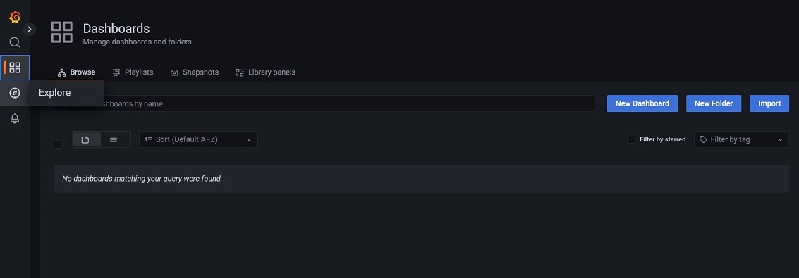
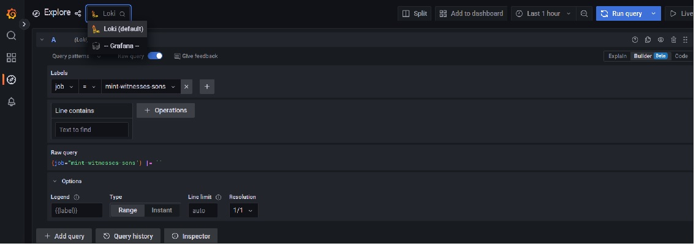
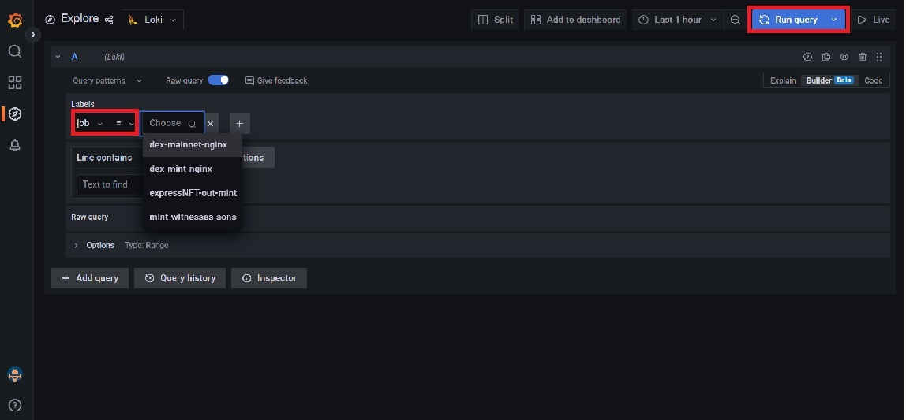
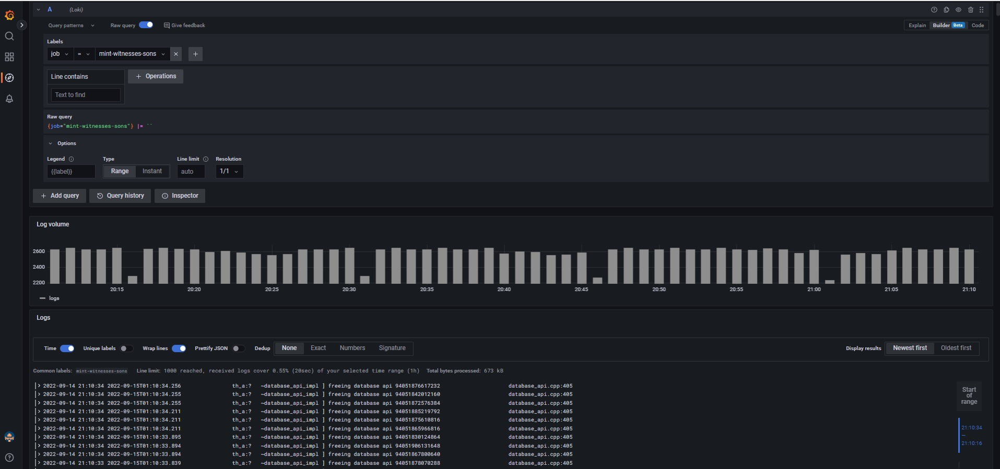

# Grafana Explorer

### Loki Datasource configuration in Grafana

1\. Login to Grafana and click **Explore** on the left pane

<figure><figcaption></figcaption></figure>

2\. Click add data source and select Loki.

3\. Set the name as Loki, URL as the domain name or IP address and port number.

<figure><figcaption></figcaption></figure>

4\. You can now click Explore and set Loki at your data source - Select your job label and run query to check the logs.

<figure><figcaption></figcaption></figure>

5\. The logs for the selected job will be displayed in the below format

<figure><figcaption></figcaption></figure>
