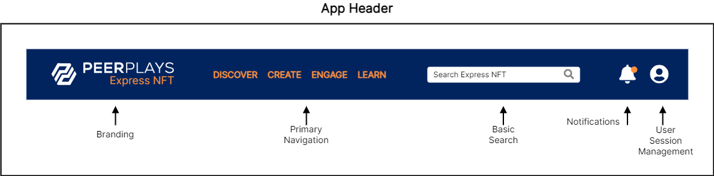

# APP-FS01 App Header

## 1. Purpose

The purpose of this functional specification (FS) document is to detail functional requirements for the Peerplays NFT Store application (the “app”) relating to the app header page fragment from a business and user perspective.

## 2. Document Tracking

### 2.1. Parent Document

This document is a child document of the NFT Store [Requirements Specification](https://devs.peerplays.tech/supporting-and-reference-docs/nft-development/nft-store/nft-store-requirements-specification).

### 2.2. Categorization

This document relates to the following tags.

`App Component`

`Page Fragment`

## 3. Scope

This FS will describe the requirements and basic design for the app’s page header fragment.

### 3.1. Components

Specific components and features covered in this FS include:

* the app header layout and design elements
  * branding
  * app header navigation
  * notifications
  * wallet status
  * search function
  * log in / out
  * user session management
  * system messages

## 4. Document Conventions

For the purpose of traceability, the following code(s) will be used in this functional specification:

| Code       | Meaning                                   |
| ---------- | ----------------------------------------- |
| APP-FS01-# | App Component Requirement - App Header FS |

**The keyword `shall` indicates a requirement statement.**

The keywords `may`, `could`, and `should` are not requirements but rather indicate items related to requirements that are worthy of consideration.

The following terms are used to describe specific users of the application:

* Unauthenticated (not logged in) users are known as `visitors`.
* Authenticated (logged in) users are known as `peers`.

The following terms are used to describe levels of user entitlement within the application:

* A `browser` is view only (except for account creation and logging in) and used for visitors.
* An `enjoyer` can interact with the market, including buying and optionally re-selling NFTs, but can’t make new NFTs.
* A `tenant` can create NFTs and sell them in addition to what the enjoyer can do.
* A `client` is an administrator level user with all entitlements.

## 5. Context

The pages of the app will need to conform to a sensible template or structural form to ensure the delivery of a consistent user experience (UX) across the app. The app header is the top portion of nearly every page in the app. It provides users quick access to the most frequently used functions. Users look to the top of the page for navigation, menus, and status information.

## 6. Design Wire-frames

The wire-frames listed below are meant to represent the application header page fragment in various states. These are provided to assist in understanding of what features may look like or their potential use. Final designs may be vastly different from these images.

## 7. Requirements

Requirements specific to the items listed in this FS are as follows.

### 7.1. App Header Layout

The app header:

**APP-FS01-1:** shall be available for all users (both visitors and peers).

**APP-FS01-2:** shall display branding, navigation, notifications, wallet status, basic search, log in / out, session management, and system messages.

**APP-FS01-3:** shall use graphic design elements which remain consistent throughout the app.

**APP-FS01-4:** shall allow user input in relevant form fields to perform the functions of the related component.

**APP-FS01-5:** shall perform input field validation and inform the user of acceptable form inputs.

**APP-FS01-6:** shall provide the user with help/hint text to explain available options and input fields.

### 7.2. Branding

The app header, in the context of branding:

**APP-FS01-7:** shall use graphical design elements which adhere to Peerplays branding guidelines.

### 7.3. Navigation

The app header, in the context of navigation:

**APP-FS01-8:** shall provide links to the following pages / functions for **all users**:

* marketplace category pages
* browse peer accounts page
* browse galleries page
* browse collections page
* browse transactions (activity) page
* support / help docs page
* any relevant social media or other marketing content

**APP-FS01-9:** shall provide links to the following pages / functions for **visitors** (browsers):

* log in function
* account creation page / function

**APP-FS01-10:** shall provide links to the following pages / functions for **peers** (enjoyers):

* log out function
* user account page
* wallet page / functions
* application settings page
* create new gallery
* create new collection
* support tickets page

**APP-FS01-11:** shall provide links to the following pages / functions for **peers** (tenants):

* create new NFT

**APP-FS01-12:** shall provide links to the following pages / functions for **peers** (clients):

* admin dashboard

### 7.4. Notifications

The app header, in the context of notifications:

**APP-FS01-13:** shall provide notifications features for peers.

**APP-FS01-14:** shall display notifications as per the notification settings applied by the user.

**APP-FS01-15:** shall allow the user to quickly view the details of the active notifications.

**APP-FS01-16:** shall allow the user to dismiss notifications.

**APP-FS01-17:** shall provide timely and relevant notifications.

### 7.5. Wallet Status

The app header, in the context of wallet features:

**APP-FS01-18:** shall provide wallet features for peers.

**APP-FS01-19:** shall display the user’s wallet status or links to the wallet functions of the application.

### 7.6. Search Functions

The app header, in the context of search:

**APP-FS01-20:** shall provide basic search features for visitors and peers.

**APP-FS01-21:** shall allow a user to search for any of the following objects:

* NFTs
* Collections
* Galleries
* Peers

**APP-FS01-22:** shall provide search suggestions as per the search settings applied by the user.

**APP-FS01-23:** shall allow search based on text within an object’s name, content, and / or configured metadata fields.

### 7.7. Log In / Out

The app header, in the context of logging in / out:

**APP-FS01-24:** shall allow visitors the ability to log in with any configured authentication feature.

**APP-FS01-25:** shall allow peers the ability to log out.

**APP-FS01-26:** shall allow the option to remember the user’s username where applicable while logging in.

### 7.8. User Session Management

The app header, in the context of user session management:

**APP-FS01-27:** shall provide quick access to user session related pages / functions.

**APP-FS01-28:** shall display the user’s logged in status.

**APP-FS01-29:** shall display a generic state when the user is logged out.

### 7.9. System Messages

The app header, in the context of system messages:

**APP-FS01-30:** shall display all system messages created by a client in the admin dashboard.

**APP-FS01-31:** shall display system messages until removed by a client in the admin dashboard.

**APP-FS01-32:** shall allow users to temporarily dismiss system messages until they revisit the application.

### 7.10. Other Requirements

The app header:

**APP-FS01-33:** shall be displayed on all pages in the app which are not stand-alone pages. This means any page which conforms to the typical header, body, and footer page structure.

**APP-FS01-34:** shall display elements using the selected graphical theme (colors, icons, thematic elements, animations, etc.)

## 8. Appendix A: Glossary

| Term   | Meaning                    |
| ------ | -------------------------- |
| RS     | Requirements Specification |
| FS     | Functional Specification   |
| NFT(s) | Non-Fungible Token(s)      |
| UI     | User Interface             |
| UX     | User Experience            |
