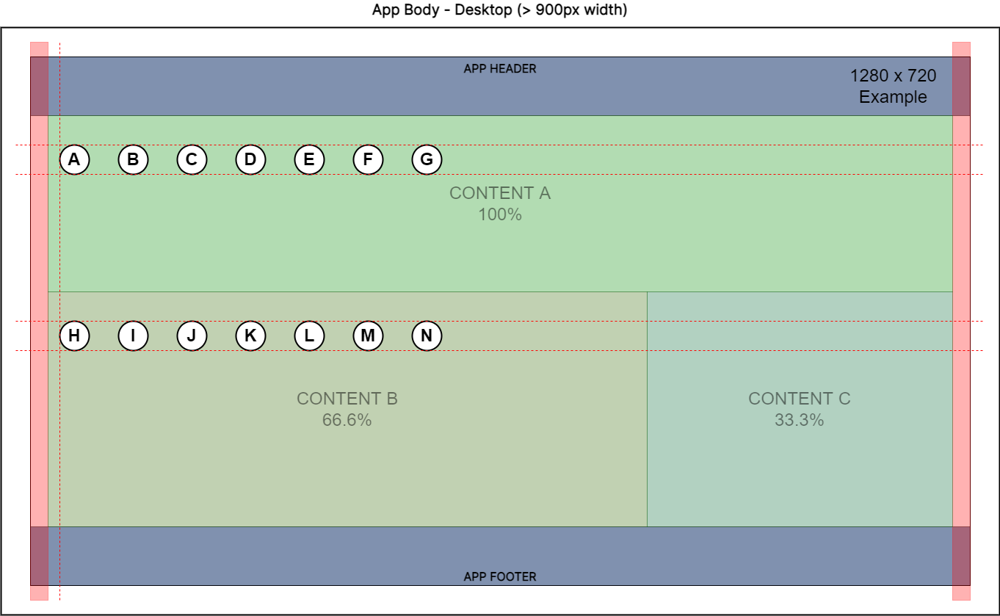
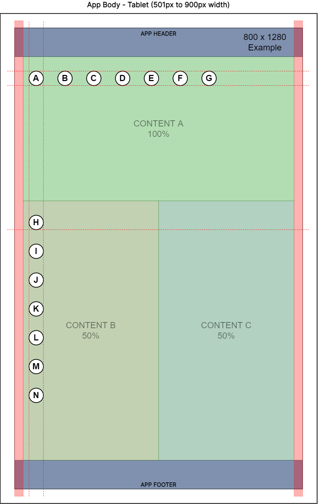
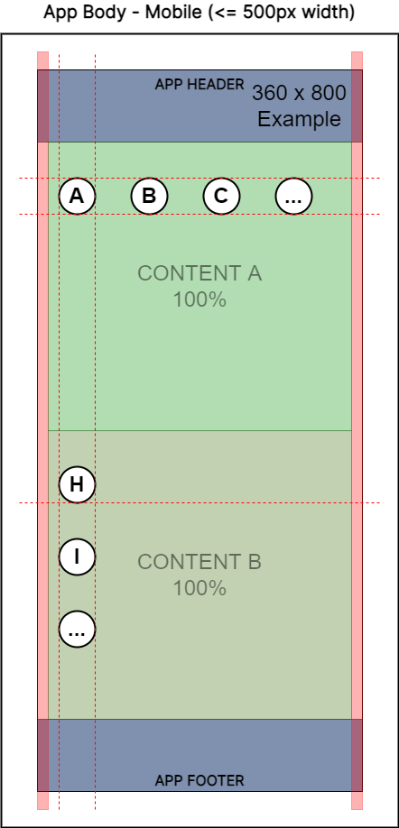

# APP-FS02 App Body

## 1. Purpose

The purpose of this functional specification (FS) document is to detail functional requirements for the Peerplays NFT Store application (the “app”) relating to the app body page fragment from a business and user perspective.

## 2. Document Tracking

### 2.1. Parent Document

This document is a child document of the NFT Store [Requirements Specification](https://devs.peerplays.tech/supporting-and-reference-docs/nft-development/nft-store/nft-store-requirements-specification).

### 2.2. Categorization

This document relates to the following tags.

`App Component`

`Page Fragment`

## 3. Scope

This FS will describe the requirements and basic design for the app’s page body fragment.

### 3.1. Components

Specific components and features covered in this FS include:

* the app body layout and design elements
  * app content

## 4. Document Conventions

For the purpose of traceability, the following code(s) will be used in this functional specification:

| Code       | Meaning                                 |
| ---------- | --------------------------------------- |
| APP-FS02-# | App Component Requirement - App Body FS |

**The keyword `shall` indicates a requirement statement.**

The keywords `may`, `could`, and `should` are not requirements but rather indicate items related to requirements that are worthy of consideration.

The following terms are used to describe specific users of the application:

* Unauthenticated (not logged in) users are known as `visitors`.
* Authenticated (logged in) users are known as `peers`.

The following terms are used to describe levels of user entitlement within the application:

* A `browser` is view only (except for account creation and logging in) and used for visitors.
* An `enjoyer` can interact with the market, including buying and optionally re-selling NFTs, but can’t make new NFTs.
* A `tenant` can create NFTs and sell them in addition to what the enjoyer can do.
* A `client` is an administrator level user with all entitlements.

## 5. Context

The pages of the app will need to conform to a sensible template or structural form to ensure the delivery of a consistent user experience (UX) across the app. The app body is the central portion of nearly every page in the app. It provides users the bulk of the content the app contains. It displays the most detailed presentation of objects.

## 6. Design Wire-frames

The wire-frames listed below are meant to represent the application body page fragment in various states. These are provided to assist in understanding of what features may look like or their potential use. Final designs may be vastly different from these images.

The three figures above represent different possible responsive design breakpoints. For example, we could use the following breakpoints to design distinct UIs in parallel to cover the use of most screen resolutions.

* Screens less than or equal to 500px wide (mobile devices)
* Screens from 501px and up to 900px wide (tablet devices)
* Screens from 901px wide and above (desktop devices)

The thick red lines along the left and right sides of the figures above represent standard gutters of 24px for desktop and tablet devices, and 12px for mobile devices. The dotted red lines show the use of key-lines which align UI elements for a cohesive look across different sections of content.

Moving between screens of different sizes, we can transform the content to better fit the new screen size. The figures above show examples of transformations that are listed in requirement `APP-FS02-10` in section 7.2 of this document.

## 7. Requirements

Requirements specific to the items listed in this FS are as follows.

### 7.1. App Body Layout

The app body:

**APP-FS02-1:** shall be available for all users (both visitors and peers).

**APP-FS02-2:** shall display the appropriate app content as per user navigation.

**APP-FS02-3:** shall use graphic design elements which remain consistent throughout the app.

**APP-FS02-4:** shall allow user input in relevant form fields to perform the functions of the related component.

**APP-FS02-5:** shall perform input field validation and inform the user of acceptable form inputs.

**APP-FS02-6:** shall provide the user with help/hint text to explain available options and input fields.

**APP-FS02-7:** shall adhere to a set of standard design guidelines.

**APP-FS02-8:** shall be displayed on all pages in the app which are not stand-alone pages. This means any page which conforms to the typical header, body, and footer page structure.

**APP-FS02-9:** shall display elements using the selected graphical theme (colors, icons, thematic elements, animations, etc.)

### 7.2. App Content

the app body, in the context of its content:

**APP-FS02-10:** shall use responsive design techniques to ensure a quality user experience on a variety of devices and screen resolutions. This includes, but is not limited to:

* Repositioning UI elements
* Resizing UI elements
* Re-flow of UI elements
* Showing/Hiding UI elements
* Replacing UI elements on breakpoints
* Re-architecture of UI to target specific devices

**APP-FS02-11:** shall use standardized rules for UI element layout properties for the following:

* Dimensions (Height, Width)
* Alignment
* Margin/Padding
* Text and Text Hierarchy

**APP-FS02-12:** shall make appropriate use of common style conventions including but not limited to the following:

* Navigation
* Color
* Typography
* Iconography
* Layering
* Spacing
* Shape
* Motion
* Interaction
* Writing style

**APP-FS02-13:** shall incorporate universal design theory principals to enable user accessibility. This should include the following:

* Equitable Use
* Flexibility in Use
* Simple and Intuitive Use
* Perceptible Information
* Tolerance for Error
* Low Physical Effort
* Size and Space for Approach and Use


See Appendix B for universal design references.


## 8. Appendix A: Glossary

| Term   | Meaning                    |
| ------ | -------------------------- |
| RS     | Requirements Specification |
| FS     | Functional Specification   |
| NFT(s) | Non-Fungible Token(s)      |
| UI     | User Interface             |
| UX     | User Experience            |

## 9. Appendix B: References

### 9.1. Universal Design

[Learn to Create Accessible Websites with the Principles of Universal Design](https://www.interaction-design.org/literature/article/learn-to-create-accessible-websites-with-the-principles-of-universal-design)

[Universal Design: Process, Principles, and Applications](https://www.washington.edu/doit/universal-design-process-principles-and-applications)

[The 7 Principles](https://universaldesign.ie/What-is-Universal-Design/The-7-Principles/)

### 9.2. Example Design Guidelines

[Design and code Windows apps - Windows apps](https://docs.microsoft.com/en-us/windows/apps/design/)

[Introduction - Ant Design](https://ant.design/docs/spec/introduce#Guidelines-and-Resources)

[Material Design](https://m3.material.io)
