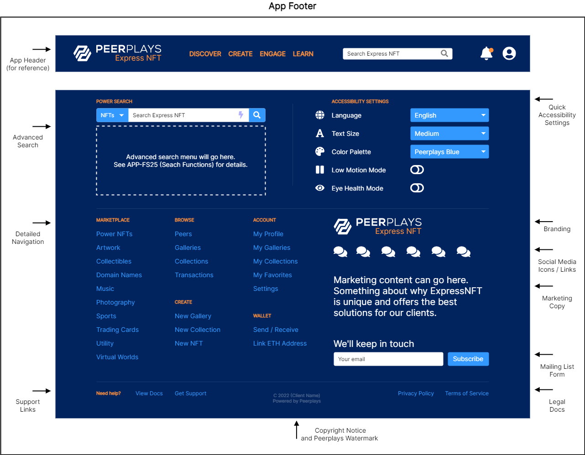

# APP-FS03 App Footer

## 1. Purpose

The purpose of this functional specification (FS) document is to detail functional requirements for the Peerplays NFT Store application (the “app”) relating to the app footer page fragment from a business and user perspective.

## 2. Document Tracking

### 2.1. Parent Document

This document is a child document of the NFT Store [Requirements Specification](https://devs.peerplays.tech/supporting-and-reference-docs/nft-development/nft-store/nft-store-requirements-specification).

### 2.2. Categorization

This document relates to the following tags.

`App Component`

`Page Fragment`

## 3. Scope

This FS will describe the requirements and basic design for the app’s page footer fragment.

### 3.1. Components

Specific components and features covered in this FS include:

* the app footer layout and design elements
  * branding
  * app footer navigation
  * notifications
  * search functions
  * accessibility settings
  * marketing, copyright, and legal content

## 4. Document Conventions

For the purpose of traceability, the following code(s) will be used in this functional specification:

| Code       | Meaning                                   |
| ---------- | ----------------------------------------- |
| APP-FS03-# | App Component Requirement - App footer FS |

**The keyword `shall` indicates a requirement statement.**

The keywords `may`, `could`, and `should` are not requirements but rather indicate items related to requirements that are worthy of consideration.

The following terms are used to describe specific users of the application:

* Unauthenticated (not logged in) users are known as `visitors`.
* Authenticated (logged in) users are known as `peers`.

The following terms are used to describe levels of user entitlement within the application:

* A `browser` is view only (except for account creation and logging in) and used for visitors.
* An `enjoyer` can interact with the market, including buying and optionally re-selling NFTs, but can’t make new NFTs.
* A `tenant` can create NFTs and sell them in addition to what the enjoyer can do.
* A `client` is an administrator level user with all entitlements.

## 5. Context

The pages of the app will need to conform to a sensible template or structural form to ensure the delivery of a consistent user experience (UX) across the app. The app footer is the bottom portion of nearly every page in the app. It provides users quick access to the most frequently used functions. Users look to the bottom of the page for detailed navigation, app-wide settings, help information, company contact information, and legal / regulatory docs.

## 6. Design Wire-frames

The wire-frames listed below are meant to represent the application footer page fragment in various states. These are provided to assist in understanding of what features may look like or their potential use. Final designs may be vastly different from these images.

## 7. Requirements

Requirements specific to the items listed in this FS are as follows.

### 7.1. App Footer Layout

The app footer:

**APP-FS03-1:** shall be available for all users (both visitors and peers).

**APP-FS03-2:** shall display branding, detailed navigation, notifications (where required), search functions, accessibility settings, legal / regulatory docs, marketing copy (where applicable), and social media links.

**APP-FS03-3:** shall use graphic design elements which remain consistent throughout the app.

**APP-FS03-4:** shall allow user input in relevant form fields to perform the functions of the related component.

**APP-FS03-5:** shall perform input field validation and inform the user of acceptable form inputs.

**APP-FS03-6:** shall provide the user with help/hint text to explain available options and input fields.

### 7.2. Branding

The app footer, in the context of branding:

**APP-FS03-7:** shall use graphical design elements which adhere to Peerplays branding guidelines.

**APP-FS03-8:** shall display a “Powered by Peerplays” (or similar) watermark.

### 7.3. Navigation

The app footer, in the context of navigation:

**APP-FS03-9:** shall provide links to the following pages / functions for **all users**:

* marketplace category pages (configurable in the admin dashboard)
* browse peer accounts page
* browse galleries page
* browse collections page
* browse transactions (activity) page
* support / help docs page
* legal / regulatory docs (privacy policy, terms of service, GDPR disclosures, etc.)
* any relevant social media or other marketing content

**APP-FS03-10:** shall provide links to the following pages / functions for **visitors** (browsers):

* log in function
* account creation page / function

**APP-FS03-11:** shall provide links to the following pages / functions for **peers** (enjoyers):

* log out function
* user account page
* wallet page / functions
* application settings page
* create new gallery
* create new collection
* support tickets page

**APP-FS03-12:** shall provide links to the following pages / functions for **peers** (tenants):

* create new NFT

**APP-FS03-13:** shall provide links to the following pages / functions for **peers** (clients):

* admin dashboard

### 7.4. Notifications

**APP-FS03-14:** shall, when necessary, display notifications about system status, regulatory disclosures, and temporary informational pop-ups (toasts).

**APP-FS03-15:** shall allow users to dismiss or otherwise acknowledge the notifications, providing the appropriate user controls as necessary.

### 7.5. Search Functions

**APP-FS03-16:** shall provide a dynamic search bar which operates as a basic search but can optionally initiate advanced search features.

### 7.6. Accessibility Settings

**APP-FS03-17:** shall provide a selection of accessibility settings in accordance with universal design theory. This section may include (but is not limited to) app-wide settings such as:

* display language
* display currency
* text size or zoom options
* color palette or template selection
* low motion, no motion, or similar (turn off animations, etc.)
* eye health mode (low contrast, low brightness, reduced blue light, muted colors)
* screen reader options
* show more info options
  * automatically display all help or informational text throughout the app
  * provide more descriptive help or informational text when available

**APP-FS03-18:** shall provide information about these settings in an accessible way such as:

* tool-tip pop-ups
* links to help documents or FAQs
* help text

### 7.7. Marketing, Copyright, and Legal Content

**APP-FS03-19:** shall provide links to all necessary legal content like the Privacy Policy, Terms of Service, and any docs required by regulatory authorities.

**APP-FS03-20:** shall display copyright text which is configurable in the admin dashboard.

**APP-FS03-21:** shall provide a mailing list subscription form which accepts a user’s email.

**APP-FS03-22:** shall display social media links which are configurable in the admin dashboard.

**APP-FS03-23:** shall display any necessary marketing content.

### 7.8. Other Requirements

The app footer:

**APP-FS03-24:** shall be displayed on all pages in the app which are not stand-alone pages. This means any page which conforms to the typical header, body, and footer page structure.

**APP-FS03-25:** shall display elements using the selected graphical theme (colors, icons, thematic elements, animations, etc.)

**APP-FS03-26:** shall conform to the predetermined responsive design standards to maintain acceptable content flow and UX on various screen dimensions.

## 8. Appendix A: Glossary

| Term   | Meaning                    |
| ------ | -------------------------- |
| RS     | Requirements Specification |
| FS     | Functional Specification   |
| NFT(s) | Non-Fungible Token(s)      |
| UI     | User Interface             |
| UX     | User Experience            |
