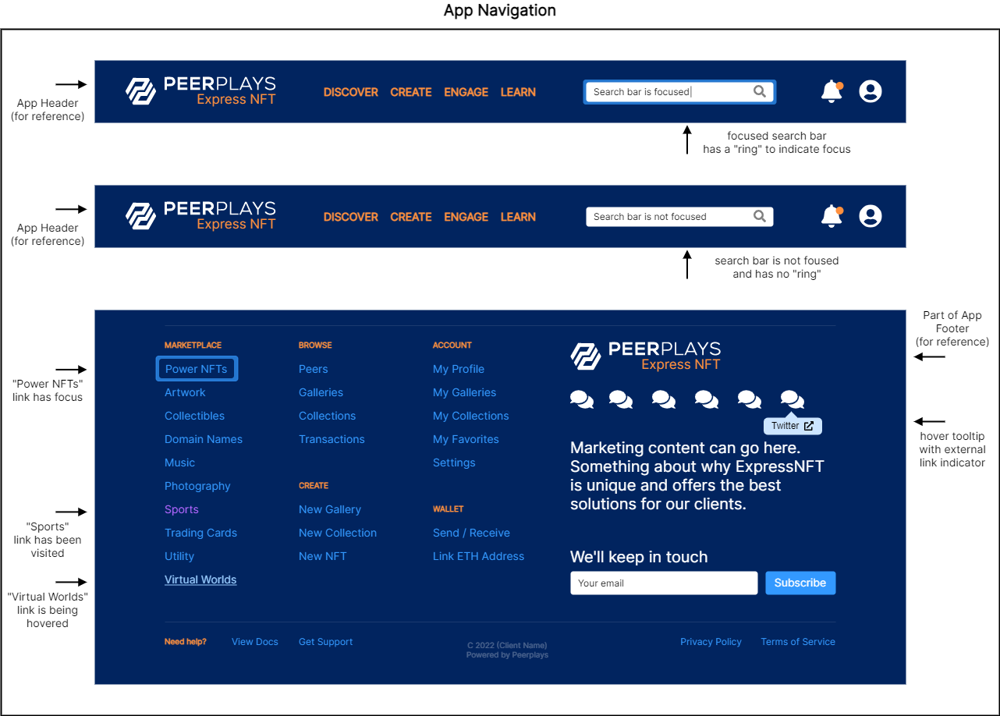

# APP-FS04 App Navigation

## 1. Purpose

The purpose of this functional specification (FS) document is to detail functional requirements for the Peerplays NFT Store application (the “app”) relating to the app navigation features from a business and user perspective.

`App Component`

`Page Fragment`

## 2. Document Tracking

### 2.1. Parent Document

This document is a child document of the NFT Store [Requirements Specification](https://devs.peerplays.tech/supporting-and-reference-docs/nft-development/nft-store/nft-store-requirements-specification).

### 2.2. Categorization

This document relates to the following tags.

`App Component`

`Page Fragment`

## 3. Scope

This FS will describe the requirements and basic design for the app’s navigation features.

### 3.1. Components

Specific components and features covered in this FS include:

* the app navigation layout and design elements
  * app navigation
  * universal design considerations

## 4. Document Conventions

For the purpose of traceability, the following code(s) will be used in this functional specification:

| Code       | Meaning                                    |
| ---------- | ------------------------------------------ |
| APP-FS04-# | App Component Requirement - App Navigation |

**The keyword `shall` indicates a requirement statement.**

The keywords `may`, `could`, and `should` are not requirements but rather indicate items related to requirements that are worthy of consideration.

The following terms are used to describe specific users of the application:

* Unauthenticated (not logged in) users are known as `visitors`.
* Authenticated (logged in) users are known as `peers`.

The following terms are used to describe levels of user entitlement within the application:

* A `browser` is view only (except for account creation and logging in) and used for visitors.
* An `enjoyer` can interact with the market, including buying and optionally re-selling NFTs, but can’t make new NFTs.
* A `tenant` can create NFTs and sell them in addition to what the enjoyer can do.
* A `client` is an administrator level user with all entitlements.

## 5. Context

Navigation is a foundational user control within the app. It guides process flows and is a major factor of user-friendliness. Designing the app navigation also provides the opportunity to incorporate universal design principals to make the app accessible to everyone.

## 6. Design Wire-frames

The wire-frames listed below are meant to represent the application body page fragment in various states. These are provided to assist in understanding of what features may look like or their potential use. Final designs may be vastly different from these images.

## 7. Requirements

### 7.1. App Navigation

The app navigation:

**APP-FS04-1:** shall display navigation elements in a natural flow.

**APP-FS04-2:** shall, upon activation of a navigation element by the user, direct the user to the appropriate page or content within the app, if the user is authorized to view that content.

**APP-FS04-3:** shall, if the user is not authorized to view the content of a page for which they are attempting to navigate, redirect the user to a page they do have access to before the unauthorized page is reached. Unauthorized navigation can redirect users to any of the following:

* a 404 or other error page
* the app home page
* help documents
* the user’s profile page
* the app login page
* the app create account page

Navigation security can be handled with route guard patterns usually implemented in popular JavaScript frameworks like Next.js (React) or Angular.

**APP-FS04-4:** shall display only the navigation elements to the user for which their app role or granted entitlements allow them to access.

**APP-FS04-5:** shall, where appropriate, indicate to the user if content is in a loading state.

**APP-FS04-6:** shall display partially loaded content until all content is available for display to the user. This can be done with loading icons (spinners, etc.) and / or content skeleton loaders which are replaced by the incoming content.

See Appendix B for references regarding content skeleton loaders.

**APP-FS04-7:** shall open menus when menu headers are activated (with mouse or keyboard) and remain open until the user deliberately closes the menu. In other words, menus should not open or close based on mouse hover. Deliberately closing a menu can consist of one of the following:

* activating the menu header again
* actively passing the focus to another element (but not a child element) like another menu header or the app body
* using a keyboard command to drop the element’s focus (like using the `Esc` key)

**APP-FS04-8:** shall indicate to the user when a navigation element is available for interaction by using one or more of the following:

* mouse cursor changes
* element style changes on mouse hover
* element style changes on focus
* element style changes on activation
* element style changes on visited status

**APP-FS04-9:** shall, where appropriate, display icons along with text labels which correspond to the context of the navigation element (i.e. magnifying glass for search, soccer ball for the sports category, etc.)

**APP-FS04-10:** shall, upon the user activating a search query, send the user to a dedicated search page with all the relevant search results displayed.

**APP-FS04-11:** shall provide pagination controls to users for navigating lists of objects.

**APP-FS04-12:** shall provide options to users for sorting lists of objects.

**APP-FS04-13:** shall provide options to users for filtering lists of objects.

**APP-FS04-14:** shall provide options to users for changing the display of lists of objects (list view, grid view, etc.)

**APP-FS04-15:** shall not display or make use of a user’s personally identifiable information (PII) in unencrypted URI parameters.

**APP-FS04-16:** shall not transmit a user’s personally identifiable information (PII) over unencrypted networks.

**APP-FS04-17:** shall display social media links which have been configured in the admin dashboard.

**APP-FS04-18:** shall display navigation for marketplace categories which have been configured in the admin dashboard.

### 7.2. Universal Design Considerations

The app navigation, in the context of universal design:

**APP-FS04-19:** shall allow users the option of operating the app navigation using a keyboard.

**APP-FS04-20:** shall implement a consistent set of keyboard commands which enables a user to logically navigate app pages without the use of a mouse.

**APP-FS04-21:** shall allow users to focus and operate control elements (inputs, toggles, checkboxes, buttons, links, etc.) using a keyboard.

**APP-FS04-22:** shall clearly display element focus and activation.

**APP-FS04-23:** shall contain all appropriate metadata in the app code to enable assistive technologies (alt text, titles, labels, etc.)

**APP-FS04-24:** shall adhere to design guidelines which clearly define standard styles for navigation elements (links, buttons, etc.)

**APP-FS04-25:** shall indicate to the user if a link opens an external vs internal resource.

See Appendix B for references regarding keyboard interaction.

### 7.3. Documents With Other App Navigation Requirements


[app-fs01-app-header.md](app-fs01-app-header.md)



[app-fs03-app-footer.md](app-fs03-app-footer.md)


## 8. Appendix A: Glossary

| Term   | Meaning                             |
| ------ | ----------------------------------- |
| RS     | Requirements Specification          |
| FS     | Functional Specification            |
| NFT(s) | Non-Fungible Token(s)               |
| UI     | User Interface                      |
| UX     | User Experience                     |
| PII    | Personally Identifiable Information |
| GDPR   | General Data Protection Regulation  |

## 9. Appendix B: References

### 9.1. Content Skeleton Loaders

[Everything you need to know about skeleton screens](https://uxdesign.cc/what-you-should-know-about-skeleton-screens-a820c45a571a)

### 9.2. Web Accessibility Initiative - Accessible Rich Internet Applications (WAI-ARIA)

[WAI-ARIA Authoring Practices 1.2](https://www.w3.org/TR/wai-aria-practices/#menu)
