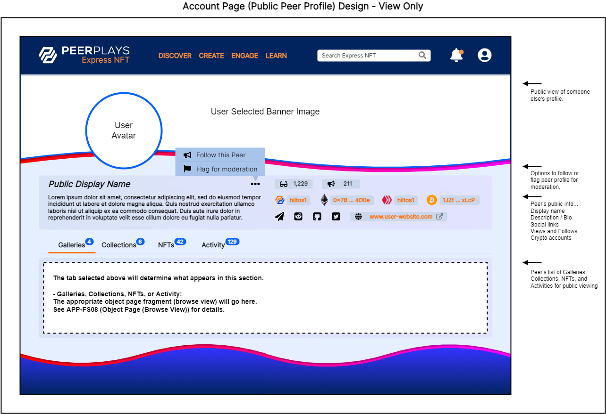
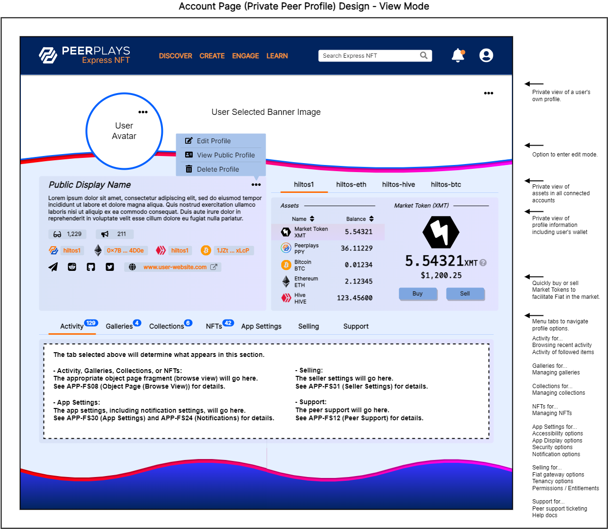
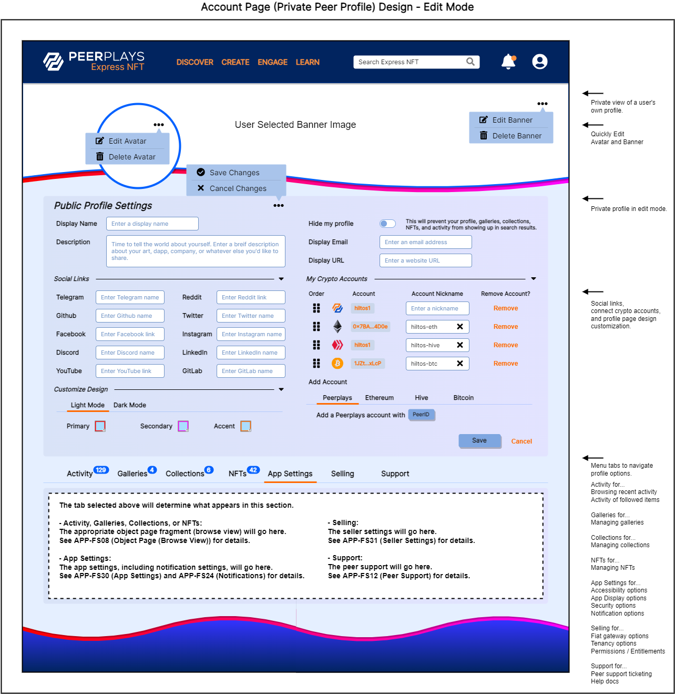

# APP-FS07 Account Page

## 1. Purpose

The purpose of this functional specification (FS) document is to detail functional requirements for the Peerplays NFT Store application (the “app”) relating to the account page from a business and user perspective.

## 2. Document Tracking

### 2.1. Parent Document

This document is a child document of the NFT Store [Requirements Specification](https://devs.peerplays.tech/supporting-and-reference-docs/nft-development/nft-store/nft-store-requirements-specification).

### 2.2. Categorization

This document relates to the following tags.

`App Component`

`Page`

## 3. Scope

This FS will describe the requirements and basic design for the app’s account (profile) page.

### 3.1. Components

Specific components and features covered in this FS include:

* Limited view of a Peer profile
* Public view of a Peer profile
* Private view of a Peer profile
* Editing view of a Peer profile

## 4. Document Conventions

For the purpose of traceability, the following code(s) will be used in this functional specification:

| Code       | Meaning                                  |
| ---------- | ---------------------------------------- |
| APP-FS07-# | App Component Requirement - Account Page |

**The keyword `shall` indicates a requirement statement.**

The keywords `may`, `could`, and `should` are not requirements but rather indicate items related to requirements that are worthy of consideration.

The following terms are used to describe specific users of the application:

* Unauthenticated (not logged in) users are known as `visitors`.
* Authenticated (logged in) users are known as `peers`.

The following terms are used to describe levels of user entitlement within the application:

* A `browser` is view only (except for account creation and logging in) and used for visitors.
* An `enjoyer` can interact with the market, including buying and optionally re-selling NFTs, but can’t make new NFTs.
* A `tenant` can create NFTs and sell them in addition to what the enjoyer can do.
* A `client` is an administrator level user with all entitlements.

## 5. Context

The account (or Peer profile) page exists in three distinct states: limited view, public view, and private view.

The limited view is for showing that a profile exists yet is currently unavailable due to admin intervention or the user hiding their own profile.

The public view is what a user sees when visiting another user’s profile. This limits the user from viewing sensitive information about their fellow peers and provides an opportunity to display the profile in a way that’s more useful to the user.

The private view is for a user viewing their own profile. This view allows the user to access app settings as well as to manage their account data, linked crypto accounts, contact support, etc. The private account page is the “home base” where users can access every important detail about their app experience.

## 6. Design Wire-frames

The wire-frames listed below are meant to represent the app’s account page in various states. These are provided to assist in understanding of what features may look like or their potential use. Final designs may be vastly different from these images.

Figure 1. The account page when viewed by another user. This is known as the public view of a Peer profile.

Figure 2. The account page when viewed by the user which the profile belongs to.

Figure 3. The account page while the user is editing their profile.

## 7. Requirements

Requirements specific to the items listed in this FS are as follows.

### 7.1. Account page

The account page:

**APP-FS07-1:** shall display design customizations selected by the profile owner, which may include but is not limited to the following:

* Colors
* Images
* Typography
* Iconography
* Custom CSS

**APP-FS07-2:** shall display a limited view when any of the following conditions are met:

* account page is set to private mode by the account owner
* account page is blocked by an admin for
  * maintenance
  * moderation
  * account suspension / ban

**APP-FS07-3:** shall display a public view when any of the following conditions are met:

* visited by a user which is unauthenticated
* visited by a user which does not own the respective account
* visited by the user which owns the account and has selected an option to visit the public view of their profile
* visited by an admin and has selected an option to visit the public view of the profile

**APP-FS07-4:** shall display a private view when any of the following conditions are met:

* visited by the user which owns the account
* visited by an admin

**APP-FS07-5:** shall display a private view in an editing mode when any of the following conditions are met:

* visited by the user which owns the account and has selected an option to enter the editing mode
* visited by an admin and has selected an option to enter the editing mode

**APP-FS07-6:** shall provide help text and form validation in accordance with universal design principals as well as accessibility settings (See APP-FS30 for details.)

### 7.2. Account page limited view

The account page, in the context of the limited view:

**APP-FS07-7:** shall display fields and functions based on the following table of possible scenarios:

| Who is visiting                    | Why the page is limited                        | Displayed fields / functions                                                                                         |
| ---------------------------------- | ---------------------------------------------- | -------------------------------------------------------------------------------------------------------------------- |
| The account owner                  | Profile is set to private by the account owner | All available fields and functions of the private view with a message indicating the profile is in private mode.     |
| An unauthenticated user            | Profile is set to private by the account owner | The username, or public display name if available, and a message indicating the profile is private.                  |
| A user who doesn’t own the account | Profile is set to private by the account owner | The username, or public display name if available, and a message indicating the profile is private.                  |
| An admin                           | Profile is set to private by the account owner | All available fields and functions of the private view with a message indicating the profile is in private mode.     |
| The account owner                  | Admin blocked the page                         | All available fields and functions of the private view with a message indicating the profile is blocked by an admin. |
| An unauthenticated user            | Admin blocked the page                         | The username, or public display name if available, and a message indicating the profile is unavailable.              |
| A user who doesn’t own the account | Admin blocked the page                         | The username, or public display name if available, and a message indicating the profile is unavailable.              |
| An admin                           | Admin blocked the page                         | All available fields and functions of the private view with a message indicating the profile is blocked by an admin. |

**APP-FS07-8:** shall offer actions to the user depending on the following scenarios:

| Who is visiting                    | Why the page is limited                        | Actions offered                                                                                     |
| ---------------------------------- | ---------------------------------------------- | --------------------------------------------------------------------------------------------------- |
| The account owner                  | Profile is set to private by the account owner | N/A                                                                                                 |
| An unauthenticated user            | Profile is set to private by the account owner | List of Peers, Galleries, Collections, and / or NFTs similar to this profile                        |
| A user who doesn’t own the account | Profile is set to private by the account owner | List of Peers, Galleries, Collections, and / or NFTs similar to this profile                        |
| An admin                           | Profile is set to private by the account owner | N/A                                                                                                 |
| The account owner                  | Admin blocked the page                         | Contact support                                                                                     |
| An unauthenticated user            | Admin blocked the page                         | List of Peers, Galleries, Collections, and / or NFTs similar to this profile                        |
| A user who doesn’t own the account | Admin blocked the page                         | List of Peers, Galleries, Collections, and / or NFTs similar to this profile                        |
| An admin                           | Admin blocked the page                         | Unblock the profile, Review flags for moderation, Review support tickets with mentions of this user |

### 7.3. Account page public view

The account page, in the context of the public view:

**APP-FS07-9:** shall display the following fields:

* Peer selected avatar, or default avatar
* Peer selected banner, or default banner
* Public display name
* Description / bio
* Configured social media links
* Configured website address
* Public email address
* Number of page views
* Number of users following the profile owner
* Number of galleries
* Number of collections
* Number of NFTs
* Number of recent transactions (activity)

**APP-FS07-10:** shall offer a “follow” the owner of the profile function (subscribe to this user's activities).

**APP-FS07-11:** shall offer a “flag” the profile for admin moderation function.

**APP-FS07-12:** shall offer menu tabs for navigation to view the user's:

* Public Activity (See APP-FS08 and APP-FS09 for details.)
* Public Galleries (See APP-FS08 and APP-FS09 for details.)
* Public Collections (See APP-FS08 and APP-FS09 for details.)
* Public NFTs (See APP-FS08 and APP-FS09 for details.)

### 7.4. Account page private view (viewing)

The account page, in the context of the private view (while viewing):

**APP-FS07-13:** shall display the following fields:

* Peer selected avatar, or default avatar
* Peer selected banner, or default banner
* Public display name
* Description / bio
* Configured social media links
* Configured website address
* Public email address
* Number of page views
* Number of users following the profile owner
* Number of galleries
* Number of collections
* Number of NFTs
* Number of recent transactions (activity)

**APP-FS07-14:** shall offer menu tabs for navigation to view and manage the user's:

* Activity (See APP-FS08 and APP-FS09 for details.)
* Galleries (See APP-FS08 and APP-FS09 for details.)
* Collections (See APP-FS08 and APP-FS09 for details.)
* NFTs (See APP-FS08 and APP-FS09 for details.)
* App Settings (See APP-FS30 for details.)
* Seller Settings (See APP-FS31 for details.)
* Support Tickets (See APP-FS12 for details.)

**APP-FS07-15:** shall offer wallet menu tabs for navigation to view and manage the user's connected crypto accounts. Each tab represents a connected account and can be managed separately. (See APP-FS05 Wallet Functions for details.)

**APP-FS07-16:** shall offer an edit banner option which allows the owner of the account profile to change their profile banner image.

**APP-FS07-17:** shall allow the following options when editing the profile banner:

* Custom PNG, JPEG, BMP, or GIF image. (if allowed in app admin config.)
* Custom MP4, WebM, MKV, or FLV video (if allowed in app admin config.)
* An NFT owned by the account owner (if allowed in app admin config.)
* Selection from a list of banners configured in the app admin config
* A default banner

**APP-FS07-18:** shall offer a delete banner option which allows the owner of the account profile to reset their profile banner image to the default banner image.

**APP-FS07-19:** shall offer an edit avatar option which allows the owner of the account profile to change their profile avatar image.

**APP-FS07-20:** shall allow the following options when editing the profile avatar:

* Custom PNG, JPEG, BMP, or GIF image. (if allowed in app admin config.)
* Custom MP4, WebM, MKV, or FLV video (if allowed in app admin config.)
* An NFT owned by the account owner (if allowed in app admin config.)
* Selection from a list of avatars configured in the app admin config
* A default avatar

**APP-FS07-21:** shall offer a delete avatar option which allows the owner of the account profile to reset their profile avatar image to the default avatar image.

**APP-FS07-22:** shall offer an edit profile option which allows the owner of the account profile to edit their profile in edit mode.

**APP-FS07-23:** shall offer a view public profile option which allows the owner of the account profile to see the public view of their own profile.

**APP-FS07-24:** shall offer a delete profile option which allows the owner of the account profile to permanantly delete their `PII` from the app (deleted from database, cache server, etc.)

### 7.5. Account page private view (editing)

The account page, in the context of the private view (while editing):

**APP-FS07-25:** shall offer options to edit the following profile fields:

* Public display name
* Description / bio
* Public display email
* Public display website URL
* Profile privacy
* Social media links to display publicly, which may include but is not limited to:
  * Telegram
  * Reddit
  * Github
  * GitLab
  * Twitter
  * Facebook (Meta)
  * Instagram
  * Discord
  * LinkedIn
  * Youtube

**APP-FS07-26:** shall allow the customization of the design of the account page (for providing a customized feel of the public view in particular.) Customization options may include but are not limited to:

* Editing a light mode and dark mode independantly
* Color theme (primary, secondary, accent colors, etc.)
* Background image or texture
* Custom CSS (if allowed in app admin config.)
* Custom design based on an NFT owned by the account owner. (if allowed in app admin config.)

**APP-FS07-27:** shall offer the following functions to manage crypto accounts:

* Add account
  * Connect a Peerplays account with PeerID
  * Connect an Ethereum account with MetaMask
  * Connect a Hive account with HiveSigner or Hive Keychain
  * Connect a Bitcoin account by importing its keys
* Reorder the list of connected account with drag and drop
* List the connected accounts with links to their respective block explorers
* Nickname accounts to easily manage them in the private view
* Remove (disconnect) an account

**APP-FS07-28:** shall provide a “save” function to save any changes in editing mode and return the user to their private view.

**APP-FS07-29:** shall indicate to the user if any unsaved changes have occurred while in editing mode (dirty form).

**APP-FS07-30:** shall provide a “cancel” function to discard the changes in editing mode and return the user to their private view.

### 8. Appendix A: Glossary

| Term   | Meaning                             |
| ------ | ----------------------------------- |
| RS     | Requirements Specification          |
| FS     | Functional Specification            |
| NFT(s) | Non-Fungible Token(s)               |
| UI     | User Interface                      |
| UX     | User Experience                     |
| PII    | Personally Identifiable Information |
