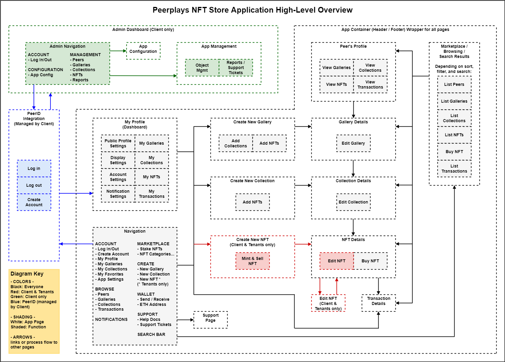
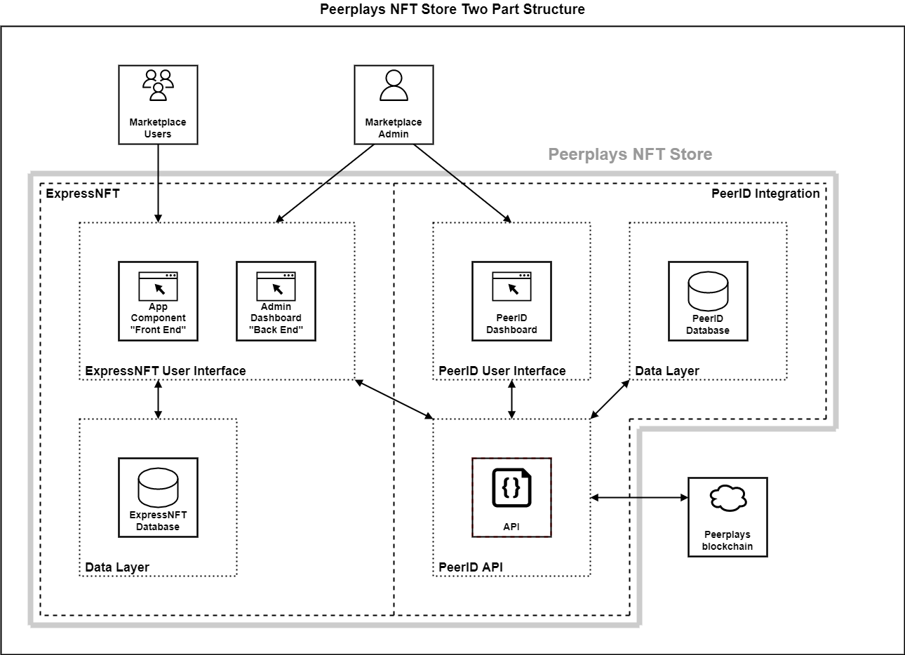

# NFT Store Requirements Specification

## 1. Introduction

This requirements specification (RS) describes the high-level requirements for the initial release of the Peerplays NFT Store. This document is intended to be used by the members of the project team who will implement and verify the correct functioning of the system. Unless otherwise noted, all requirements specified here are committed for the initial release.

### 1.1. Purpose

The purpose of this RS is to cover the high-level outline and resulting requirements of the NFT Store. Lower level requirements documents for each component will be created as functional specifications (FS).

### 1.2. Document Conventions

For the purpose of traceability, the following codes will be used in this RS:

| Code      | Meaning                           |
| --------- | --------------------------------- |
| **OPE-#** | Operating Environment Requirement |
| **CON-#** | Constraint                        |
| **DEP-#** | Dependency                        |
| **APP-#** | App Component Requirement         |
| **ADM-#** | Admin Component Requirement       |
| **PID-#** | PeerID Integration Requirement    |
| **SYS-#** | System Requirement                |

The keyword `shall` indicates a requirement statement.

### 1.3. Project Scope

The NFT Store will permit Peerplays users to:

* create NFT metadata (privileged users)
* mint and sell NFTs (privileged users)
* view, auction, and buy NFTs
* participate in secondary markets (if allowed by NFT owners)
* use the following wallet functions
  * send / receive Peerplays assets
  * deposit / withdraw sidechain assets (BTC, ETH, etc.)
* log in / out of the app through a PeerID integration
* create a public profile
* manage and display NFTs with galleries / collections
* search / browse NFTs, collections, galleries, and peer profiles
* help moderate the app via flagging inappropriate content
* manage the app with an admin dashboard (admin users)
* run reports for app administration (admin users)
* use support tickets or similar for user support


**Peerplays assets** in the context of this RS are any on-chain asset. This includes native Peerplays assets like the PPY token, Peerplays NFTs, and CATs. This also includes assets that have originated off-chain that have been transferred onto the Peerplays chain through the services of Peerplays SONs. These external (sidechain) assets include Peerplays versions of BTC, HIVE, or ETH and even Peerplays versions of NFTs living on the Ethereum chain. The external assets are backed by their counterparts, locked in a Peerplays controlled account on their native chains.


#### **1.3.1 Out of Scope**

Hardware requirements are excluded from this RS and will be covered in another document within the NFT Store project.

The PeerID User Interface is excluded from this RS.

## 2. Overall Description

### 2.1. Product Perspective

The design for the NFT Store represents the flagship NFT offerings of the Peerplays ecosystem. The NFT Store is composed of three components: the admin dashboard, the application, and the PeerID integration.


**ExpressNFT** is a heavily modified version of the `ExpressCart` FOSS software. See Appendix B for links to ExpressCart references to learn more.


The structure of the NFT Store will be based on two parts: ExpressNFT and PeerID. ExpressNFT consists of the UI/UX design elements and interfaces with the Peerplays blockchain through the PeerID API to perform actions on behalf of the user. ExpressNFT is comprised of the admin dashboard, application component, and their related database. PeerID provides an API to interact with the blockchain and handles account creation, on-chain permissions, and user login/logout functions. Currently, both parts are expected to be hosted locally rather than in a distributed fashion. Each part will require a database for storing sessions and all other non-chain based data.

### 2.2. User Classifications

#### **2.2.1. User Types**

User types are how we label the relationship between an entity and the system. The following are the names used in this RS for such entities.

| User types | Description                                                  |
| ---------- | ------------------------------------------------------------ |
| User       | A user is an entity that accesses any part of the NFT Store. |
| Visitor    | A user which is **not** authenticated (not logged in).       |
| Peer       | A user which is authenticated (logged in).                   |

#### **2.2.2. User Roles**

User roles are broad sets of entitlements (permissions) that help facilitate the management of users and their abilities in the system. While the management of user entitlements can be very granular (even atomic), the use of roles satisfies the majority of marketplace use cases and maintains user-friendliness of administering the system at scale.

| User role | Example Entitlements                                                                                                                                                                                                                                                                                                                                                                                                                          | Notes                                                                                                                                                                                                                                                 |
| --------- | --------------------------------------------------------------------------------------------------------------------------------------------------------------------------------------------------------------------------------------------------------------------------------------------------------------------------------------------------------------------------------------------------------------------------------------------- | ----------------------------------------------------------------------------------------------------------------------------------------------------------------------------------------------------------------------------------------------------- |
| Browser   | 
- <strong>view</strong>: profiles, galleries, collections, NFTs, transactions - <strong>create account</strong> - <strong>log in</strong> - <strong>search</strong>
                                                                                                                                                                                                                                                           | Visitors can only have the browser role. It's essentially a "read only" role which allows for new accounts and logging in.                                                                                                                            |
| Enjoyer   | 
- everything browser has, plus... - <strong>bid on / buy NFT</strong> - <strong>create</strong>: profile, galleries, collections - <strong>trade, auction, sell NFT</strong>: in secondary market, if allowed by NFT metadata owner - <strong>use wallet</strong> - <strong>submit support ticket</strong> - <strong>flag content for admin review</strong> <strong></strong>- <strong>apply for tenancy</strong>
 | Peers are automatically granted the enjoyer role (at minimum). This role is the base level that allows for interaction with the system.                                                                                                               |
| Tenant    | 
- everything enjoyer has, plus... - <strong>create</strong>: NFT metadata - <strong>mint NFTs</strong> - <strong>sell / auction NFTs</strong> - <strong>manage NFT metadata</strong>
                                                                                                                                                                                                                                       | Peers can be granted the tenant role if approved by a Peer in the client role. Auto-tenancy can be configured in the admin dashboard which will grant all new Peers the tenant role automatically. This role is used for producing and managing NFTs. |
| Client    | 
- everything tenant has, plus... - <strong>admin dashboard</strong> - <strong>NFT Store configuration</strong> - <strong>NFT Store management</strong> - <strong>NFT Store reports</strong> - <strong>NFT Store support tickets</strong>
                                                                                                                                                                                | Peers can be granted the client role if approved by a Peer in the client role. This role is used to manage the NFT Store as a whole.                                                                                                                  |


**Note**: See section 3.2.3. (ADM-8) for system security requirements.


### 2.3. Operating Environment

**OPE-1:** The NFT Store shall operate correctly with the following web browsers (and platforms):

| Browser       | Platforms                                              |
| ------------- | ------------------------------------------------------ |
| Google Chrome | Ubuntu GNU Linux, Windows 10 / 11, Android, macOS, iOS |
| Edge          | Ubuntu GNU Linux, Windows 10 / 11, Android             |
| Firefox       | Ubuntu GNU Linux, Windows 10 / 11, Android, macOS, iOS |
| Brave         | Ubuntu GNU Linux, Windows 10 / 11, Android, macOS, iOS |
| Safari        | macOS, iOS                                             |

**OPE-2:** The NFT Store shall operate correctly at the minimum resolution of 1334-by-750-pixel resolution at 326 ppi onward (iPhone SE resolution).

**OPE-3:** The NFT Store shall permit user access by desktop computer, Android, iOS, and Windows smartphones and tablets.

### 2.4. Design and Implementation Constraints

**CON-1:** All HTML code shall conform to the HTML 5.0 standard.

**CON-2:** Design elements shall maintain a standard look and feel based on Peerplays brand guidelines.

**CON-3:** The NFT Store UI shall be built with a responsive UI design.

**CON-4**: The NFT Store implementation shall satisfy the regulatory requirements for each jurisdiction for which is it intended to operate within. At a minimum, this includes the European Union (EU), Canada, and the United States (US).

**CON-5**: The NFT Store implementation shall publicly host all necessary legal and/or contractual documents. This may include, but is not limited to: privacy policy, terms of use/service, cookies disclosure, GDPR related forms/material, risk disclosures, etc.

### 2.5. Dependencies and Assumptions

**DEP-1:** The operation of the NFT Store depends on the Peerplays chain being operational.

**DEP-2:** Successful transfers of assets on to and off of the Peerplays chain depends on having an operational sidechain for any given asset.

## 3. Requirements

### 3.1. App Design

#### **3.1.1. App Component**

**Description**

The app component of the NFT Store consists of the overall application's graphical design framework. This framework ties together the UIs of the main application functions into one cohesive UX design. In this way the app component can be described as both the individual UI elements and the wrapper that binds them into what a user would experience as a single app.

The app component is responsible for information display, receiving and validating user input, managing input and output from the ExpressNFT database, and app navigation.

The app component interfaces with the PeerID API. Users never interact directly with the Peerplays blockchain.

**Requirements**


The requirements below are for the overall NFT Store UI which contains the header, body, and footer specific UIs. See the sections relating to each specific app component feature for requirements for their part of the app component.


**APP-1:** The app component shall interface with the PeerID API to handle authentication, sessions, and on-chain permissions.

**APP-2:** The app component shall integrate feature specific UIs to provide a consistent graphical design across all elements.

**APP-3:** The app component shall provide navigation for all integrated features. Navigation must provide access to the following pages:

* NFT STORE HOME PAGE
* ADMIN HOME PAGE (where applicable)
* WALLET
  * Send / Receive
  * Link ETH Address
* NOTIFICATIONS
* SEARCH BAR
* SUPPORT
  * Help Docs
  * Support Tickets
* MARKETPLACE
  * (NFT Categories)
* BROWSE
  * Peer Profiles
  * Galleries
  * Collections
  * NFTs
  * Transactions
* CREATE
  * New Gallery
  * New Collection
  * New NFT
* ACCOUNT
  * Log In / Out
  * Create Account
  * My Profile
  * My Galleries
  * My Collections
  * My Favorites
  * App Settings
  * Apply for Tenancy

**APP-4:** The app component shall allow user input in relevant form fields to perform the functions of the related feature.

**APP-5:** The app component shall perform input field validation and inform the user of acceptable form inputs.

**APP-6:** The app component shall provide the user with help / hint text to explain available options and input fields.

**APP-7:** If an error occurs, The app component shall display meaningful error information to the user and provide them with actions they can take to attempt to resolve the error whenever possible.

#### **3.1.2. Admin Component**

**Description**

The admin component (or admin dashboard) is a "back end" designed for use by the administrators of the NFT Store implementation. Peers which have been granted the client role can use the admin dashboard to change the NFT Store configuration settings, manage the daily operations of the NFT Store, and generate reports.

The admin component is responsible for information display, receiving and validating user input, managing input and output from the ExpressNFT database, and admin navigation.

The admin component interfaces with the PeerID API. Users never interact directly with the Peerplays blockchain.

**Requirements**


The requirements below are for the overall NFT Store UI which contains the header, body, and footer specific UIs. See the sections relating to each specific admin component feature for requirements for their part of the admin component.


**ADM-1:** The admin component shall interface with the PeerID API to handle authentication, sessions, and on-chain permissions.

**ADM-2:** The admin component shall integrate feature specific UIs to provide a consistent graphical design across all elements.

**ADM-3:** The admin component shall provide navigation for all integrated features. Navigation must provide access to the following pages:

* NFT STORE HOME PAGE
* ADMIN HOME PAGE
* ACCOUNT
  * Log In / Out
* CONFIGURATION
* MANAGEMENT
  * Manage Peers
  * Manage Objects (Galleries, Collections, NFTs)
* REPORTS
* SUPPORT

**ADM-4:** The admin component shall allow user input in relevant form fields to perform the functions of the related feature.

**ADM-5:** The admin component shall perform input field validation and inform the user of acceptable form inputs.

**ADM-6:** The admin component shall provide the user with help / hint text to explain available options and input fields.

**ADM-7:** If an error occurs, The admin component shall display meaningful error information to the user and provide them with actions they can take to attempt to resolve the error whenever possible.

### 3.2. Functions

#### **3.2.1. App Component**

**Requirements**

**APP-8:** The app component shall provide the following functions:

* NFT Store home page
* app navigation
* account creation
* authentication
  * log in / out
  * user session management
* notifications
* wallet functions
* peer support
  * help docs
  * support tickets
* account page
  * my profile
  * my galleries
  * my collections
  * my NFTs
  * my favorites
  * my transactions
  * app settings
  * apply for tenancy
* create / edit pages
  * new / edit gallery
  * new / edit collection
  * new / edit NFT
* browse view pages
  * browse peers
  * browse galleries
  * browse collections
  * browse NFTs
  * browse transactions
* marketplace pages
  * NFTs by category
* detail view pages
  * peer profiles
  * gallery details
  * collection details
  * NFT details
  * transaction details
* search functions
  * advanced search
  * search results


Lower level FS documents will contain detailed requirements for the above features.


#### **3.2.2. App Component UI Template**

**Requirements**

**APP-9:** The app component UI template shall provide the following structural features:

* app header (page fragment)
  * branding
  * app navigation
  * notifications
  * wallet status
  * search function
  * log in / out
  * user session management
  * system messages
* app body (page fragment)
  * app content (pages)
* app footer (page fragment)
  * branding
  * marketing content
  * app navigation
  * regulatory / legal content


Lower level FS documents will contain detailed requirements for the above features.


#### **3.2.3. Admin Component**

**Requirements**

**ADM-8:** The admin component shall provide the following functions:

* admin home page
* admin navigation
* authentication
  * log in / out
  * user session management
* notifications
* NFT Store configuration
  * maintenance mode
* NFT Store management
  * search features
  * system messaging
  * manage peers (roles, entitlements, profiles, transactions)
  * manage objects (galleries, collections, NFTs)
* NFT Store security
  * Roles
  * Entitlements
* NFT Store reporting
  * flagged content moderation
  * business intelligence (BI) reporting
  * ad-hoc reports
  * advanced search
* NFT Store support tickets
  * support tickets
  * tenancy applications
* NFT Store regulatory compliance
  * GDPR compliance


Lower level FS documents will contain detailed requirements for the above features.


#### **3.2.4. Admin Component UI Template**

**Requirements**

**ADM-9:** The admin component UI template shall provide the following structural features:

* admin header (page fragment)
  * branding
  * admin navigation
  * notifications
  * log in / out
  * admin session management
  * system messages
* admin body (page fragment)
  * admin content (pages)
* admin footer (page fragment)
  * branding
  * marketing content
  * admin navigation
  * regulatory / legal content


Lower level FS documents will contain detailed requirements for the above features.


#### **3.2.5. PeerID Integration**

**Description**

The PeerID integration will provide authentication, account creation, session, and on-chian permissions services through its available API. PeerID is also the connection to the blockchain, acting on behalf of the NFT Store peers. This way peers can retain control of their private keys but still use them to perform actions on the blockchain such as creating NFT metadata and selling assets.

PeerID has its own user interface that peers can use to manage which blockchain permissions the NFT Store is allowed to use on their behalf. Such permissions can be revoked by the peer at any time. The PeerID UI is out of the scope of this RS and related FS documents, but is described here for clarity.

PeerID will need to be integrated into the NFT Store by using its API. This PeerID integration will be managed by the NFT Store admin users (clients).

**Requirements**

**PID-1:** The PeerID API shall be used as an integration into the NFT Store.

**PID-2:** The PeerID integration shall provide peer account creation on the Peerplays blockchain.

**PID-3:** The PeerID integration shall provide peer account authentication on the Peerplays blockchain.

**PID-4:** The PeerID integration shall provide peer session management.

**PID-5:** The PeerID integration shall provide peer on-chain permissions management on the Peerplays blockchain.

**PID-6:** The PeerID integration shall allow peers to revoke on-chain permissions previously granted to the NFT Store.

**PID-7:** The PeerID integration shall provide an API gateway to transact on the Peerplays blockchain on behalf of NFT Store peers.

#### **3.2.6. System Components**

**Description**

The system components are comprised of the databases, microservices, middleware, serverless functions, and any other supporting software necessary to operate the NFT Store.

**Requirements**

**SYS-1:** The system components shall be secured using the following or similar methods based on system security best practices:

* use non-standard ports
* only allow connections from trusted sources (allow-listed IPs, localhost, vpn)
* only allow TLS or SSL (encrypted) connections
* set up and use service accounts for daily operations
* use read-only service accounts for data reading
* use secure passwords for all database accounts

## 4. Appendix A: Glossary

| Term   | Meaning                    |
| ------ | -------------------------- |
| RS     | Requirements Specification |
| FS     | Functional Specification   |
| NFT(s) | Non-Fungible Token(s)      |
| UI     | User Interface             |
| UX     | User Experience            |
| FOSS   | Free Open Source Software  |

## 5. Appendix B: References

### 5.1. PeerID

* [PeerID GitLab](https://gitlab.com/PBSA/peerid)

### 5.2. ExpressNFT

* [ExpressNFT GitLab](https://gitlab.com/PBSA/dapps/NFT-store)


**Note**: The ExpressNFT repo listed here is named **`NFT Store`** in GitLab. This is different than the naming conventions used in this RS document. The repo linked here contains the admin dashboard, application component, and their required database connection. It does not contain the PeerID software.


### 5.3. ExpressCart

* [ExpressCart Website](https://expresscart.markmoffat.com/)
* [ExpressCart GitHub Repo](https://github.com/mrvautin/expressCart)
* [ExpressCart NPM](https://www.npmjs.com/package/express-cart)
