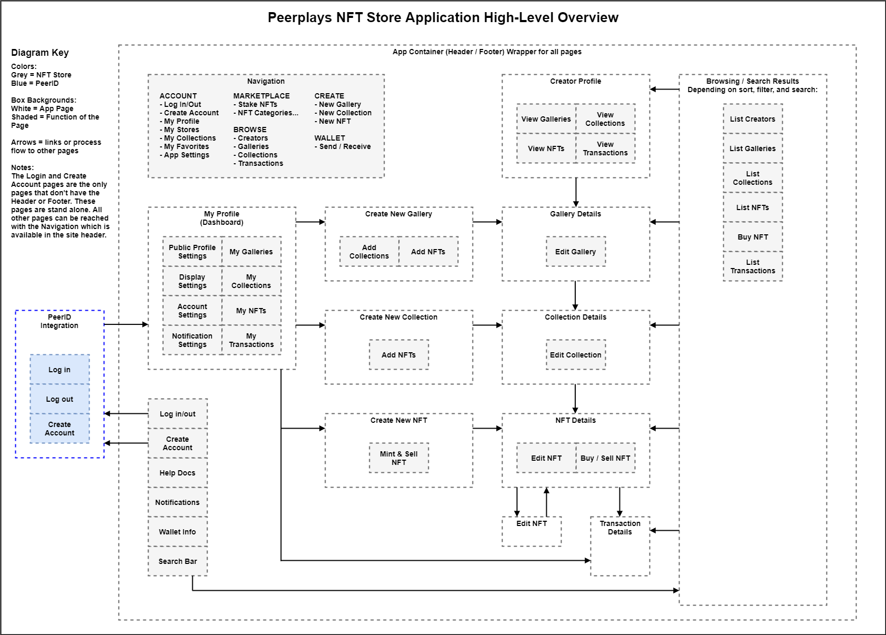
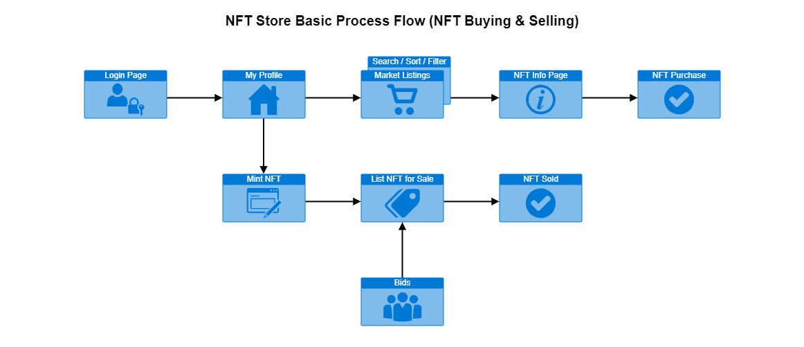
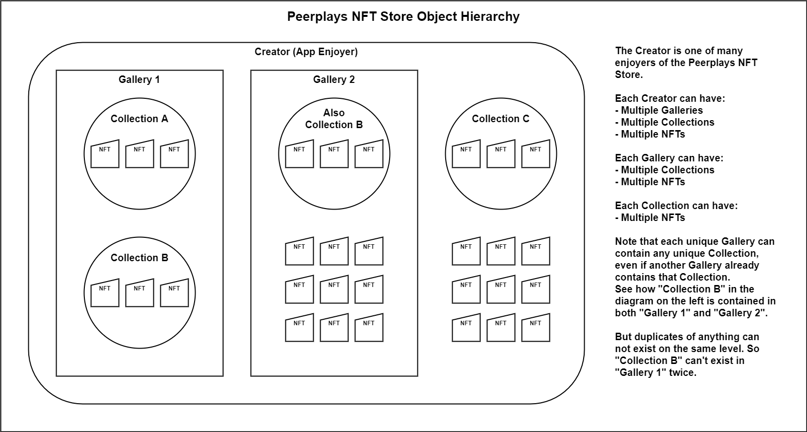

# NFT Store UI HLD

## 1. Introduction

NFTs \(Non-Fungible Tokens\) are quickly becoming an integral part of crypto-economies. With Peerplays aimed to become a foundational blockchain, NFTs need to be a large focus of its offerings. Additionally, Peerplays is uniquely suited to overcome many of the worst obstacles of NFT mass adoption: high transaction costs, slow network speeds, and limited storage capacity.

### 1.1. Project Goal

The overall goal of the Peerplays NFT Store project is to develop a user interface to enable users to easily perform NFT related operations on the Peerplays blockchain.

### 1.2. Purpose

The purpose of this High Level Design \(HLD\) document is to provide a concise and combined overview of the separate, more detailed, Low Level Design and Functional Specification documents to facilitate the sharing of information about this system. To find more information about the complete system design, see the Supporting & Reference Docs &gt; [NFT Store](https://devs.peerplays.tech/supporting-and-reference-docs/nft-development/nft-store) docs in the Peerplays Developer Documentation Portal.

## 2. NFT Store UI Site Map



## 3. High-Level Process Flow Diagram



## 4. NFT Store Object Model



### 4.1. Object Hierarchy

The NFT Store objects could be thought of like this:

* The NFT Store contains many `Creators`.
* A **`Creator`** can own many `Galleries`, `Collections`, and `NFTs`.
* A **`Gallery`** can contain many `Collections` and `NFTs`.
* A **`Collection`** can contain many `NFTs`. 

Figure 3 is a visual representation of the points above. The NFT Store is structured this way to provide a framework that is built with two important concepts at its core:

1. Consistency with industry standards, thereby meeting consumer expectations and instantly providing a familiar experience.
2. Giving Creators the flexibility to make unique, and branded, shopping experiences for their customers.

### 4.2. Creators

Creators are the enjoyers who come to make, buy, sell, and auction NFTs. They need a place to display their NFTs in a way that makes sense to potential buyers. A `creator` object is not yet defined on the blockchain, however, it may be possible to simply use the `account` object that is already defined.

A creator object could be developed like this:

```cpp
class nft_creator_object : public abstract_object<nft_creator_object>
   {
      public:
         static const uint8_t space_id = protocol_ids;
         static const uint8_t type_id  = nft_creator_object_type;
         
         account_id_type                owner;
         std::string                    creator_nickname;
         std::string                    creator_bio;
         std::string                    creator_avatar_image_uri;
         std::string                    creator_banner_image_uri;
         vector<std::string>            creator_social_media_links;
         vector<nft_gallery_id_type>    gallery_ids;
         vector<nft_collection_id_type> collection_ids;
         vector<nft_id_type>            token_ids;
   }
```


App settings like notification and display settings will need to be stored off-chain in local \(in browser\) storage. This is to prevent needless blockchain transactions.


### 4.3. Galleries

Galleries can also be thought of as storefronts, showcases, shops, etc. These are meant to represent the highest level of branding and can provide a very customized, unique, and polished feel for customers. Like entering a store in a shopping mall or plaza, galleries can be used to contain the broadest categories of NFTs that still belong together. A `gallery` object is not yet defined on the blockchain.

A gallery object could be developed like this:

```cpp
class nft_gallery_object : public abstract_object<nft_gallery_object>
   {
      public:
         static const uint8_t space_id = protocol_ids;
         static const uint8_t type_id  = nft_gallery_object_type;
         
         account_id_type     owner;
         // nft_creator_id_type creator; // If using the creator object.
         std::string         gallery_title;
         std::string         gallery_description;
         std::string         gallery_thumbnail_image_uri;
         std::string         gallery_banner_image_uri;
         vector<nft_collection_id_type> collection_ids;
         vector<nft_id_type> token_ids;
   }
```

### 4.4. Collections

Collections are essentially sets of related NFTs. Collections are meant for narrower categories so that the NFTs within are closely related. A `collection` object is not yet defined on the blockchain.

A collection object could be developed like this:

```cpp
class nft_collection_object : public abstract_object<nft_collection_object>
   {
      public:
         static const uint8_t space_id = protocol_ids;
         static const uint8_t type_id  = nft_collection_object_type;
         
         account_id_type     owner;
         // nft_creator_id_type creator; // If using the creator object.
         std::string         collection_title;
         vector<std::string> collection_categories;
         std::string         collection_description;
         std::string         collection_thumbnail_image_uri;
         std::string         collection_banner_image_uri;
         vector<nft_id_type> token_ids;
   }
```

### 4.5. NFTs

NFTs are the discrete units of sale. They may exist as one-offs that don't belong to any collection. More often they can relate closely together as a collection. NFTs are already defined as objects on the blockchain. They allow the creator to set custom permissions and even to edit their metadata.

Additional fields that might be standard in the NFT Store, such as the NFT description, category, and custom key-value pair parameters, could be stored in the `token_uri` field of the minted NFT or the `base_uri` field of the NFT Metadata object already defined on the blockchain. These fields are simple string fields and could accommodate JSON objects with such info.

### 4.6. Some Examples

<table>
  <thead>
    <tr>
      <th style="text-align:left">Example</th>
      <th style="text-align:left">Creator</th>
      <th style="text-align:left">Gallery</th>
      <th style="text-align:left">Collection</th>
      <th style="text-align:left">NFT</th>
    </tr>
  </thead>
  <tbody>
    <tr>
      <td style="text-align:left">
        <p>Clothing Shop in a Mall</p>
        <p>(Real life analogy)</p>
      </td>
      <td style="text-align:left">GAP</td>
      <td style="text-align:left">GAP Store#1125</td>
      <td style="text-align:left">Baby Clothes</td>
      <td style="text-align:left">Baby Boys Faded Jeans size 2T</td>
    </tr>
    <tr>
      <td style="text-align:left">NFT Store</td>
      <td style="text-align:left">Hiltos</td>
      <td style="text-align:left">Collectable Cards</td>
      <td style="text-align:left">Horse Race Card Game</td>
      <td style="text-align:left">Black Beauty first edition</td>
    </tr>
    <tr>
      <td style="text-align:left">NFT Store</td>
      <td style="text-align:left">Hiltos</td>
      <td style="text-align:left">Collectable Cards</td>
      <td style="text-align:left">Blockchain RPG Card Game</td>
      <td style="text-align:left">Longsword +2</td>
    </tr>
    <tr>
      <td style="text-align:left">NFT Store</td>
      <td style="text-align:left">Hiltos</td>
      <td style="text-align:left"></td>
      <td style="text-align:left"></td>
      <td style="text-align:left">My First NFT just for fun!</td>
    </tr>
  </tbody>
</table>

## 5. User Classifications

Several [user personas](https://devs.peerplays.tech/supporting-and-reference-docs/nft-development/nft-store/nft-store-user-stories#3-user-personas) have been identified to facilitate the development of the NFT Store design. While the personas demonstrate how people of various backgrounds may interact with the system, all users within the NFT Store will have the same features available to them. As such, only one type of user exists in the NFT Store, the NFT Store **creator**. They are named "creators" because the purpose of using the NFT store is to create.

## 6. System Security

The NFT Store server-side security will be accomplished through the use of SSL encryption and other server security best practices. Transactions on the blockchain are secured by public-private key encryption.

### 6.1. User Accounts

User accounts are issued and maintained on the blockchain through the [PeerID](https://devs.peerplays.tech/tools-and-integrations/peerid) system integration. Each creator must have a unique account registered in the Peerplays blockchain. Unauthenticated enjoyers can browse the NFT Store, but can't transact with the blockchain and are therefore required to log in to buy/sell/bid, create/edit NFTs, create galleries and collections, or manage their profile.

### 6.2. Passwords

Creator passwords are not stored on the network or PeerID system. Instead, the PeerID system can transact on behalf of the enjoyer using custom permission encrypted public-private key pairs and OAuth access tokens.

## 7. NFT Store Pages & Features

All NFT Store pages consist of:

* the site header
* the page body
* the site footer

The site header contains the Peerplays NFT Store identification using Peerplays branding guidelines. It also contains the main navigation menu, basic account functions, and a search bar.

The page body contains the content of the specific page.

The site footer contains marketing content, social media site links, broader scope of navigation, and links to legal documents such as privacy policy and terms of service, if required.

All object lists \(NFTs, Creators, Transactions, Galleries, Collections, etc.\) will provide the basic functions for various view options:

* List view / grid view / detail view
* sorting / filtering / searching
* pagination / number of items per page

### 7.1. Accessing the NFT Store

#### 7.1.1. The NFT Store Homepage

The NFT Store homepage, or landing page, is the page at the root domain that enjoyers will first visit. This page is used to provide initial site navigation, marketing content, featured content, starting points for enjoyers, and helpful resources. The homepage can include a call to action, search bar, list of available categories, and the login function. The color scheme and graphical design of the homepage \(and **all** NFT store pages\) should align with Peerplays branding guidelines.

#### 7.1.2. Login / Logout

The login function will be managed with the PeerID system integration. Logging out invalidates the OAuth token thereby requiring another log in to access enjoyer data once again. The login / logout function should always be available to the enjoyer in the main nav menu.

#### 7.1.3. New Account Creation

The new account creation function will be managed with the PeerID system integration. Creating a new account should be available to unauthenticated enjoyers from the main nav menu.

### 7.2. User Profiles

#### 7.2.1. Logged In User's Profile

When logged in, an enjoyer can view and edit their own profile and settings.

Public profile fields the enjoyer can edit:

* Publicly displayed username
* Description / Bio \(free text field\)
* Profile pictures \(avatar, banner, background, etc.\)
* Social media profile links

Email notification settings include:

* When an item is sold
* When a bid is received on an item
* When a watched item price changes
* When an auction expires
* When you are outbid in an auction
* When the metadata changes on an owned NFT
* When you buy an item
* To receive the Peerplays newsletter

Display settings include:

* dark mode / light mode
* display language

#### 7.2.2. Other User's Profiles

It's also possible to view the profiles of other enjoyers. This displays their owned NFTs, NFT Collections, NFT Stores, account activity, public profile info, and activity relating to the logged in enjoyer \(if any\).

#### 7.2.3. Transactions List

Transaction lists should be available on the profiles of creators. These will list transaction histories from the perspective of the creator rather than the perspective of the NFT. This should provide the same information available in other transaction lists, like:

* transaction type \(transfer, sold, auctioned, minted\)
* transaction participants
* transaction date, block number
* transaction item \(the NFT\)
* transaction price, if applicable
* transaction currency \(PPY, BTC, USD\)

### 7.3 NFT Pages

#### 7.3.1. Creating a New NFT

Creating an NFT using the CLI Wallet program is a multi-step process. This process gets more complex if applying custom permissions to the NFTs. The most complex workflow consists of the following steps:

1. Create an **Account Role**. This requires...
   1. the name of the new role
   2. any additional metadata you need to store
   3. the list of operations to allow for the new role
   4. the list of accounts that are applied to this role
   5. the timestamp for when this role expires
2. Create an **NFT Metadata** object using the new Account Role. This requires...
   1. the name of the NFTs that will be created with this metadata
   2. the symbol of the NFTs that will be created with this metadata
   3. the URI of the NFTs that will be created with this metadata
   4. the account name of the revenue partner \(who gets royalties on all sales\)
   5. the revenue split amount \(the percentage of the sales that go to the revenue partner\)
   6. if the minted NFTs are transferable
   7. if the minted NFTs are sell-able \(or auction-able\)
   8. the Account Role id from step 1
3. And finally, **create the NFT**. This requires...
   1. the account of the owner of the Metadata from step 2
   2. the Metadata id from step 2
   3. the owner of the minted NFT
   4. the approved account of the minted NFT \(usually the owner\)
   5. the URI of this specific minted NFT

This requires three operations on the blockchain and a lot of information gathering. The workflow steps can be recreated, and the required information simplified, as a single GUI page in the NFT Store. The necessary details can be entered by the creator on one page. Then the workflow can follow the appropriate steps, in order, behind the scenes.

To maintain user-friendliness, the NFT Store UI can combine the concepts of the Account Role, NFT Metadata, and NFT minting operations into a unified "NFT Template" or similar idea. The NFT Store can also provide pre-populated input fields \(drop-downs, radio buttons, etc.\) with valid data to avoid data validation issues, malicious inputs, and messy / accidental inputs. 

#### 7.3.2. Editing an Existing NFT

Editing an NFT or set of NFTs can also be a single page. Similar to creating an NFT, editing an NFT can be presented as editing a unified "NFT Template" or similar. Special care must be given to educating creators as to how editing NFTs can effect people who own minted NFTs from their metadata. This concept is very different from Ethereum based NFTs! For example, Account Roles do expire and may need to be updated later. Also, revenue share and permission settings on the metadata can be changed.

#### 7.3.3. The Creator's Owned NFTs \(My NFTs\)

A list of owned NFTs must be provided for the creator and others to view. This list helps the creator manage their NFTs and others to browse. From this list creators can quickly get basic info about their NFTs, list them for sale/auction, kick off a search for similar NFTs, and mark their favorite NFTs.

Specifically, the list view should offer the following for each item in the list:

* NFT name \(or symbol\)
* the creator's nickname and link to their profile
* collection name  with link to the collection \(if applicable\)
* function to favorite / un-favorite
* a thumbnail image
* link to the details page for this NFT
* a quick menu:
  * List it for sale / auction \(if owned by the logged in creator\)
  * Buy it now / make a bid \(if owned by another creator\)
  * Search for similar NFTs

#### 7.3.4. NFTs On Offer \(for sale / auction\)

The list of NFTs on offer is one of the most important pages of the NFT Store. It displays all the NFTs that are currently on offer \(for sale or for auction\). This page shows all NFTs together as a generic NFT Store gallery. Creators, galleries, and collections become facets of the sort, filter, and search functions of this page. Enjoyers browsing the NFTs on offer page can also use commonly found NFT metadata parameters to customize their search.

#### 7.3.5. NFT Details Page

The NFT Details page will provide all the NFT's information, including but not limited to:

* NFT name
* NFT symbol
* NFT description
* NFT category
* Creator name\(NFT metadata owner\)
  * avatar icon
* Owner name\(NFT instance owner\)
  * avatar icon
* NFT URI
* NFT image, video, music, 3D model, etc. \(the payload\)
* if the NFT has unlock-able data
* stake NFT info \(if applicable\)
  * NFT age and maturity date
  * claimed rewards / unclaimed rewards
  * voting power
  * stake quantity and currency
  * Peerplays community \(if applicable\)
* revenue partner
* revenue split
* if transfers are allowed
* if selling is allowed
* account role owner
* account role name
* account role permissions
* account role accounts
* account role custom metadata
* when the account role expires
* NFT custom metadata \(custom parameters\)
* if the NFT belongs to a collection, and which one
* if the NFT belongs \(directly\) to a gallery, and which one

This page should be equipped to display the intended payload of the NFT. For example, if the NFT contains a video, the video should be displayed in a video player.

In addition to the NFT specific information, pricing and other market information should be available. This should include:

* lifetime transactions of this NFT
  * transaction type \(transfer, sold, auctioned, minted\)
  * transaction participants
  * transaction date, block number
  * transaction price, if applicable
  * transaction currency \(PPY, BTC, USD\)
* Price & volume history
* Estimated value
* Estimated popularity

A variety of functions should also be available on this page as well:

* favorite / un-favorite function
* sharing options
* add to / remove from collection
* add to / remove from gallery
* listings of this NFT for sale
  * with an option to buy
* offers to buy this NFT
* list of other NFTs in the same collection

### 7.4 Collection & Gallery Pages

#### 7.4.1. Creating a New Collection / Gallery

**Collections** can be created to group related NFTs together. A creator can give the collection a title, description, a banner and thumbnail image, and select its appropriate categories. This is like a display you would find in a supermarket for a brand of candy bar. There may be multiple flavors but they are all the same brand and have the same marketing message.

**Galleries** can be created to group similar collections and/or distinct NFTs. A creator can give the gallery its own title, description, banner and thumbnail image. Since galleries are the top level of hierarchy, they don't get categories. They can contain collections and NFTs with multiple different categories. Continuing the supermarket analogy, a gallery would represent a whole department within the store. This is like the whole candy isle with all its different brands and marketing messages.

#### 7.4.2. Editing an Existing Collection / Gallery

Editing collections and galleries is a simple matter of giving creators a form to change their existing information.

NFTs can be added and removed from collections.

NFTs and collections can be added and removed from galleries.

#### 7.4.3. The Creator's Collections / Galleries \(My Collections / My Galleries\)

These pages display the collections or galleries owned by a given creator. Much like the list of NFTs, basic information should be displayed about each item in the list.

* title
* images
* categories \(for collections\)
* owner name
* number of contained NFTs

#### 7.4.4. Collection Details / Gallery Details Page

The collection or gallery details page would be the display of the collection or gallery itself. These pages would display the contents of the given collection or gallery along with their branding. The lists of NFTs provided by these pages offer robust sorting, filtering, and searching, just like the overall NFTs on offer page but specific to the collection or gallery.

## 8. Help and User Support

Links to help documents should be provided from the navigation menu. Pages within the NFT Store can also be available to support NFT Store branding on help documents. Documents should provide help in a variety of formats, such as:

* FAQs
* User Guides on specific topics \(like creating an NFT, buying an NFT, wallet info, etc.\)
* Conceptual guides \(like What is an NFT, Why I should buy an NFT, etc.\)
* Security information \(like known NFT scams and how to avoid them, reporting bad activity, etc.\)
* Video guides \(use universal design theory, like providing captions or transcripts, etc.\)
* P2P help forums or Stack Overflow-like Q&A portals

