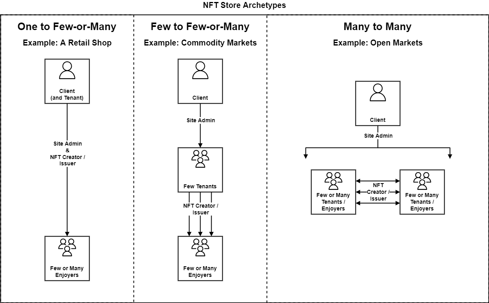

# NFT Store User Stories

## 1. Overview

NFTs are rapidly growing in terms of scope and scale. New kinds of users are finding value in NFTs and their respective markets. We have an opportunity to accommodate users from many perspectives by anticipating their needs and building the solutions into the NFT Store from the beginning. This document is the initial exploration into the typical user personas of NFT marketplaces and their stories.

## 2. Pages & Features

* Landing Page
  * homepage with initial navigation, marketing, search bar
* Account
  * login / logout
  * create new (using email, Facebook, or Discord)
* Profile
  * manage profile / app settings, user help tickets, messages (user's profile)
  * view NFTs owned & on offer, public info (other user's profile)
* My NFTs
  * multiple NFTs owned by user
* Create/Edit NFT
  * new NFT
  * existing NFT
* NFT Details Page
  * single NFT view
* NFT Market List
  * multiple NFTs on offer
* Knowledge base / Support
  * FAQs
  * user support
  * help docs / how-to docs
* Admin Panel
  * dashboard
  * user help tickets
  * messaging system
  * flagged users / content
  * logs

## 3. User Classes

Users of the NFT Store will align with at least one of the following classes. The users can belong to more than one class.

### 3.1. Client

The Client is clearly defined by the entities who install, configure, and operate the white label NFT Store software. Given the nature of this class, very few users will be considered Clients (usually one individual or organization). Clients are essentially the owners of the NFT Store instance they run and are the highest authority. Users in the Client class can be identified by the following characteristics:

* Own and operate private servers hosting the NFT Store software.
* Host an instance of PeerID for user authentication and app permissions.
* Manage the NFT Store instance through the use of an admin dashboard.
* Concerned with the administration of users in the Tenant class.

### 3.2. Tenant

A Tenant is an entity (individual or organization) which is mainly concerned with creating, issuing, and managing NFTs. There can be any number of Tenants in an NFT Store instance. Depending on the needs of the Client, there may be as few as one Tenant. In fact, the Client may also be the only Tenant. Users in the Tenant class can be identified by the following characteristics:

* Create NFTs and issue them to auction, sell, or trade them.
* Manage the NFTs they have created.
* Concerned with the administration of their NFT collections, seller's profile, or store front.

### 3.3. Enjoyer

An Enjoyer (consumer) is interested in bidding on or buying NFTs from Tenants. Enjoyers don't create or issue NFTs. Enjoyers maintain NFTs they have collected and may participate in secondary markets depending on how the Client configured the NFT Store instance. Users in the Enjoyer class can be identified by the following characteristics:

* Bid on NFTs at auction.
* Buy NFTs that are sold by Tenants.
* Participate in secondary markets, if allowed by configuration and/or permissions.
* Maintain a user profile and collections of NFTs they own.

### 3.4. How user classes may determine store architecture

Use classes could represent the hierarchy of system permissions. For example, Clients could have all entitlements in the system (including all Client, Tenant, and Enjoyer entitlements.) Tenants could have both Tenant and Enjoyer entitlements. Enjoyers could only have Enjoyer entitlements. Therefore:

* A Client is also a Tenant and Enjoyer.
* A Tenant is also an Enjoyer.
* An Enjoyer has the minimum level of permissions.

#### The level of tenancy determines how the NFT Store operates

Three distinct archetypes are formed by the level of NFT Store tenancy:

1. **One to Few-or-Many**
2. **Few to Few-or-Many**
3. **Many to Many**

## 4. User Personas

* **NFT Artist**
  * Main Motivation: Creating new NFTs to express themselves creatively.
  * Other Motivation: Making money on the sales of their created NFTs.
  * Class: Tenant
  * Concerns:
    * User friendliness of system.
    * Robust feature-set to enable creativity and expression.
    * High cost of NFT creation.
    * Low demand for their NFTs.
* **Speculative Trader**
  * Main Motivation: Making money by holding, buying and selling other people's NFTs.
  * Class: Enjoyer
  * Concerns:
    * Quality, speed, and accuracy of the system.
    * Availability of pricing information.
    * Robust feature-set for buying and selling for profit.
* **Dapp Developer**
  * Main Motivation: Creating new NFTs to suit their dapp.
  * Other Motivation: Managing their existing NFTs to run their dapp with tight controls.
  * Class: Tenant
  * Concerns:
    * High cost of NFT creation.
    * Robust feature-set to carefully manage NFT permissions.
* **Dapp Enjoyer**
  * Main Motivation: Finding and buying NFTs related to the dapps they use.
  * Other Motivation: Selling NFTs related to the dapps they use.
  * Class: Enjoyer
  * Concerns:
    * Robust feature-set to enable easily finding NFTs related to the dapps they use.
    * Viewing of detailed NFT information.
* **Seller/Buyer of Stake NFTs**
  * Main Motivation: Exiting (or entering) their stake position in Peerplays (Voting Power & Rewards Claiming NFTs).
  * Class: Enjoyer
  * Concerns:
    * Quickly filtering for stake NFTs.
    * Quickly finding staking related information on NFTs.
* **Curious Knowledge Seeker**
  * Main Motivation: Understanding everything the Peerplays NFT Store offers.
  * Other Motivation: Browsing a wide variety of NFTs.
  * Class: Enjoyer
  * Concerns:
    * Finding knowledge on a wide and deep variety of NFT topics.
    * Finding knowledge on the workings of the NFT Store.
* **NFT Collector**
  * Main Motivation: Finding specific NFTs to collect and hold.
  * Class: Enjoyer
  * Concerns:
    * Finding authenticity, rarity, authorship, and transactional information on specific NFTs.
    * Finding information about related NFTs (collections, sets, etc.)
    * Robust feature-set to view a display of their NFTs.
    * Detailed view of single NFTs.
* **NFT Store Admin**
  * Main Motivation: General management of the NFT Store.
  * Other Motivation: User and Content moderation.
  * Class: Client
  * Concerns:
    * Being alerted to and moderating inappropriate content and user behavior.
    * Elevated abilities to edit content, soft/hard ban users, and communicate with users.
    * Need to view/search detailed information, extended metadata, logs, etc. not commonly available to users (perhaps in an admin panel).
    * Tracking of user issues and providing user support.

## 5. User Stories

### 5.1. Story collection 1

As an **NFT Artist**...

| Story # | I want...                                                   | so that...                                                                                       |
| :-----: | ----------------------------------------------------------- | ------------------------------------------------------------------------------------------------ |
|   1.1   | to create an NFT based on my latest artwork                 | I can express my emotions, thoughts, and feelings in a creative way and share it with the world. |
|   1.2   | links to social apps from my NFTs and Store Profile         | I can easily share my creations with my social followers.                                        |
|   1.3   | to make NFTs to sell                                        | I can share and profit from my work.                                                             |
|   1.4   | to create a gallery (or collection) of my NFTs              | I can display all my creations side-by-side as a collection.                                     |
|   1.5   | to ensure my work is not stolen (copied, plagiarized, etc.) | only I can profit from my hard work and creativity.                                              |

### 5.2. Story collection 2

As a **Speculative Trader**...

| Story # | I want...                                                           | so that...                                                 |
| :-----: | ------------------------------------------------------------------- | ---------------------------------------------------------- |
|   2.1   | to find the most popular NFTs                                       | I can learn what to invest in to make money later.         |
|   2.2   | to easily locate price / trade history of an NFT                    | I can see if the NFT is profitable to hold.                |
|   2.3   | to find similar NFTs                                                | I can compare NFTs across categories or collections.       |
|   2.4   | real-time price and trading data                                    | I can make quick decisions and make money in fast markets. |
|   2.5   | data on price movements over time (averages, price changes, volume) | I can trade NFTs like I would trade stocks.                |

### 5.3. Story collection 3

As a **Dapp Developer**...

| Story # | I want...                                                       | so that...                                                                   |
| :-----: | --------------------------------------------------------------- | ---------------------------------------------------------------------------- |
|   3.1   | cheap NFT minting                                               | I can make a dapp with hundreds of virtual items without breaking my budget. |
|   3.2   | full control of my NFTs permissions                             | I can make my dapp work just the way I need it to.                           |
|   3.3   | to make my own marketplace for my dapp's NFTs                   | the users of my dapp won't get confused or distracted by unrelated NFTs.     |
|   3.4   | guides, examples, and use cases about making and editing NFTs   | I can set up my dapp right the first time, and not take forever doing so.    |
|   3.5   | a dashboard to view the distribution of all the NFTs of my dapp | I can track the use / trends of my dapp to spot new opportunities.           |

### 5.4. Story collection 4

As a **Dapp Enjoyer**...

| Story # | I want...                                                       | so that...                                                                  |
| :-----: | --------------------------------------------------------------- | --------------------------------------------------------------------------- |
|   4.1   | to find the NFTs related only to the dapp I use                 | I won't get lost in unrelated NFTs.                                         |
|   4.2   | to sell my NFT (belonging to the dapp I use)                    | I can share in the community of the dapp and make some money.               |
|   4.3   | all the information available about the dapp's NFT virtual item | I can make informed decisions about which items to buy for use in the dapp. |
|   4.4   | detailed and beautiful graphics shown for the NFT               | I can immerse myself in the imagery of the related dapp's themes.           |
|   4.5   | to see other users that own NFTs related to the dapp I use      | I can see how other people use the dapp and which related NFTs they own.    |

### 5.5. Story collection 5

As a **Seller/Buyer of Stake NFTs**...

| Story # | I want...                                                        | so that...                                                             |
| :-----: | ---------------------------------------------------------------- | ---------------------------------------------------------------------- |
|   5.1   | to sell my aged stake NFT to exit my position before it matures  | I can get rid of it now and actually make money.                       |
|   5.2   | to buy an aged stake NFT                                         | I can get some voting power right now even though it'll cost me more.  |
|   5.3   | to see all the stake information (like its age, claimed rewards) | I'll know if it's worth the money to buy it and exactly what I'll get. |
|   5.4   | to see all stake NFTs in one list                                | I can focus on finding the perfect stake NFT.                          |
|   5.5   | to know what my aged stake NFT is worth                          | I'll know if it's better to hold onto it or to sell it.                |

### 5.6. Story collection 6

As a **Curious Knowledge Seeker**...

| Story # | I want...                                            | so that...                                                                             |
| :-----: | ---------------------------------------------------- | -------------------------------------------------------------------------------------- |
|   6.1   | to see all the categories of available NFTs          | I know what I can and can't find in the NFT Store.                                     |
|   6.2   | to quickly figure out what a particular NFT **does** | I know if it's of any use to me.                                                       |
|   6.3   | to understand what a particular NFT **is**           | I know if I want to collect it and/or if it's meaningful to me.                        |
|   6.4   | to browse NFTs with robust sorting and filtering     | I can quickly find what I'm looking for and to satisfy my curiosity.                   |
|   6.5   | suggested related NFTs and/or other user's profiles  | I can wander through related content to find things I didn't know I needed or existed. |

### 5.7. Story collection 7

As an **NFT Collector**...

| Story # | I want...                                                           | so that...                                                 |
| :-----: | ------------------------------------------------------------------- | ---------------------------------------------------------- |
|   7.1   | to see the whole collection or set of the NFTs I collect            | I can compare and see what I have vs. what I still need.   |
|   7.2   | to see who has items in the set that I collect                      | I can follow their profile.                                |
|   7.3   | the ability to set an NFT as a "favorite" or to "watch" it          | I can buy it as soon as it's for sale / auction.           |
|   7.4   | notifications about certain NFTs                                    | I won't miss an opportunity to buy a collectable.          |
|   7.5   | to see information about the authenticity, rarity, authorship, etc. | I know I have an original copy with a certain rarity, etc. |

### 5.8. Story collection 8

As an **NFT Store Admin**...

| Story # | I want...                                                                                               | so that...                                                                                            |
| ------- | ------------------------------------------------------------------------------------------------------- | ----------------------------------------------------------------------------------------------------- |
| 8.1     | An admin panel with a dashboard and pages dedicated to detailed information                             | I have all the information I need displayed in a way that makes my job easy.                          |
| 8.2     | To view all the flagged users and content                                                               | I can moderate user behavior and site content and make good decisions to improve the user experience. |
| 8.3     | To be able to communicate with users in the dapp                                                        | I can notify and work with users to help moderate content and collaborate on resolving issues.        |
| 8.4     | my admin account to be obviously marked as an admin account in comments, messages, and the profile page | users understand I have elevated privileges due to the responsibilities I have to moderate the site.  |
| 8.5     | A ticketing system for user support                                                                     | I can track and resolve user issues.                                                                  |
