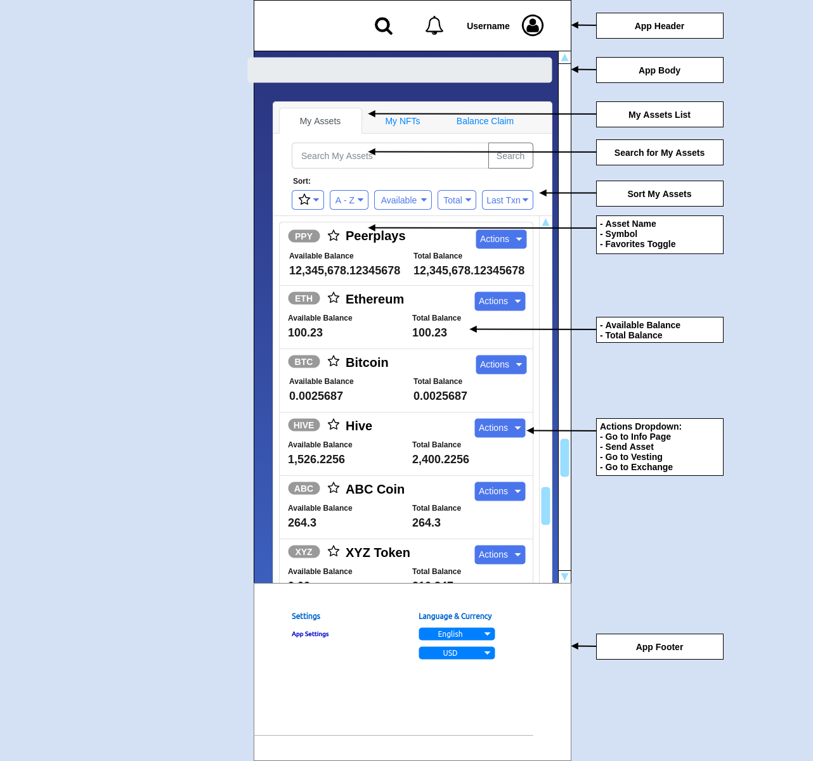

# Asset Info Page and Asset Lists

## 1. Purpose

The purpose of this document is to outline functional specifications for the Peerplays Decentralized Exchange \(Dex\) relating to asset information functions from the user's perspective.

## 2. Scope

The "my assets" list, asset info page, and asset explorer are part of the wallet functionality built into the Dex. This functional spec covers listing a user's owned assets in various locations throughout the Dex app.


**Peerplays assets** in the context of this functional spec are any on-chain asset. This includes native Peerplays assets like the PPY coin, Peerplays NFTs, and CATs. This also includes assets that have originated off-chain that have been transferred onto the Peerplays chain through the services of Peerplays SONs. These external \(sidechain\) assets include Peerplays versions of BTC, HIVE, or ETH and even Peerplays versions of NFTs living on the Ethereum chain. The external assets are backed by their counterparts, locked in a Peerplays controlled account on their native chains.


### 2.1. Components

Specific components and features covered include:

* the My Assets list layouts in the following contexts:
  * wallet dashboard
  * exchange dashboard
  * exchange page
* the Asset Info page layout
  * Asset Info display
  * Asset Explorer \(advanced search and list\)

## 3. Document Conventions

For the purpose of traceability, the following code\(s\) will be used in this functional specification:

| Code | Meaning |
| :--- | :--- |
| **AL-\#** | Asset Listing Requirement |

The keyword `shall` indicates a requirement statement.

## 4. Process Overview

The processes which will be described here:

* user navigation among asset related lists and pages

### 4.1. User Navigation

Assumptions: The user has an account and owns some assets.

_FIG 1. User navigation among asset lists / pages_


The arrows in FIG 1 above correspond to the steps in the process flow that follows.


User navigation:

1. User logs in and initially lands on the wallet dashboard page. The user clicks on an asset in their "My Assets" list to view its details.
2. User lands on the Asset Info page for the selected asset. The user reviews the available exchange markets for this asset and clicks a trading pair to view the exchange page.
3. User lands in the exchange page for the selected trading pair. After some trades, the user decides to look up an asset. User navigates to the Asset Info Page.
4. User searches and finds an asset. User clicks to view the asset details.

## 5. Context

Various pages in the Dex require a list of assets the user owns. Asset lists throughout the Dex can add to the user friendliness of the app by providing quick access to detailed asset information and links to the most important Dex features.

## 6. Design Wireframes

_FIG 2. Asset List on Dashboard Design Wireframe_

_FIG 3. Asset Links on Exchange Page Trading Pairs_

_FIG 4. Asset Information Page Design Wireframe_

## 7. Requirements

Requirements specific to the items outlined in this functional specification are as follows.

### 7.1. My Asset List layout \(Wallet Dashboard\)

the My Assets List layout:

* **AL-1** shall be available to authenticated users on the wallet dashboard.
* **AL-2** shall allow users to search the list of their assets and display the results.
* **AL-3** shall allow users to sort the assets by the following \(ascending and descending\):
  * favorite
  * available balance
  * total balance
  * last transaction \(time\)
  * alphabetically
* **AL-4** shall, for each asset the user owns, display the following information:
  * the asset symbol
  * the asset name
  * the user's available balance
  * the user's total balance
  * an actions dropdown button
* **AL-5** shall allow the user to take the following actions within the actions options:
  * send asset
  * view the asset's info page
  * view the asset's vesting page
  * view the asset's exchange page \(default trading pair\)
* **AL-6** shall allow the user to mark the asset as a favorite.

### 7.2. My Asset List layout \(Exchange Dashboard\)

the My Assets List layout:

* **AL-7** shall be available to authenticated users on the exchange dashboard.
* **AL-8** shall allow users to search the list of their assets and display the results.
* **AL-9** shall allow users to sort the assets by the following \(ascending and descending\):
  * favorite
  * available balance
  * total balance
  * last transaction \(time\)
  * alphabetically
* **AL-10** shall, for each asset the user owns, display the following information:
  * the asset symbol
  * the asset name
  * the user's available balance
  * the user's total balance
  * an actions dropdown button
* **AL-11** shall allow the user to take the following actions within the actions options:
  * view the asset's available trading pairs in the exchange
  * view the asset's info page
  * view the asset's vesting page
  * send asset
* **AL-12** shall allow the user to mark the asset as a favorite.

### 7.3. Asset List layout \(Exchange Page\)

the market selector assets list:

* **AL-13** shall be available to users on the exchange page \(market selector\).
* **AL-14** shall allow users to search the list of available and display the results.
* **AL-15** shall allow users to sort the assets by the following \(ascending and descending\):
  * favorite
  * available balance
  * 24h trade volume
  * alphabetically
* **AL-16** shall, for each available market, display the following information:
  * the asset symbols in the market trade pair
  * the user's available balance \(if user is authenticated\)
  * the 24h trade volume
  * links to the asset info page for each asset
* **AL-17** shall allow the user to select a trading pair to view its market on the exchange page.
* **AL-18** shall allow the user to mark the asset as a favorite.

### 7.4. The Asset Information Page

#### Asset Info Display

the Asset Info Page:

* **AL-19** shall be available for each Peerplays Asset \(except for NFTs which will be covered by the NFT Express-Cart project\).
* **AL-20** shall display the following information for the selected asset:
  * asset name
  * asset symbol
  * asset description \(See note below\)
  * asset url \(See note below\)
  * asset community social links
* may display informative tags. \(See note below\)
  * examples:
  * Core token, CAT, or Sidechain token
  * allows PowerUp
  * provides rewards
  * allows trading, sending
  * etc...
* **AL-21** shall display a buy button for quick link to the exchange.
* **AL-22** shall display rewards info.
* **AL-23** shall display supply info:
  * circulating supply
  * max supply
  * inflation rate


**NOTE on Asset Info Display:** Some information should be provided by PBSA, CAT creator, or Advisor / SMEC.


#### Asset Explorer \(advanced search and list\)

the Search functions on the Asset Info Page:

* **AL-24** shall allow searching for assets by the following methods:
  * search by:
  * asset name
  * asset symbol
  * informative tags \(if available\)
* **AL-25** shall display the information page for the selected asset.

#### Asset Exchange Info

the Asset Info Page exchange info section:

* **AL-26** shall display the following information:
  * all exchange trading pairs for the given asset:
    * the current price
    * the 24h volume
    * a button to show more details about the pair
  * given the selected trading pair:
    * the price chart
    * the current price
    * 24h change
    * 24h low & high
    * 24h volume
    * yesterday's low & high
    * yesterday's open & close
    * yesterday's change
    * yesterday's volume
    * 7 day low & high
    * 30 day low & high
    * 90 day low & high
    * 1 year low & high
    * All time high with date and price
    * All time low with date and price
* **AL-27** shall allow the user to select a trading pair to go to its exchange page.

#### Asset Holders Info

the Asset Info Page holders info section:

* **AL-28** shall display the following information:
  * a ranked list of all users which own the selected asset, including:
    * their username
    * their asset balance
    * their asset powerup balance \(if relevant to the asset\)
* **AL-29** shall allow the user to sort the list by the following:
  * username
  * balance
  * powerup balance
* **AL-30** shall allow the user to click a username in the list to visit the user's profile page.

#### Asset Community Info

* **AL-31** shall display the following information about the selected asset:
  * community discussion
  * CAT governance \(if applicable\)
  * CAT information \(if applicable\)
  * links to community resources


**NOTE on Asset Community Info:** Some information should be provided by PBSA, CAT creator, Advisor / SMEC, or community members.


#### Asset Recent Transactions Info

* **AL-32** shall display the following information about the selected asset:
  * a list of recent transactions which used the asset, including:
    * block number
    * date and time
    * transaction data

### 7.4. The system

* **AL-33** if an error occurs at any point, the system shall display meaningful error information to the user and provide them with actions they can take to attempt to resolve the error.

## 8. Glossary

**CAT:** Community Asset Token - A token created by a community for the purpose of forming a community which takes advantage of the Peerplays ecosystem to manage governance, payments, and other transactions. The community can enact its own role based security to manage its tokens and community parameters. CATs are native to the Peerplays blockchain.

**SMEC:** Subject Matter Expert Committee - A group of delegates which act as the experts for a given topic. They are given the power of decision-making within the area of their expertise.

## 9. Related documents

* [Peerplays Dex Requirements Specification](../requirements-specification.md)

