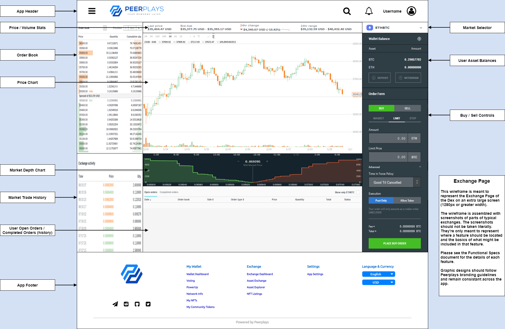

# index

## 1. Purpose

The purpose of this document is to outline functional specifications for the Peerplays Decentralized Exchange \(DEX\) relating to the Exchange page from the user's perspective.

## 2. Scope

The exchange page is the most prominent component of the DEX. The exchange page should include all functions that are dedicated to the exchange of fungible assets as an open market.

### 2.1. Components

Specific components covered include:

* the Exchange Page layout
* the Order Book widget \(market open orders\)
* the Trade History widget \(market trade history\)
* the My Open Orders list \(user open orders\)
* the My Trade History list \(user trade history\)
* the Buy / Sell controls
* the Price Chart
* the Price / Volume statistics
* the Market selector
* the Balances display

### 2.2. Features

In addition to the above, the following features will be covered:

#### 2.2.1. Order Types

* Market Orders
* Limit Orders
  * Limit: Good Til Canceled
  * Limit: Good Til Time
  * Limit: Immediate-or-Cancel
  * Limit: Fill-or-Kill
  * Limit: Maker-or-Cancel
* Stop-Limit Orders

## 3. Document Conventions

For the purpose of traceability, the following code\(s\) will be used in this functional specification:

| Code | Meaning |
| :--- | :--- |
| **EP-\#** | Exchange Page Requirement |

The keyword `shall` indicates a requirement statement.

## 4. Process Overview

The processes which will be described here:

* Placing a Market Order
* Placing a Limit Order
* Placing a Stop-Limit Order

### 4.1. Market Orders

To create a market order:

1. User selects buy or sell.
2. User selects the market tab in the buy / sell controls.
3. User enters the quantity of the asset they wish to buy or sell \(ex. 0.5 BTC\).
4. The system displays to the user how much buying the asset will cost in terms of the selling asset and any applicable fees. \(ex. buying 0.5 BTC, Fee = 0.0025 BTC, Total = 8.185 ETH\)
5. User clicks Place Order to initiate the market order.
6. The system displays a confirmation dialog to the user to ensure accuracy of the field inputs.
7. User accepts the confirmation dialog.
8. The system clears the widget form fields.
9. The system initiates the market order on behalf of the user using the supplied field inputs.
10. The system notifies the user of the successful transaction.
11. The market order may be filled immediately, partially filled, or remain on the order book until filled or canceled.
12. The order will appear in the order book and the open orders list. Any fulfilled trading \(partial and/or full\) will appear in the market and user trade history.
13. The user may cancel any remaining portion of the order from the open orders list.

### 4.2. Limit Orders

To create a limit order:

1. User selects buy or sell.
2. User selects the limit tab in the buy / sell controls.
3. User enters the quantity and limit price of the asset they wish to buy or sell \(ex. BUY Quantity = 5 ETH, Limit Price = 0.05 BTC\).
4. User specifies any advanced options for the limit order \(limit order type\) as follows:
   1. Good Til Canceled - No additional options.
   2. Good Til Time - User selects a "Cancel after" time-frame \(1m, 5m, 15m, 1h, 6h, 1d, 1wk\)
   3. Immediate-or-Cancel - No additional options.
   4. Fill-or-Kill - No additional options.
   5. Maker-or-Cancel - No additional options.
5. The system displays to the user how much buying the asset will cost in terms of the selling asset and any applicable fees. \(ex. buying 5 ETH @ 0.05 BTC each, Fee = 0.00125 BTC, Total = 0.25125 BTC\)
6. User clicks Place Order to initiate the limit order.
7. The system displays a confirmation dialog to the user to ensure accuracy of the field inputs.
8. User accepts the confirmation dialog.
9. The system clears the widget form fields.
10. The system initiates the limit order on behalf of the user using the supplied field inputs.
11. The system notifies the user of the successful transaction.
12. The limit order may be filled immediately, partially filled, canceled, or remain on the order book until filled, canceled, or timed out depending on the advanced options specified. \(See the Glossary for more details on the order types.\)
13. The order will appear in the order book and the open orders list. Any fulfilled trading \(partial and/or full\) will appear in the market and user trade history.
14. The user may cancel any remaining portion of the order from the open orders list.

### 4.3. Stop-Limit Orders

To create a stop-limit order:

1. User selects buy or sell.
2. User selects the stop-limit tab in the buy / sell controls.
3. User enters the stop price of the asset they wish to buy or sell.
4. User enters the quantity and limit price of the asset they wish to buy or sell \(ex. BUY Stop Price = 0.04 BTC, Quantity = 5 ETH, Limit Price = 0.05 BTC\).
5. The system displays to the user how much buying the asset will cost in terms of the selling asset and any applicable fees. \(ex. buying 5 ETH @ 0.05 BTC each, Fee = 0.00125 BTC, Total = 0.25125 BTC\)
6. User clicks Place Order to initiate the stop-limit order.
7. The system displays a confirmation dialog to the user to ensure accuracy of the field inputs.
8. User accepts the confirmation dialog.
9. The system clears the widget form fields.
10. The system initiates the stop-limit order on behalf of the user using the supplied field inputs.
11. The system notifies the user of the successful transaction.
12. The stop-limit order is triggered only when the stop price is crossed. At that point, a limit order will be created.
13. The order will appear in the order book and the open orders list. Any fulfilled trading \(partial and/or full\) will appear in the market and user trade history.
14. The user may cancel any remaining portion of the order from the open orders list.

## 5. Context

The exchange page contains in-depth functions to trade assets in Peerplays. This page should contain everything a user needs to understand the current state of the market to make informed decisions about their trades. The exchange page should provide all the tools a user would use to trade as with any industry standard exchange platform.

A review of modern exchange platforms has helped guide the requirements for the Peerplays DEX exchange page.

## 6. Design Wireframe

_FIG 1. Peerplays DEX Exchange Page Design Wireframe_

## 7. Requirements

Requirements specific to the items outlined in this functional specification are as follows.

### 7.1. Exchange Page layout

The exchange page:

* **EP-1** shall be available for authenticated users within the application menu.
* should be available for unauthenticated users within the application menu.
* **EP-2** shall display widgets and components that have been configured to be active in the exchange page.
* **EP-3** shall use graphic design elements which adhere to Peerplays branding guidelines.
* **EP-4** shall use graphic design elements which remain consistent throughout the app.
* **EP-5** shall allow user input in relevant form fields to perform the functions of the related component.
* **EP-6** shall perform input field validation and inform the user of acceptable form inputs.
* **EP-7** shall provide the user with help/hint text to explain available options and input fields.

### 7.2. Order Book widget \(market open orders\)

The order book widget:

* **EP-8** shall display a real-time aggregation of buy and sell orders of the selected market pair.
* **EP-9** shall display the order prices, amount available for those prices, and total cost for the given amount.
* **EP-10** shall allow the user to select various threshold \(precision\) levels to group orders by price. \(This could be done by number of decimal places\)
* **EP-11** shall display the market spread \(gap in price between ask price and bid price.\)
* **EP-12** shall allow the user to select to view buy orders only, sell orders only, or both buy and sell orders.
* **EP-13** shall allow the user to click a price level to apply that data to the buy / sell controls automatically.
* **EP-14** the design shall indicate to the user buy orders \(green\) vs sell orders \(red\).

### 7.3. Trade History widget \(market trade history\)

The trade history widget:

* **EP-15** shall display all recently executed trades of the selected market pair arranged in a list chronologically from most recent.
  * may be based on time \(past 12 hours\)
  * may be based on number of trades \(past 100 trades\)
* **EP-16** shall be updated in real-time.
* **EP-17** shall include the trade quantity, price, and timestamp.
* **EP-18** the price shall indicate if the trade was a buy \(green\) or a sell \(red\) order by design.
  * the design may indicate a buy or sell with icons, arrows, or other design elements as well as color.

### 7.4. My Open Orders list \(user open orders\)

The my open order list:

* **EP-19** shall include all of the user's currently open orders \(regardless of selected market pair\) with real-time data updates.
  * may allow the user to toggle viewing open orders for the selected market pair vs all their open orders.
* **EP-20** shall include the following data fields:
  * the date and time each order was opened.
  * the market pair
  * if the order is a buy or sell \("side"\)
  * the order type \(limit, stop-limit, etc.\)
  * the order price
  * the total order quantity
  * the filled order quantity
  * the total price
  * the incurred fees
  * the order status \(partially filled, pending if stop-limit stop price hasn't been met, open\)
  * the expiry time \(if applicable\)
* may display a separate list of filled quantities of a partially filled order.
* **EP-21** shall allow the user to sort the list by its data fields.
* **EP-22** shall allow the user to filter the list by its data fields.
* **EP-23** shall allow the user to cancel any open order.
  * may be a button or context menu.

### 7.5. My Trade History list \(user trade history\)

The my trade history list:

* **EP-24** shall include all of the user's completed trade activities \(regardless of selected market pair\) with real-time data updates.
  * may allow the user to toggle viewing their trade history for the selected market pair vs all their trade history.
* **EP-25** shall include the following data fields:
  * the date and time each order was opened.
  * the date and time each order was completed \(filled, partially filled, canceled\).
  * the market pair
  * if the order was a buy or sell \("side"\)
  * the order type \(limit, stop-limit, etc.\)
  * the order price
  * the filled order quantity
  * the total price
  * the incurred fees
  * the order status \(partially filled, filled, canceled by user, expired\)
* may display a separate list of filled quantities of a partially filled order.
* **EP-26** shall allow the user to sort the list by its data fields.
* **EP-27** shall allow the user to filter the list by its data fields.

### 7.6. Buy / Sell controls

The buy / sell controls:

* **EP-28** shall allow the user to select between buy and sell orders.
* **EP-29** shall allow the user to select among market, limit, and stop-limit order types.
* **EP-30** shall allow the user to input the order amount.
* **EP-31** shall, if the order type is a limit order, allow the user to input the limit price and limit order option \(good-til-canceled, good-til-time, fill-or-kill, maker-or-cancel, immediate-or-cancel\).
* **EP-32** shall, if the order type is a stop-limit order, allow the user to input the limit price and stop price.
* **EP-33** shall display to the user the fees of the order given the user inputs.
* **EP-34** shall display to the user the total of the order given the user inputs.
* **EP-35** shall allow the user to create an order if the following criteria is met:
  * the user is logged in.
  * the order form is filled in with validated inputs.
  * the user has an appropriate amount of assets to satisfy the needs of the order.

The system:

* **EP-36** shall create orders on the user's behalf and apply them to the order book.

### 7.7. Price Chart


The price chart in the initial release of the DEX may not be included or have limited features. The requirements in this section represent later releases of the DEX and may be rolled out in staged releases if necessary.


The price chart:

* **EP-37** shall display a real-time chart of price data for the selected market.
* **EP-38** shall include standard price information: open, high, low, close, current, and volume
* **EP-39** shall allow the selection of chart timeframe with standard timeframes: M1, M5, M15, M30, H1, H4, D1, W1, and MN
* may allow the selection of other timeframes, preset or custom.
* **EP-40** shall display time along the x-axis and price along the y-axis.
* **EP-41** shall allow for zooming the chart in and out.
* **EP-42** shall allow for dragging the chart to view historical prices.
* **EP-43** shall allow for viewing individual bar price data. For example, hovering the mouse on a historical price bar for its open, high, low, close, and volume info.
* **EP-44** shall allow the selection of chart type: candlesticks, line chart, or bar chart views.
* **EP-45** shall allow for adding and removing technical indicators:
  * Moving Averages

### 7.8. Price / Volume statistics

The price / volume statistics:

* **EP-46** shall display the last price for the selected market pair.
* **EP-47** shall display the Bid and Ask prices.
* **EP-48** shall display the 24-hour price change in terms of raw value and in percentage.
* **EP-49** shall display the 24-hour price range \(high and low\).
* **EP-50** shall display the values in terms of the currency chosen by the user.

### 7.9. Market selector

The market selector:

* **EP-51** shall display the currently selected market \(trading pair\).
* **EP-52** shall allow the user to select any available market.
* **EP-53** shall allow the user to flip the trading pair. For example, users need to be able to change the selected market from BTC-ETH to ETH-BTC.

The system:

* **EP-54** shall update the page to reflect the selected market. \(Order book, history, asset balances, chart, prices, etc.\)

### 7.10. Balances display

The balances display:

* **EP-55** shall display the user's asset balances available for trading relating to the currently selected market.

The system:

* **EP-56** shall update the available balances in the display when orders are created / filled.

### 7.11. The system

* **EP-57** if an error occurs at any point, the system shall display meaningful error information to the user and provide them with actions they can take to attempt to resolve the error.

## 8. Glossary

**Market order:** Orders that are meant to execute as quickly as possible at the current market price. If you’re buying an asset, a market order will execute at whatever price the seller is asking. If you’re selling, a market order will execute at whatever the buyer is bidding. The biggest drawback of the market order is that you can’t specify the price of the trade. Market orders cannot be canceled because they are filled immediately. Market orders may be partially filled at several prices.

**Limit order:** An order that sets the maximum or minimum price at which you are willing to buy or sell. The biggest advantage of the limit order is that you get to name your price, and if the asset reaches that price, the order will be filled.

**Good Til Canceled:** A type of Limit order \(the default limit order.\) A Good Til Canceled Limit order will stay on the Order Book until it's 100% filled or canceled. Even if the order has partial fills, it will stay on the books.

**Good Til Time:** A type of Limit order. A Good Til Time Limit order will stay on the Order Book until it's 100% filled, canceled, or its specified duration has expired. Even if the order has partial fills, it will stay on the books.

**Immediate-or-Cancel:** A type of Limit order. This order will be placed and if it is not immediately filled, it will automatically be canceled and removed from the order book. Note that it may be partially filled and then the unfilled portion is canceled.

**Fill-or-Kill:** A type of Limit order. This order will only complete if the entire amount can be matched. Partial matches are not filled with this order type and will not execute.

**Maker-or-Cancel:** A type of Limit order. It's the opposite of a Fill-or-Kill. This order will only be placed in the order book if the entire amount is _not_ immediately filled. If any portion of this order can be immediately filled, it will be canceled.

**Stop-Limit Order:** Stop-Limit orders allow you to buy or sell when the price reaches a specified value, known as the stop price. This order type helps traders protect profits, limit losses, and initiate new positions. A Stop-Limit order will automatically post a limit order at the limit price when the stop price is triggered. Note that the stop order will be triggered instantly if the stop price specified was already met.

## 9. Related documents

* [Peerplays DEX Requirements Specification](../requirements-specification.md)

## 10. Exchange Platforms Reference

The following platforms have been reviewed to help guide the requirements of the Peerplays DEX exchange page offerings.

* [TradingView](https://www.tradingview.com/)
* [p2pb2b.io](https://p2pb2b.io)
* [Gemini](https://www.gemini.com/)
* [Coinbase Pro](https://pro.coinbase.com)

