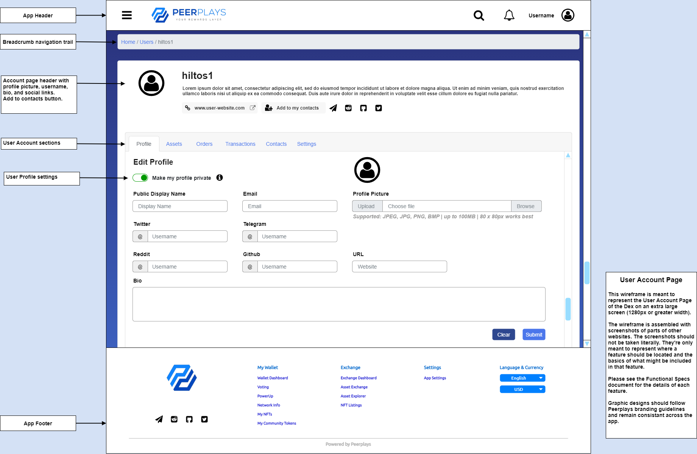
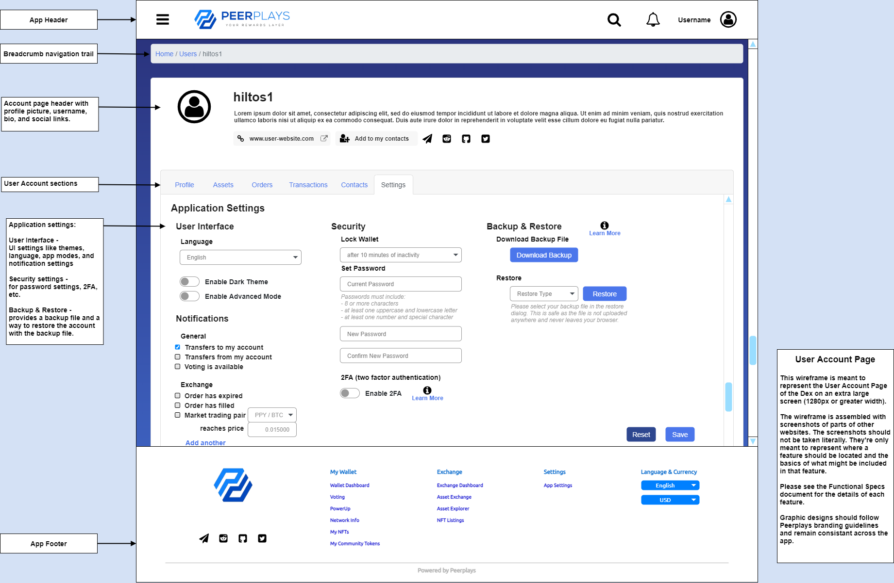

# User Account Page

## 1. Purpose

The purpose of this document is to outline functional specifications for the Peerplays Decentralized Exchange \(DEX\) relating to the user account page from the user's perspective.

## 2. Scope

The user account page is part of the wallet functionality built into the DEX. This functional spec covers the features and layout of the user account page.

### 2.1. Components

Specific components and features covered include:

* the user account page layout
  * user profile
  * assets list
  * exchange orders info
  * user transactions list
  * user contacts
  * app settings

## 3. Document Conventions

For the purpose of traceability, the following code\(s\) will be used in this functional specification:

| Code | Meaning |
| :--- | :--- |
| **UA-\#** | User Account Page Requirement |
| **AL-\#** | Asset Listing Requirement |
| **EP-\#** | Exchange Page Requirement |
| **VP-\#** | Voting Page Requirement |

The keyword `shall` indicates a requirement statement.


This functional spec focuses on UA requirements. AL, EP, and VP requirements are for reference.


## 4. Context

The DEX must provide a central location for user account management. This is where users can edit their profile, view their orders and transactions, and change the app settings.

Users should also be able to keep track of other users that they frequently interact with. For the purpose of creating a user friendly experience, a contacts list feature would allow a user to quickly find the profiles of people they often send/receive tokens from or engage in discussions with. This would give them easy access to social links and transaction histories of the users that matter most to them.

## 5. Design Wire-frames

_FIG 1. User Account Page Design Wireframe - Profile_

_FIG 2. User Account Page Design Wireframe - App Settings_

## 6. Requirements

Requirements specific to the items outlined in this functional specification are as follows.


**Assumptions:** The user visiting the user account settings is authenticated.


### 6.1. User Account Page layout

the User Account Page layout:

* **UA-1** shall be available to authenticated users from the main navigation.
* **UA-2** shall display a user's display name.
* **UA-3** shall display an "Add to my contacts" button.
* **UA-4** if the profile is set to public, shall display a user's profile picture, email, social link icons, personal website url, and bio \(all where available\).
* **UA-5** if the profile belongs to the authenticated user, shall display the following sections to facilitate user account settings:
  * profile settings
  * user assets
  * user orders
  * user transactions
  * user contacts
  * application settings

### 6.2. User Profile

the user profile settings:

* **UA-6** shall allow making the user's profile private \(Default = private\).
* **UA-7** shall allow the user to edit their profile with the following settings:
  * Public display name \(can be different from username\)
  * email
  * profile picture
  * bio \(short description\)
  * social app handles \(Twitter, Telegram, Reddit, Github, etc...\)
  * personal website url
* **UA-8** shall allow the user to clear the form.
* **UA-9** shall allow the user to save the form.

### 6.3. User Assets List

the user assets list:

* **UA-10** shall display all assets the user owns.
* **UA-11** shall display separate lists for tokens and NFTs.

for token assets:

* **See requirements AL-2 through AL-6:** [DEX Functional Specs - Asset Info Page and Asset Lists](asset-info-page-and-asset-lists.md)


The token assets list in the user account page should also follow the requirements AL-2 through AL-6 as per the Asset Info Page and Asset Lists functional spec document.


for NFTs:

* **UA-11** shall allow users to search the list of their NFTs and display the results.
* **UA-12** shall allow users to sort the NFTs by the following \(ascending and descending\):
  * favorite
  * available balance
  * total balance
  * last transaction \(time\)
  * alphabetically
* **UA-13** shall, for each NFT the user owns, display the following information:
  * the NFT name
  * the user's available balance
  * the user's total balance
  * an actions dropdown button
* **UA-14** shall allow the user to take the following actions within the actions options:
  * send NFT
  * view the NFT's info page \(link to Express Cart NFT market\)
  * view the NFT's vesting page \(if a PowerUp NFT\)
  * view the NFT's market page \(link to Express Cart NFT market\)
* **UA-15** shall allow the user to mark the NFT as a favorite.

### 6.4. User Exchange Orders Info

the user exchange orders info:

* **UA-16** shall display a paginated list of the user's currently open exchange orders.
* **UA-17** shall display a paginated list of the user's exchange order history.
* **See requirements EP-19 through EP-27:** [DEX Functional Specs - Exchange Page](exchange-page.md)
* **UA-18** shall allow the user to select the number of items to view per page.
* **UA-19** shall allow the user to export the list to their local machine.
  * may be sorted and/or filtered by transaction metadata.
  * may be pdf, csv, or similar format.


The open and historical orders lists in the user account page should also follow the requirements EP-19 through EP-27 as per the Exchange Page functional spec document.


### 6.5. User Transaction List

the user transaction list:

* **UA-20** shall display a paginated and chronological \(newest first\) list of transactions relevant to the user's account.
* **UA-21** shall allow the user to select the number of transactions to view per page.
* **UA-22** shall allow the user to export the list to their local machine.
  * may be sorted and/or filtered by transaction metadata.
  * may be pdf, csv, or similar format.

### 6.6. User Contacts

the user contacts info:

* **UA-23** shall display a list of the user's contacts.
* **UA-24** each contact in the list shall link to the specified user profile.
* **UA-25** shall allow the user to search the list of contacts by name.
* **UA-26** shall display an actions button for each contact in the list with the following actions:
  * send to contact
  * visit profile
  * remove contact

### 6.7. App Settings

the app settings:

* **UA-27** shall display all application settings options, including the following:
  * User Interface settings
  * Notifications settings
  * Security settings
  * Backup & Restore options

User Interface settings:

* **UA-28** shall allow the selection of language the UI uses.
* **UA-29** shall allow the option to enable a dark theme.
* **UA-30** shall allow the option to enable an advanced mode.

Notifications settings:

* **UA-31** shall allow the user to toggle each notification on and off.
* **UA-32** shall allow the user to toggle the voting pop-up feature. \(**see VP-57 through VP-63:** [DEX Functional Specs - Voting Page](https://app.gitbook.com/@peerplays/s/community-project-docs/peerplays-dex/functional-specs/voting-page)\)
* may allow the user to configure exchange notifications based on trading pair and price.


The requirements VP-57 through VP-63 as per the Voting Page functional spec document are provided for context regarding UA-32.


Security settings:

* **UA-33** shall allow the user to set a timer to automatically lock the app after a selected number of minutes of inactivity.
* **UA-34** shall allow the user to change their password.
* may allow the user to enable 2FA for the app.

Backup & Restore options:

* **UA-35** shall provide the user the ability to download a backup file for their account.
* **UA-36** shall allow the user to restore their account in the app using the following methods:
  * using the backup file provided by the backup feature.
  * importing the user's private key.
  * using a local wallet brainkey.

### 6.8. The system

* **UA-37** if an error occurs at any point, the system shall display meaningful error information to the user and provide them with actions they can take to attempt to resolve the error.

## 7. Related documents

Parent Document

* [Peerplays DEX Requirements Specification](../requirements-specification.md)

Sibling Documents \(referenced in this document\)

* [DEX Functional Specs - Asset Info Page and Asset Lists](asset-info-page-and-asset-lists.md)
* [DEX Functional Specs - Exchange Page](exchange-page.md)
* [DEX Functional Specs - Voting Page](https://app.gitbook.com/@peerplays/s/community-project-docs/peerplays-dex/functional-specs/voting-page)

