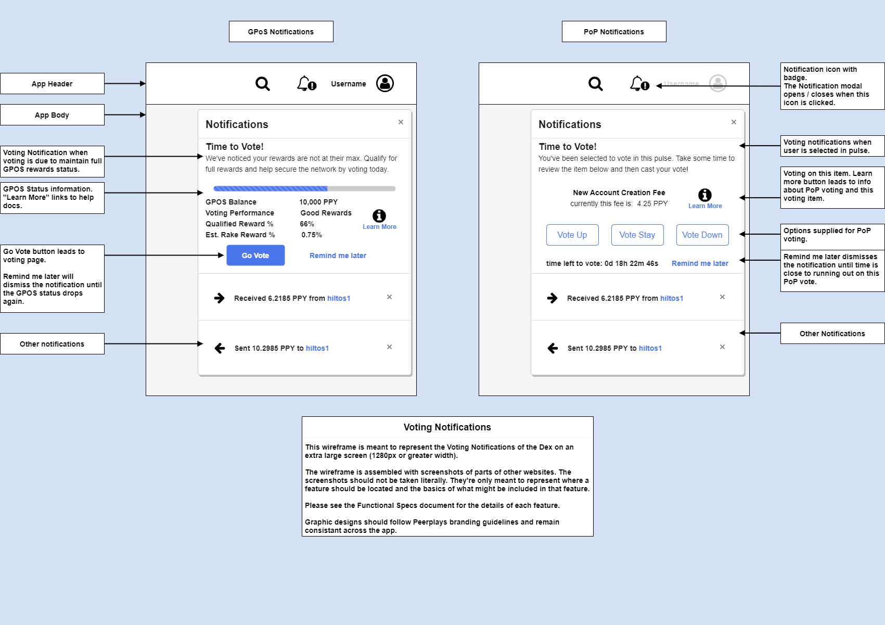

# Voting Page

## 1. Purpose

The purpose of this document is to outline functional specifications for the Peerplays Decentralized Exchange \(DEX\) relating to the voting page from the user's perspective.

## 2. Scope

The voting page is part of the wallet functionality built into the DEX. Voting is critical for blockchain governance. This functional spec covers voting for node operators, advisors, and items that should be voted on for consensus. This document will cover voting for current \(GPoS\) and potential future \(PoP\) consensus mechanisms.


Proof of Pulse consensus mechanics have not been fully developed at this time. The sections of this functional spec that detail PoP related requirements are included for potential future DEX releases. They are not expected to be included in the initial release.


### 2.1. Components

Specific components and features covered include:

* the Voting Page layout
* GPoS:
  * the Voting Directions / Explanation
  * Voting by Proxy
  * the Operator / Advisor Voting
  * Voting Notifications
* PoP:
  * the Voting Directions / Explanation
  * the Voting Statistics
  * the PoP Voting
  * the Quick Voting Pop-up
  * Voting Notifications

## 3. Document Conventions

For the purpose of traceability, the following code\(s\) will be used in this functional specification:

| Code | Meaning |
| :--- | :--- |
| **VP-\#** | Voting Page Requirement |

The keyword `shall` indicates a requirement statement.

## 4. Process Overview

The processes which will be described here:

* GPoS Voting
* PoP Voting

### 4.1. GPoS Voting

Assumptions: The user has Powered Up tokens which grant voting power.

To vote for node operators:

1. User navigates to the voting page.
2. If needed, the user reads the voting directions.
3. User selects the tab which corresponds with what to vote for: Witnesses, SONs, Advisors.
4. User reviews the information on each candidate.
5. User selects which candidates to vote for, which accumulate in a list.
6. When ready, the user confirms their selection.
7. The system acknowledges to the user that the votes have been received and applied.

### 4.2. PoP Voting

Assumptions: The user has Powered Up tokens which grant voting power.

To vote on a randomly assigned item:

1. User navigates to the voting page.
2. If needed, the user reads the voting directions.
3. User reviews the information for their randomly assigned item.
4. User selects their vote: Vote Up, Vote Down, Vote Unchanged.
5. When ready, the user confirms their selection.
6. The system acknowledges to the user that the vote has been received and applied.

## 5. Context

The voting page provides a user friendly and informative way to vote on blockchain issues. Voting must be simple to increase voter participation.

## 6. Design Wireframes

_FIG 1. Peerplays DEX Voting Notifications Design Wireframe_

_FIG 2. Peerplays DEX Voting Page Design Wireframe: GPoS_

_FIG 3. Peerplays DEX Voting Page Design Wireframe: PoP_

_FIG 4. Proof of Pulse Voting Pop-up_

## 7. Requirements

Requirements specific to the items outlined in this functional specification are as follows.

### 7.1. Voting Page layout

* **VP-1** shall be available for authenticated users within the application menu.
* should be available for unauthenticated users within the application menu for the purpose of viewing voting statistics and learning about voting.
* **VP-2** shall display widgets and components that have been configured to be active in the voting page.
* **VP-3** shall use graphic design elements which adhere to Peerplays branding guidelines.
* **VP-4** shall use graphic design elements which remain consistent throughout the app.
* **VP-5** shall allow user input in relevant form fields to perform the functions of the related component.
* **VP-6** shall perform input field validation and inform the user of acceptable form inputs.
* **VP-7** shall provide the user with help/hint text to explain available options and input fields.
* **VP-8** shall provide on-page navigation for viewing the following:
  * Statistics
  * How-To
  * FAQ

the voting notifications:

* **VP-9** shall not notify users if they have notifications turned off.

### 7.2. GPoS Specific Components and Features

the voting page:

* **VP-10** shall provide on-page navigation for voting for the following:
  * Proxy
  * Witnesses
  * SONs
  * Advisors

voting by proxy:

* **VP-11** shall display accounts that meet the following two points so that voters may easily select proxies:
  * a\) have recently voted \(i.e. are up-to-date on their GPoS rewards\)
  * b\) have other users already using them as a proxy for voting
* **VP-12** shall allow users to search for user accounts to add to the list of accounts available as proxies for votes.
* **VP-13** shall allow users to select an account to proxy vote.
* **VP-14** shall allow users to filter and/or sort lists of proxies by relevant key performance indicators \(KPIs\).
  * how often they vote
  * who they vote for
* **VP-15** shall allow users to publish their changes to the blockchain.

voting for witnesses, sons, and advisors:

* **VP-16** shall allow users to search for user accounts to add to the list of accounts available as candidates for votes.
* **VP-17** shall list all existing Witness, SON, and Advisor accounts as candidates for their respective votes.
* **VP-18** shall allow users to filter and/or sort lists of candidates by relevant key performance indicators \(KPIs\).
* **VP-19** shall allow users to add and remove candidates to their list of approved candidates.
* **VP-20** shall allow users to reset the changes they made to their approved candidates list.
* **VP-21** shall allow users to publish their changes to the blockchain.

The voting statistics section:

* should display graphical representations of statistics relevant to voting:
  * voter turnout \(on a rolling monthly basis\)
  * number of proxy votes / witness votes / son votes / advisor votes
  * pie charts of the share of votes for top witnesses, sons, advisors
  * list of top accounts providing proxy votes

the How-To section:

* **VP-22** shall display a brief How-To guide to voting using GPoS mechanics.

the FAQ section:

* **VP-23** shall display a list of frequently asked questions about GPoS voting and their answers.

the voting notifications:

* **VP-24** shall notify users when it's time to vote when their GPoS voting performance drops.
* **VP-25** shall notify users, if they have selected the "remind me later" option, when their GPoS voting performance drops again.
* **VP-26** shall notify users once per month if they have voting power but have not voted.
* **VP-27** shall display the following user information:
  * GPOS Balance
  * Voting Performance
  * Qualified Reward %
  * Estimated Rake Reward %
* **VP-28** shall display a link for the user to learn more which leads to GPOS voting help docs.
* **VP-29** shall allow the user to dismiss the notification with the remind me later option.
* **VP-30** shall display a button which sends the user to the voting page.

### 7.3. PoP Specific Components and Features

voting on the randomly selected PoP votable item:

* **VP-31** shall provide on-page navigation for viewing the following:
  * Discussion
  * Reports
  * Details \(about the voting item that is currently selected\)
* **VP-32** shall allow users to view the current active vote for their account.
* **VP-33** shall allow users to view the current value for the item they're voting on.
* **VP-34** shall allow users to view the time left for their active vote.
* **VP-35** shall allow users to vote on their active vote item:
  * Vote Up
  * Vote Stay
  * Vote Down
* **VP-36** shall allow users to confirm their vote before it's published to the blockchain.

The voting statistics section:

* **VP-37** shall allow users to select the voting item to view the statistics for.
* **VP-38** shall display graphical representations of statistics relevant to voting based on the user's selection of voting item:
  * voter turnout \(on a rolling monthly basis\)
  * pie chart of number of votes up / stay / down
  * moving average line chart of votes up / stay / down
  * list of top voters
  * display of change in value of item voted for over time

the How-To section:

* **VP-39** shall display a brief How-To guide to voting using PoP mechanics.

the FAQ section:

* **VP-40** shall display a list of frequently asked questions about PoP voting and their answers.

the discussion, reports, and details sections:

* **VP-41** shall allow the user to select a voting item to review the pages associated with that item.

the discussion section:

* **VP-42** shall display a public discussion forum with its topic relating to the selected voting item.
* **VP-43** shall allow authenticated users to post messages in a public discussion forum.
* **VP-44** shall allow users who have commented to delete their own comments.
* **VP-45** shall allow self-moderation by authenticated users.
  * in a fashion similar to stackoverflow, users can up/down vote discussion post comments.
  * down voted comments become hidden.
* **VP-46** shall break the comments into pages with pagination.
* **VP-47** shall allow sorting comments by up votes or time-series.
* **VP-48** shall display which users have participated in voting on this item in the current pulse.

the reports section:

* **VP-49** shall display reports on the selected item.
  * voting outcomes
  * changes in the value of the item
  * the effect the voting outcomes have on the value of the item

the details section:

* **VP-50** shall display a detailed explanation of the selected voting item.
  * what exactly is the voting item \(ex. what transactions will trigger a fee, etc.\)
  * how changes in the value of the item effect the operation of the blockchain.
  * if and how the item is related to other voting items.
  * how the outcomes on votes will effect the value of the item.
  * examples of all of the above.

the voting notifications:

* **VP-51** shall notify users when it's time to vote when they are selected in a pulse.
* **VP-52** shall notify users, if they have selected the "remind me later" option, when their time left to vote runs low.
* **VP-53** shall display the following information:
  * the item they're selected to vote on
  * the current value of the voting item
  * the Vote Up / Vote Stay / Vote Down buttons \(for quick voting\)
  * the time the user has left to cast their vote in the current pulse
* **VP-54** shall display a link for the user to learn more which leads to the details on the voting page.
* **VP-55** shall allow the user to dismiss the notification with the remind me later option.
* **VP-56** if quick voting, shall allow the user to confirm their vote before publishing to the blockchain.

the voting pop-up:

* **VP-57** shall display to users when they are selected in a pulse.
* **VP-58** shall not display to users when they are not selected in a pulse or have already voted in the current pulse.
* **VP-59** shall not display to users when they have selected the setting to prevent the voting pop-up.
* **VP-60** shall display the following information:
  * the item they're selected to vote on
  * the current value of the voting item
  * the time the user has left to cast their vote in the current pulse
* **VP-61** shall display a link for the user to learn more which leads to the details on the voting page.
* **VP-62** shall allow the user to minimize the pop-up with a minimize button.
* **VP-63** shall display a button which sends the user to the voting page.

### 7.4. The system

* **VP-64** if an error occurs at any point, the system shall display meaningful error information to the user and provide them with actions they can take to attempt to resolve the error.

## 8. Glossary

**GPoS Consensus Mechanism:** Gamified Proof of Stake - This form of consensus requires users to stake PPY. The staked, or PoweredUp, PPY grants users voting power based on their quantity of staked PPY. It then rewards voters by giving them a percentage of their weighted stake in the transaction fees collected. Voting more recently will give a higher percentage. This percentage diminishes over time until the user votes again. With this mechanism, users can only vote for node operators.

**PoP Consensus Mechanism:** Proof of Pulse - This form of consensus requires users to stake PPY. The staked, or PoweredUp, PPY grants users voting power based on their quantity of staked PPY and duration the PPY was staked. No rewards are distributed for voting in this model. Voters are chosen at random on regular intervals. These voters are assigned a random item to vote on. Items may include node operators, fee levels, blockchain parameters, and other items. Voters can vote up, down, or unchanged. When the votes are tallied, each item is scheduled to change incrementally based on the results of the vote.

## 9. Related documents

* [Peerplays DEX Requirements Specification](../requirements-specification.md)

