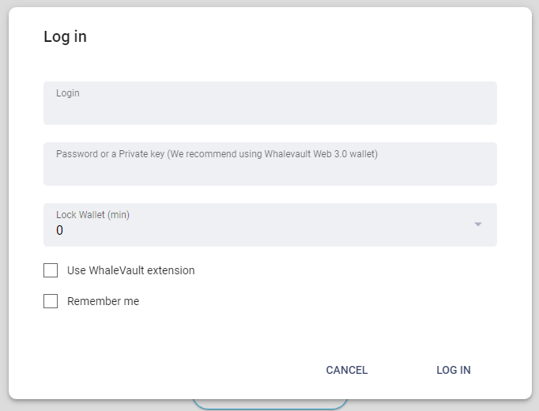
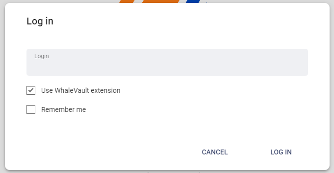

# NEX-FS11 WhaleVault Integration

The Peerplays NEX application functional requirements specification for the WhaleVault integration.

## 1. Purpose

The purpose of this functional specification (FS) document is to detail functional requirements for the Peerplays NEX application (the “app”) relating to the WhaleVault integration from a business and user perspective.

## 2. Document Tracking

### 2.1. Parent Document

This document is a child document of the NEX Requirements Specification (NEX-RS).

### 2.2. Categorization

This document relates to the following tags.

`App Component`

`Integration`

## 3. Scope

This FS will describe the requirements and basic design for the app’s WhaleVault integration.

### 3.1. Components

Specific components and features covered in this FS include:

* login page layout
* WhaleVault integration

## 4. Document Conventions

For the purpose of traceability, the following code(s) will be used in this functional specification:

| Code       | Meaning                                      |
| ---------- | -------------------------------------------- |
| NEX-FS11-# | NEX App Requirement - WhaleVault Integration |

**The keyword `shall` indicates a requirement statement.**

The keywords `may`, `could`, and `should` are not requirements but rather indicate items related to requirements that are worthy of consideration.

## 5. Context

WhaleVault is a browser extension which allows for websites to transact with Graphene-based blockchains (such as Peerplays) without exposing a users password or private keys. Integrating WhaleVault into the app will allow users to have a streamlined login experience as well as the confidence in knowing their credentials are safe.

## 6. Design Wire-frames

The wire-frames listed below are meant to represent the app’s WhaleVault integration in various states. These are provided to assist in understanding of what features may look like or their potential use. Final designs may be vastly different from these images.

<figure><figcaption>
Figure 1. Login Page with WhaleVault
</figcaption></figure>

<figure><figcaption>
Figure 2. WhaleVault selected on login page.
</figcaption></figure>

## 7. Requirements

Requirements specific to the items listed in this FS are as follows.

### 7.1. Login Page Layout

**NOTE**: The following requirements are in addition to the requirements listed in NEX-FS02 (Login and Account Creation).

The login page layout:

**NEX-FS11-1:** shall, if the WhaleVault extension is installed in the user’s browser, provide user input controls which allow the user to choose to login with WhaleVault.

**NEX-FS11-2:** shall, if the WhaleVault extension is not installed in the user’s browser or not selected by the user, recommend that the user install or use WhaleVault for logging in.

**NEX-FS11-3:** shall, if WhaleVault is selected by the user, prompt the user for their username.

**NEX-FS11-4:** shall, while logging in, perform the following input control validation:

* Check if WhaleVault is installed and available
* Check if the username exists on the blockchain
* Check if the username exists in WhaleVault

### 7.2. WhaleVault Integration

**NEX-FS11-5:** shall check if the WhaleVault extension is installed and available in the user’s browser.

**NEX-FS11-6:** shall, while logging in, use the WhaleVault workflows to provide authentication service for the app.

**NEX-FS11-7:** shall, if logged in through WhaleVault, use the WhaleVault workflows to provide reauthentication for secured transactional operations throughout the app. This includes any operations which require the active or owner key like placing buy / sell orders, asset transfers, and account updates.

## 8. Appendix A: Glossary

| Term | Meaning                    |
| ---- | -------------------------- |
| RS   | Requirements Specification |
| FS   | Functional Specification   |
| UI   | User Interface             |
