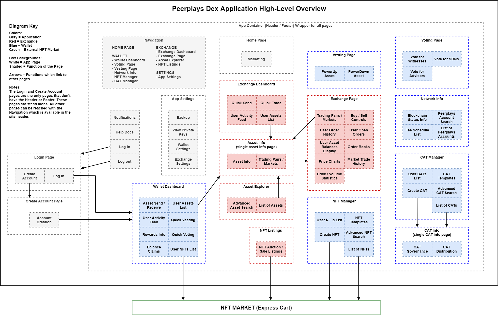
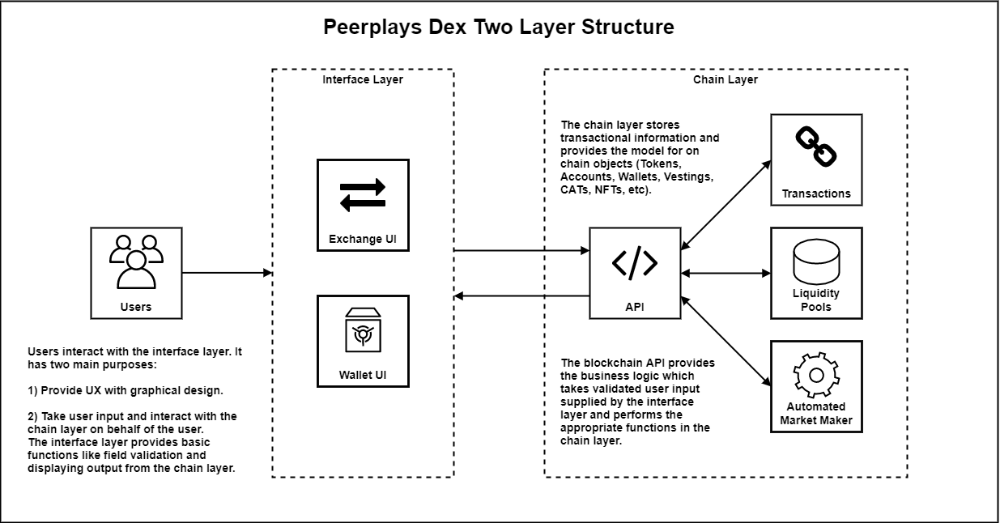
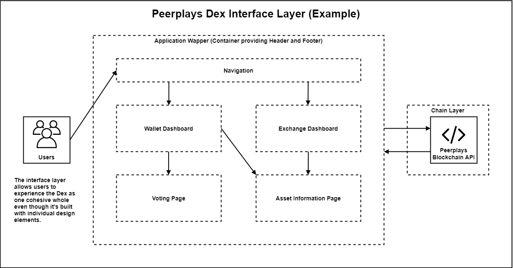
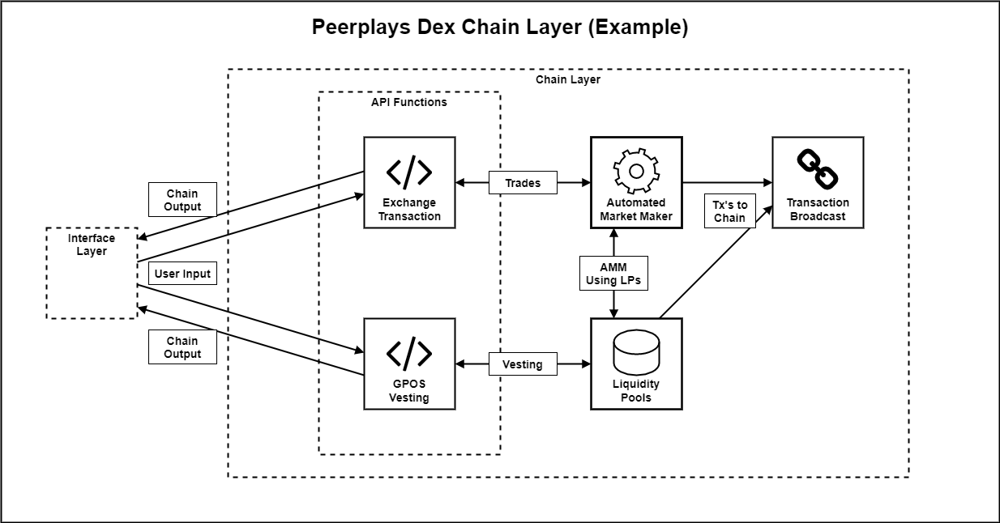
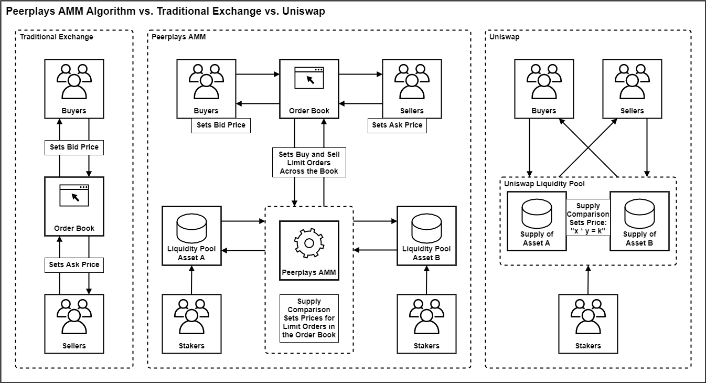

# Requirements Specification

## 1. Introduction

This requirements specification (RS) describes the high-level requirements for the initial release of the Peerplays Decentralized Exchange platform (DEX). This document is intended to be used by the members of the project team who will implement and verify the correct functioning of the system. Unless otherwise noted, all requirements specified here are committed for the initial release.

### 1.1. Purpose

The purpose of this RS is to cover the high-level outline and resulting requirements of the DEX. Lower level requirements documents for each component will be created.

### 1.2. Document Conventions

For the purpose of traceability, the following codes will be used in this RS:

| Code     | Meaning                           |
| -------- | --------------------------------- |
| **OE-#** | Operating Environment Requirement |
| **CO-#** | Constraint                        |
| **DE-#** | Dependency                        |
| **IL-#** | Interface Layer Requirement       |
| **CL-#** | Chain Layer Requirement           |
| **AC-#** | Application Component Requirement |
| **EC-#** | Exchange Component Requirement    |
| **WC-#** | Wallet Component Requirement      |

The keyword `shall` indicates a requirement statement.

### 1.3. Project Scope

The DEX will permit Peerplays users to:

* exchange Peerplays assets
* view, auction, buy, and sell NFTs
* use the following wallet functions
  * create an account
  * send / receive Peerplays assets
  * deposit / withdraw sidechain assets (BTC, ETH, etc.)
  * use GPOS vesting
  * governance voting (witnesses, SONs, advisors)
  * create CATs
  * view blockchain status


**Peerplays assets** in the context of this RS are any on-chain asset. This includes native Peerplays assets like the PPY coin, Peerplays NFTs, and CATs. This also includes assets that have originated off-chain that have been transferred onto the Peerplays chain through the services of Peerplays SONs. These external (sidechain) assets include Peerplays versions of BTC, HIVE, or ETH and even Peerplays versions of NFTs living on the Ethereum chain. The external assets are backed by their counterparts, locked in a Peerplays controlled account on their native chains.


## 2. Overall Description

### 2.1. Product Perspective

The design for the DEX seamlessly integrates application, asset exchange, and wallet functions into a singular app. The DEX will act as the main wallet for Peerplays users. It will give users the ability to use the exchange without needing another app. Basic NFT related functions will be included. The DEX is composed of three components: The application, The exchange, and the wallet.

_FIG 1. Peerplays _DEX _Application High-Level Overview (Page Map)_

The structure of the DEX will be based on two layers, the interface (UI) layer, and the chain layer. The interface layer consists of the UI/UX design elements and interfaces with the chain layer to perform actions on behalf of the user. The chain layer consists of the blockchain and API. It provides business logic, object models, and storage.

_FIG 2. Peerplays _DEX _Two Layer Structure_

### 2.2. User Classes and Characteristics

| User class | Description                                                                                                                                                                                                                                                                                                                                                                                                    |
| ---------- | -------------------------------------------------------------------------------------------------------------------------------------------------------------------------------------------------------------------------------------------------------------------------------------------------------------------------------------------------------------------------------------------------------------- |
| User       | A user is an entity that accesses the DEX . A user with a Peerplays account has the intention of using the DEX to manage their account and Peerplays assets. A user without a Peerplays account has the intention of using the DEX to create a new account. A user (with or without an account) may also be interested in accessing the DEX to view information on the status of the blockchain, markets, etc. |

### 2.3. Operating Environment

**OE-1:** The DEX shall operate correctly with the following web browsers (and platforms):

| Browser       | Platforms                                         |
| ------------- | ------------------------------------------------- |
| Google Chrome | Ubuntu GNU Linux, Windows 10, Android, macOS, iOS |
| Firefox       | Ubuntu GNU Linux, Windows 10, Android, macOS, iOS |
| Brave         | Ubuntu GNU Linux, Windows 10, Android, macOS, iOS |
| Safari        | macOS, iOS                                        |

**OE-2:** The DEX shall operate correctly at the minimum resolution of 1334-by-750-pixel resolution at 326 ppi onward (iPhone SE resolution).

**OE-3:** The DEX shall permit user access by desktop computer, Android, iOS, and Windows smartphones and tablets.


**OE-4:** In later versions of the DEX , the DEX shall operate as both a hosted version and a stand-alone app (i.e. Electron App).


### 2.4. Design and Implementation Constraints

**CO-1:** All HTML code shall conform to the HTML 5.0 standard.

**CO-2:** Design elements shall maintain a standard look and feel by using Tailwind CSS and Tailwind UI components.

**CO-3:** The DEX UI shall be built with a responsive UI design.

### 2.5. Assumptions and Dependencies

**DE-1:** The operation of the DEX depends on the Peerplays chain being operational.

**DE-2:** Successful transfers of assets on to and off of the Peerplays chain depends on having an operational sidechain for any given asset.

## 3. System Features

### 3.1. App Design

#### 3.1.1. Interface Layer

**Description**

The interface layer of the DEX consists of the overall application's graphical design framework. This framework ties together the UIs of the application, exchange, and wallet components into one cohesive UX design. In this way the interface layer can be described as both the individual UI elements and the wrapper that binds them into what a user would experience as a single app.

The interface layer is responsible for information display, receiving and validating user input, managing input and output from the chain layer, and app navigation.

The interface layer interfaces with the chain layer. Users never interact directly with the chain layer. In a traditional web app, the interface layer would be like the client-side code.

_FIG 3. Peerplays _DEX _Interface Layer_

**Requirements**


The requirements below are for the overall DEX UI which contains the application, wallet, and exchange specific UIs. See the sections relating to each specific component for requirements for their part of the interface layer.


**IL-1:** The interface layer shall integrate component specific UIs to provide a consistent graphical design across all components.

**IL-2:** The interface layer shall provide navigation for all integrated components. Navigation must provide access to the following pages:

* HOME PAGE
* WALLET
  * Wallet Dashboard
  * Voting
  * Vesting
  * Network Info
  * NFT Manager
  * CAT Manager
* EXCHANGE
  * Exchange Dashboard
  * Exchange
  * Asset Explorer
  * NFT Listings
* SETTINGS
  * App Settings

**IL-3:** The interface layer shall be built with a responsive UI design.

**IL-4:** The interface layer shall allow user input in relevant form fields to perform the functions of the related component.

**IL-5:** The interface layer shall perform input field validation and inform the user of acceptable form inputs.

**IL-6:** The interface layer shall provide the user with help/hint text to explain available options and input fields.

**IL-7:** If an error occurs, the interface layer shall display meaningful error information to the user and provide them with actions they can take to attempt to resolve the error whenever possible.

#### 3.1.2. Chain Layer

**Description**

The chain layer of the DEX consists of the blockchain API, on-chain objects, and transaction storage. The API provides business logic required to take user input, transform that input as necessary, and perform actions on the blockchain. The chain layer also supplies the interface layer with information from the chain. The purpose of the chain layer is to split away the business logic and data storage from the graphical design.

In a traditional web app, the chain layer would be like the server-side code and data storage.

_FIG 4. Peerplays _DEX _Chain Layer_

**Requirements**


The requirements below are for the overall DEX functions which contains the application, wallet, and exchange specific functions. See the sections relating to each specific component for requirements for their part of the chain layer.


**CL-1:** The chain layer shall interface with the interface layer via the blockchain API.

**CL-2:** The chain layer shall contain the objects and functions required by the exchange and wallet components.

### 3.2. Components

#### 3.2.1. Application Component

**Description**

The application component is the basic foundation for the DEX. It provides the following functions:

* the DEX home page
* navigation
* account creation
* authentication
  * login/logout
  * user session management
* notifications
* help docs
* application settings
  * wallet settings
  * exchange settings


Lower level requirements specification documents will contain functional specifications for the above features.


**3.2.1.1. Application Component UI**

**Requirements**

**AC-1:** The application component UI shall provide navigation to the following pages (or page fragments) which contain features as listed below:

* Site Header (page fragment)
  * app navigation
* Site Body (page fragment, container for app pages)
* Site Footer (page fragment)
* Home Page
  * marketing content
* Application Settings Page
  * wallet backup
  * view private keys
  * wallet settings
  * exchange settings
* Login Page (stand-alone page, no header/footer)
* Create Account Page (stand-alone page, no header/footer)
  * account creation

#### 3.2.2. Exchange Component

**Description**

The exchange facilitates the exchange of assets. It is important to Peerplays communities and blockchain governance because it allows the flow of PPY and CATs to accounts across the chain. The exchange is also necessary for rewards generation as the transaction fees are distributed to those who stake into the LPs.

The exchange component handles all decentralized exchange related functions. This includes:

* trading pairs / markets
* the order book
* user order management
* market trade history
* searching and viewing asset information
* exchanging Peerplays assets using various order types
  * market orders
  * limit orders
    * good-til-canceled
    * good-til-time
    * fill-or-kill
    * immediate-or-cancel
    * maker-or-cancel
  * stop-limit orders
* quick send
* quick trade
* NFT auction / sale listings
* trade slippage protection
* Peerplays Automatic Market Maker (AMM)
* viewing and managing price charts


Lower level requirements specification documents will contain functional specifications for the above features.


**3.2.2.1. Exchange Component UI**

**Requirements**

**EC-1:** The exchange component UI shall provide navigation to the following pages which contain features as listed below:

* Exchange Dashboard
  * quick send
  * quick trade
  * user activity feed
  * user assets list
* Exchange Page
  * order books
  * buy / sell controls
  * user order history
  * user open orders
  * user asset balances display
  * market trade history
  * trading pairs / markets
  * price charts
  * price / volume statistics
* Asset Explorer
  * advanced asset search
  * asset info (single asset information page)
* NFT Listings
  * NFT auction / sales listings

**3.2.2.2. Automated Market Maker (AMM)**

**Description**

The AMM will utilize an algorithm which allows exchange and order book mechanics based on Uniswap-like technology. The AMM executes trades using the supply available within the liquidity pools.

A PPY based Uniswap-like algorithm will be necessary for the exchange to function. This will allow an exchange-like experience but also guarantees liquidity. This also makes PPY the basis of all trades and compliments Peerplays asset staking mechanisms.

Something like a hybrid between Uniswap and a traditional exchange order book, the AMM algorithm allows speculative trading of any trading pair. The prices are set on supply and demand principles. The diagram below illustrates the key differences between traditional trading, Uniswap, and the AMM algorithm.

_FIG 5. Peerplays _DEX _Automated Market Maker_

In a traditional exchange, an order book is filled with the orders of buyers and sellers in a given market. Orders are filled when buyers are willing to pay what the sellers are asking for, or sellers are willing to take what buyers are bidding. Liquidity in this case is entirely dependent on the supply provided by the buyers and sellers.

In a Uniswap system, there are no order books. Instead, people stake assets into liquidity pools to earn rewards based on generated transaction fees. Buyers and sellers simply swap their assets at a price that preserves the liquidity within the underlying liquidity pools. Essentially, the greater the gap in supply between two assets, the higher the price will be for that trading pair. This creates an incentive to balance the supply in the liquidity pools.

Peerplays AMM combines the two systems to make an exchange system supported by staked liquidity pools. Order books are populated from the liquidity pools based on the difference between the available supplies of the assets in a given pair. Like in Uniswap, the higher the supply gap, the higher the price. The order book then takes orders from buyers and sellers with their limit prices. In this way, the pair of liquidity pools of the trading pair act as large market making buyers and sellers who are always willing to trade. As long as there are people willing to stake their assets to the liquidity pools, there will always be available liquidity for the exchange.

**Requirements**

**EC-2:** The AMM shall manage its own limit orders for each market (trading pair) based on LP supply comparison.

**EC-3:** The AMM shall execute transactions on the chain in accordance with its operating algorithms.

**EC-4:** The AMM shall adjust all its positions based on changes in available supply in the LPs to preserve liquidity.

**3.2.2.3. Exchange Liquidity Pools (LPs)**

**Description**

The liquidity pools are special Peerplays controlled accounts that store staked assets for use in exchange trading. Users can stake assets to LPs to claim rewards based on exchange fees related to those assets.

**Requirements**

**EC-5:** The LPs shall store a supply of assets from stakeholders.

**EC-6:** The LPs shall allow assets to be staked and un-staked.

**3.2.2.4. Trade Slippage Protection**

**Description**

Slippage refers to the difference between the expected price of a trade and the price at which the trade is executed. Slippage can occur at any time but is most prevalent during periods of higher volatility when market orders are used. It can also occur when a large order is executed but there isn't enough volume at the chosen price to maintain the current bid/ask spread. To protect users from slippage on large market orders, the DEX should provide slippage protection.

**Requirements**

**EC-7** The exchange shall implement trade slippage protection where market orders that move the price in excess of 10% will stop executing and return a partial fill. For example: a market buy submitted when the last trade price is $4,000 will only fill at price levels below $4,400.

#### 3.2.3. Wallet Component

**Description**

The wallet is the main component with which users interact with the Peerplays chain. The wallet is the window to their account and asset information. It's also the foundation of account functions like logging in/out, sending/staking assets, governance, and viewing the status of the blockchain.

The wallet module handles all user account related functions. This includes:

* creating new accounts
* viewing and managing a user's account information
* viewing a user's asset balances
* sending and receiving assets
* voting functions
* vesting (staking) functions
* creating, viewing, and managing a user's NFTs
* searching and viewing other user's NFTs
* creating, viewing, and managing a user's CATs
* searching and viewing other user's CATs
* viewing the blockchain status information
* searching and viewing other user's public information
* viewing help documentation for user account functions
* user session management


Lower level requirements specification documents will contain functional specifications for the above features.


**3.2.3.1. Wallet Component UI**

**Requirements**

**WC-1:** The Wallet module view layer shall provide the following pages which contain features as listed below:

* Wallet Dashboard
  * user assets list
  * user NFTs list
  * user activity feed
  * rewards information
  * quick voting
  * quick vesting
  * asset send / receive
  * balance claims
* Voting Page
  * vote for witnesses
  * vote for sons
  * vote for advisors
* Vesting Page
  * power up asset
  * power down asset
* Network Info
  * blockchain status information
  * Peerplays account search
  * fee schedule
* NFT Manager
  * user NFTs list
  * NFT templates
  * create NFT
  * NFT Explorer
    * advanced NFT search
    * NFT Info (single NFT page)
* CAT Manager
  * user CATs list
  * CAT templates
  * create CAT
  * CAT distribution
  * CAT governance
  * CAT Explorer
    * advanced CAT search
    * CAT Info (single CAT page)

## 4. Appendix A: Glossary

| Term   | Meaning                   | Notes / References |
| ------ | ------------------------- | ------------------ |
| RS     | Requirement Specification | -                  |
| DEX    | Decentralized Exchange    | -                  |
| NFT(s) | Non-Fungible Token(s)     | -                  |
| GPOS   | Gamified Proof of Stake   | -                  |
| CAT(s) | Community Asset Token(s)  | -                  |
| UI     | User Interface            | -                  |
| UX     | User Experience           | -                  |
| AMM    | Automated Market Maker    | -                  |
| LP(s)  | Liquidity Pool(s)         | -                  |

## 5. Appendix B: References

[Tailwind CSS](https://tailwindcss.com)
