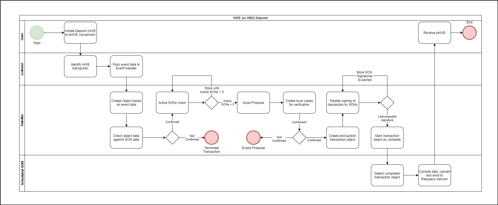

# HIVE Deposit Handling

## 1. Purpose

The purpose of this document is to outline functional specifications for monitoring the Hive network and handling deposits. The result of a deposit is the conversion of HIVE and HBD to a Peerplays asset \(pHIVE & pHBD\).

## 2. Scope

Sidechain operating nodes will monitor the Hive network for events of interest, namely the transfer of assets to a Peerplays controlled address on the Hive network. When a transfer happens, the sidechain will process it, in order to pick up information needed to handle it. Handling deposits will create a certain amount of tokens on the Peerplays network. This amount will match the amount of assets on the target sidechain by a predefined exchange rate.

Specific functions covered include:

* monitor transactions to a designated sidechain user address
* handle deposit via creation of sidechain event data
* create & confirm object proposals
* conversion of HIVE to pHIVE \(or HBD to pHBD\) based on defined exchange rate, with applicable fees
* sign transactions
* withdraw Hive for conversion into Peerplays tokens

## 3. Background

> **NOTE:** Deposit handling requirements are not final.

Deposit handling will consist of two parts, a HIVE Event Listener and a HIVE Event Handler. Listener can identify and report new blocks, transactions, or filtered single event \(like specific operation involving a specific address\).

The requirements below are describing functional specifications based on using a multi-signature primary wallet controlled by the SON network, holding all the funds. All transfers are made to and from this multi-signature wallet.

## 4. Process Overview

Described here is the process of monitoring a deposit address and processing transactions that occur in relation to a target address.

pHIVE token issue is initiated by the Sidechain Listener identifying a Hive deposit, passing information to Sidechain Handler.

Steps involved:

> **NOTE:** HIVE listed in the steps below could also be HBD. The process is identical for both assets.

1. User initiates a deposit to convert HIVE to pHIVE
2. Listener identifies that a HIVE transaction is initiated
3. Listener passes event data to handler
4. Handler receives event data and creates an object \(normally SON Wallet Object, SON Wallet Deposit Object, or SON Wallet Withdraw Object\)
5. Object is checked by all active SONs to compare object data from the chain against data generated by each SON.
   1. If data does not match, transaction is terminated
   2. If data matches, object is deemed 'Confirmed'. Proceed to next step
6. Handler checks the number of active SONs
   1. If active SONs are &gt; 5, proceed to next step
   2. If active SONs are &lt; 5, store transaction for processing until required number of active SONs is available \(this step will be repeated until SON availability requirement is met\)
7. Issue proposal for for sidechain transaction create operation
8. Active SONs create local copies of transaction data to be verified against proposal
9. Proposal is verified by active sons by comparing local copies of transaction data to proposal
   1. If data does not match, proposal is not approved and will eventually expire thus terminating the transaction
   2. If data matches, proposal is approved. Proceed to next step
10. Transaction object containing a list of SONs expected to sign is created and published to the sidechain. List of SONs will be created based on list of active SONs
11. Expected SON signers initiate parallel processing of transaction. Offline SONs will not participate in signing and only the online SONs \(regardless of status\) will sign the transaction
12. Sign transaction
    1. Each signing SON adds its signature
    2. Each signing SON is added to list of received signatures
    3. Operation evaluator checks signatures to determine if latest signature is the last signature required to complete transaction signing
       1. If no, repeat this step after each SON's signature
       2. If yes, mark transaction object as ‘Completed' \(helper field complete = true\)
13. Scheduled SON detects completed transaction object
14. Transaction is converted to a readable format and sent to the Peerplays network
15. User receives pHIVE amount
16. Deposit is marked as processed

## 5. Context

To facilitate conversion of Hive into Peerplays tokens, SON must include an event listener and an event handler mechanism to identify specific types of transactions and handle them accordingly. The proposed approach uses a multi-signature primary wallet controlled by SON network, holding all the funds. All transfers are made to and from this multi-signature wallet.

## 6. Flow Diagram





## 7. Requirements

### 7.1 Wallet information

The deposit address implementation should be a **one-or-weighted-multisig** address.

SON must be able to create/update Peerplays multisig account, and create/re-create Hive multisig address controlled by active SONs.

The SONs may change at any maintenance interval when the votes are tallied and the existing SONs are voted out. Since, the Hive public keys of the SONs will be used to create the multisig Hive wallet, their public keys will have to be changed in order to operate the multisig Hive wallet. System must transfer the funds from the old wallet to the new wallet every time a SON changes and incur associated Hive transaction fees. The transaction fees on the Hive network consist of Resource Credits which are generated based on the account's Hive Power. It will be necessary to maintain a minimum of 100 Hive Power in this Primary Wallet for the sake of covering transaction fees with Resource Credits.

To reduce this additional cost, an m-of-n multisig Hive wallet will be created with signatures of 2/3rd SONs required for a Hive transaction. Change of public key for the SON in the multisig Hive wallet is not needed until 1/3rd of the SONs changes. Once, 1/3rd of the initial SONs changes, we must create a new multisig Hive wallet with the public keys of the current SONs and transfer the funds from the previous wallet to the newly created multisig Hive wallet.

Requirements below assume use of multi-signature primary wallet controlled by SON network, holding all the funds. All transfers are made to and from this multi-signature wallet.

A minimum of 5 SONs must be active to enable the HIVE-SON sidechain. The Hive network supports up to 40 weighted keys for each authority role per wallet. So for the "Active" role, up to 40 SONs can be added to the primary wallet to supply their signing of transactions. The number of signatures required to complete a transaction can be configured when the wallet is created. To do so, a threshold value is set. When each SON signs the transaction their weight is added to the transaction. When the total combined weight becomes greater than or equal to the threshold value, the transaction will become valid and can be completed. The threshold value should be set by Peerplays advisors.

SON must be able to keep the history records of active primary wallets, duration of activity period, and the SONs who control the wallet at the time of creation.

### 7.2 Listener

SON must include a Hive event listener which monitors a designated Hive address registered as a sidechain user address for deposits. Specifically, the listener uses a Hive node interface for monitoring changes in the block changes.

Listener must be able to recognize a change that signifies a deposit event and capture the following data associated with each transaction of this type:

* Transaction unique identifier
* Transfer operation's source address
* Transfer operation's target address
* Transfer amount
* Transaction fee \(for transfer operation\)

### 7.3 Handler

SON must include a Hive event handler which uses information supplied by the Listener to perform a specific operation that's based on transaction type submitted by listener. When handler receives notification of Deposit transaction from the Listener, **sidechain\_event\_data** must be received and passed to **sidechain\_event\_data\_received**.

System must then create a SON Wallet Deposit Object, which upon creation will be processed by all available SONs to verify its data. To verify object, system must check local data of each SON against object data on the side chain. Object must be deemed valid when its data is confirmed, and rejected when its data cannot be confirmed. Transaction terminates if object data is not confirmed during this check.

Successful object verification results in issuance of transaction create proposal that is based on confirmed object and includes some of its data \(specifically, a reference to the object\). Created sidechain transaction object must contain reference to the sidechain where it should be processed, reference to the object it is created for, sidechain transaction body, list of expected signers, list of received signatures, and the helper fields for calculating signature weights.

This proposal must be verified by SONs, which is performed by verifying referred object against locally recreated transaction data. If data does not match, proposal will be deleted from proposal list and transaction won't be completed. If data matches, system must approve the proposal. Approved proposals must result in object being published on the chain.

When the object is published on the chain, SONs specified on the list of expected signers must begin processing it in parallel. Note that SONs specified as signers must sign the transaction as long as they are online, disregarding their status \(thus SON in any status must sign the transaction\). Once enough signatures hve been collected, transaction is marked as ‘Completed'.

When scheduled SON detects that a sidechain transaction object has been completed, it must collect all data from the sidechain transaction object, compile it, convert to a format that is ready for transmission to Peerplays network, and send this transaction to the Peerplays network.

SON must start conversion of deposit amount from Hive into Peerplays tokens following deposit confirmation. Conversion operation must calculate HIVE to PPY conversion using 1:1 rate. Conversion is completed by sending funds from Hive address \(sidechain user address for deposits\) to primary wallet \(Hive multisig address\).

User will receive peerplays core assets matching the amount of deposited Hive.

### 7.3 Refund Scenario

In some cases a transaction will not be processed by SONs \(such as when active SONs threshold is not met\), which will cause funds to wait until required number of active SONs become available. System must allow users to initiate refunds of their transactions.

Refund scenario must adhere to same rules as regular Hive transaction:

1. User needs transaction id for the transaction they wish to refund
2. User creates another transaction using transaction id of transaction they want to refund to move funds to their own address
3. User signs the transaction using a private key that matches the public key he provided in sidechain address mapping
4. Transaction is pushed to Hive network and user is refunded once transaction is processed

### 7.4 Deposit Address - **One-or-weighted-multisig**

This deposit address implementation type allows to send funds from this address with 2/3 weights of SON votes \(like in Primary Wallet\) or with single user signature. To create such address we need:

**1\)** user public key

**2\)** all SONs public keys

**3\)** every SON weight

> **Note:** This is the current implementation of the Deposit address for BTC-SON.

This address type is implemented by hive\_one\_or\_weighted\_multisig\_address class.

### Examples

sending 100 HIVE to deposit address \(JSON-RPC\):

```javascript
{
   "jsonrpc":"2.0",
   "method":"condenser_api.broadcast_transaction",
   "params":{
      "trx":{
         "ref_block_num":1097,
         "ref_block_prefix":2181793527,
         "expiration":"2016-03-24T18:00:21",
         "operations":[
            "transfer",
            {
              "from": "test",
              "to": "deposit.address",
              "amount": "100 HIVE",
              "memo": ""
            }
          ],
         "extensions":[],
         ["1f65df7e3fb5f3ad49c433054127d71918c10865d67367efa380edee2e9943540d1e6f97317a1cdfe547f49d89048a44bd2f9a9a7278e51b9fef98dfddaee576da"]
      }
   },
   "id":1
}
```

cli wallet command:

`transfer sonaccount01 son-account 100 TEST "" true`

## 8. Glossary

**pHIVE**​ is a Peerplays Blockchain Asset, which represents users' balances in Hive on Peerplays blockchain. Having a balance of 1 pHIVE would mean having it backed by the same amount of Hive on a Witness-controlled Multisig Wallet. New pHIVE are NOT ISSUED by OWNER with ​issue ​operation. New pHIVE are issued strictly in relation with ​Deposit​ operations.

**pHBD**, like pHIVE, is a Peerplays Blockchain Asset which represents a users' HBD balance on the Peerplays blockchain. HBD \(Hive Backed Dollar\) is a stable-coin on the Hive network that aims to be pegged to the United States Dollar. So 1 HBD should equal 1 USD.

**PW** \(**Primary Wallet**\) ​is the main Multisig Hive Wallet.

**Multi-signature \(multisig\)** refers to requiring more than one key to authorize a Hive transaction. It is generally used to divide up responsibility for possession of Hive.

## Supporting Information

[Hive Node - Get Transaction Node](https://developers.hive.io/nodeop/get-transaction-node.html) for creating a Hive node with the lowest possible required resources to support getting transactions.

[Hive - Stream Blockchain Transactions](https://developers.hive.io/tutorials-javascript/stream_blockchain_transactions.html) to stream and detect transactions on the Hive blockchain.

[How to serialize and sign Hive transactions using Javascript](https://developers.hive.io/tutorials-recipes/how-to-serialize-and-sign-using-js.html) for Hive transactions \(with multisig\).

[Using Multisignature Accounts](https://developers.hive.io/tutorials-recipes/using-multisignatire-accounts.html) for information on Hive multisig accounts.

[Broadcast Ops](https://developers.hive.io/apidefinitions/#apidefinitions-broadcast-ops) for a list of Broadcast operations available in the APIs.

