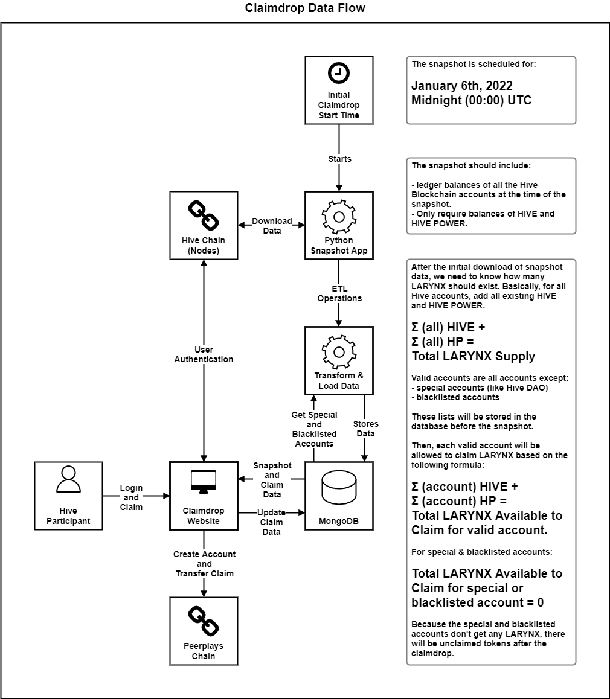
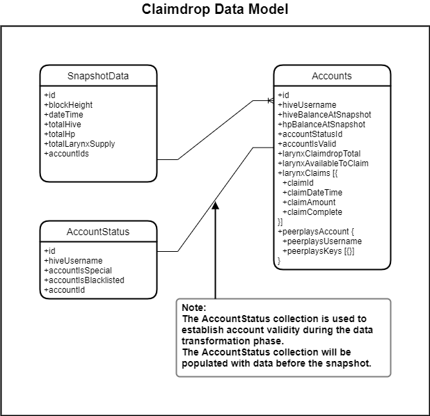

# Claimdrop Snapshot Functional Specification

## 1. Purpose

The purpose of this document is to outline functional specifications for the data snapshot of the Hive blockchain that will be used for the SPK Network claimdrop.

## 2. Scope

This document will focus on the capture of specific data from the Hive blockchain at a single point in time. Data integrity and security considerations will also be included in this document.

### 2.1. Components

Specific components and features covered include:

* the required fields
* the data model
* data flow
* data storage requirements

## 3. Document Conventions

For the purpose of traceability, the following code(s) will be used in this functional specification:

| Code       | Meaning                        |
| ---------- | ------------------------------ |
| **SNAP-#** | Claimdrop Snapshot Requirement |

The keyword **`shall`** indicates a requirement statement.

The word **`app`** in this document refers to the web-based UI relating to the initial SPK Network token claimdrop that is the subject of another document.

The abbreviation **`FS`** stands for "Functional Specification" and refers to this document unless otherwise noted.

## 4. Process Overview

The processes which will be described here:

* Taking the Hive chain snapshot

### 4.1. Taking the Hive Chain Snapshot

Assumptions: Hive blockchain full nodes are available to query and download blocks.

To take the Hive chain snapshot:

1. When midnight (00:00) UTC, January 6th, 2022 arrives, a prewritten and tested script will run.
2. The script queries active Hive full nodes for the following information:
   1. The block number of the last validated (and therefore official) block before the midnight cutoff. This is the snapshot block.
   2. The usernames, HIVE and HIVE POWER (HP) balances for **all** Hive accounts at the time of the snapshot block.
3. This information is stored in a database.
4. The script uses the downloaded information to calculate the total LARYNX supply which is stored in the database.
5. The script uses the downloaded information to calculate the amount of claimable LARYNX for each Hive account:
   1. Valid Hive accounts can claim `1 LARYNX per HIVE` **and** `1 LARYNX per HIVE POWER` (based on HIVE and HP account balance in snapshot).
   2. Invalid accounts (special and blacklisted accounts) cannot claim LARYNX (or available LARYNX Claim == 0).
6. This information is stored in the database.

## 5. Context

The app will provide a user-friendly experience with the single purpose of allowing Hive blockchain participants to claim SPK Network tokens on the Peerplays blockchain, namely:

* LARYNX

These tokens are being distributed through a claimdrop mechanism to holders of HIVE and HIVE POWER (HP). Participants of the Hive blockchain require a way to claim these tokens. Peerplays accounts must also be provided for claiming these tokens as the SPK Network tokens will be native to the Peerplays blockchain. The initial claimdrop is scheduled for January 2022. After the initial claimdrop, subsequent monthly claimdrops will occur for a limited time. Last, tokens left unclaimed after the claimdrop period is over will be distributed so as not to lock up the tokens.

To support the app, a snapshot must be taken of the Hive blockchain which will be used at the basis of the claimdrop. Hive account balances (HIVE and HP) are required to calculate the amount of LARYNX to create for the claimdrop. In addition to the snapshot data, other claimdrop data must be stored to facilitate the app.

## 6. Design Diagrams

### 6.1. Diagrams

&#x20;_FIG 1. SPK Network Claimdrop: Data Flow Diagram_

&#x20;_FIG 2. SPK Network Claimdrop: Data Model_

### 6.2. Downloads





## 7. Requirements

Requirements specific to the items outlined in this functional specification are as follows.

### 7.1. Required Fields

**Assumptions**: A collection in the database will be populated with `special` and `blacklisted` Hive accounts before the snapshot and subsequent data transformations.

* **SNAP-1** the following data fields shall be **collected** during the Hive blockchain snapshot:
  * datetime of snapshot
  * block height of snapshot
  * all Hive accounts:
    * username
    * HIVE balance at snapshot
    * HIVE POWER at snapshot
* **SNAP-2** the following data fields shall be **derived** after the Hive blockchain snapshot:
  * total of all HIVE balances in the snapshot
  * total of all HIVE POWER balances in the snapshot
  * total LARYNX supply
  * for each Hive account:
    * account status (valid? special? blacklisted? See `Assumptions` noted above)
    * total LARYNX claimdrop
    * total amount of unclaimed LARYNX
    * LARYNX claims (See **SNAP-3**)
    * Peerplays account information (See **SNAP-3**)
* **SNAP-3** the following data fields shall be **recorded/calculated** when a claim is made:
  * for each claim:
    * datetime of the claim
    * amount of LARYNX claimed
    * status of the claim (completed?)
  * Peerplays account info (if not already existing):
    * Peerplays username
    * Peerplays keys or other login details

### 7.2. Data Flow

* **SNAP-4** snapshot of the Hive blockchain shall be taken **midnight (00:00 UTC) January 6th, 2022**.
* **SNAP-5** shall download all required data from the Hive blockchain.
* **SNAP-6** shall perform ETL (extract, transform, load) operations on the data to store all required primary and derived data to a database.
* **SNAP-7** shall use a preexisting account status (or similar) collection to establish account validity for LARYNX claims.
* **SNAP-8** shall perform atomic operations to prevent data corruption or mismatched data.
* **SNAP-9** shall provide data via the database to the claimdrop website app.
* **SNAP-10** shall accept and store updated information about claims and accounts throughout the claimdrop process.

### 7.3. Data Model

* **SNAP-11** shall store related information in relevant collections which maintain logical relationships via ID fields.

### 7.4. Data Storage

* **SNAP-12** shall store data in a NoSql type database such as MongoDB or similar.
* **SNAP-13** shall provide high availability to the data throughout the claimdrop process.

### 7.5. Quality & Security Requirements

* **SNAP-14** the database shall **not** be directly accessible by the public. Instead, the data can only be accessed publicly through connected applications with user authentication features.
* **SNAP-15** the data shall be regularly backed up and stored on another server (or other location) so as to ensure data recovery. Data redundancy can be used for load balancing of applications if necessary.
* **SNAP-16** after the snapshot, quality checks shall be performed on the data to ensure data integrity. This should be done with standard quality procedures such as manually inspecting a statistically significant (square root (n) + 1) number of records. Inspections should compare captured database records with their primary data source. No errors should be acceptable (100% accuracy is expected).

## 8. Related Documents


[initial-claimdrop-functional-specification.md](initial-claimdrop-functional-specification.md)

