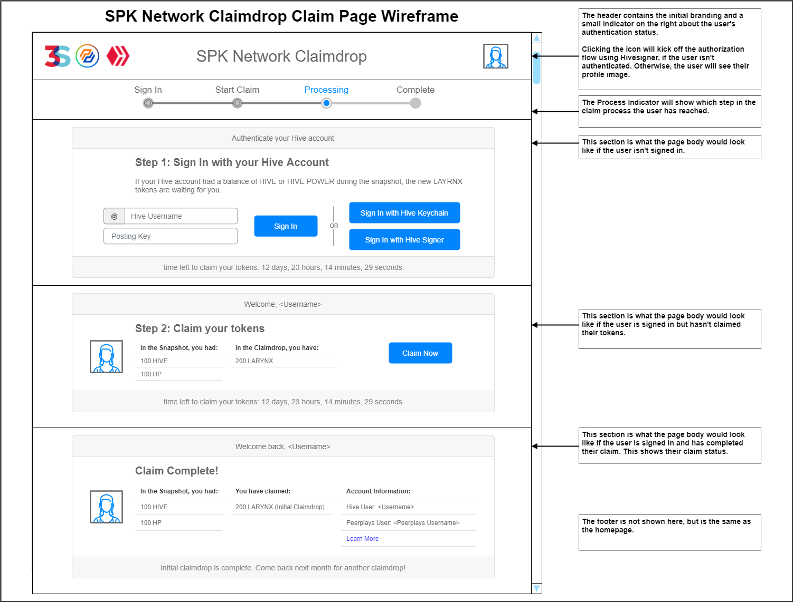

# Initial Claimdrop Functional Specification

## 1. Purpose

The purpose of this document is to outline functional specifications for the web-based UI relating to the initial SPK Network token claimdrop.

## 2. Scope

This document will focus on the initial SPK Network token claimdrop functionality within a web-based end user application. Hive blockchain participants will need to claim the SPK Network tokens (SPK, LARYNX, and BROCA) to take part in the SPK Network Peerplays community on the first day of its release.

### 2.1. Components

Specific components and features covered include:

* the SPK Network Claimdrop Homepage layout
* Initial Claimdrop Page:
  * instructions for claiming tokens
  * form for claiming tokens
  * checking the status of claimed tokens
* Help Page for First Level of User Support:
  * FAQs
  * How-To Guide
  * "Contact Us" info

## 3. Document Conventions

For the purpose of traceability, the following code(s) will be used in this functional specification:

| Code      | Meaning                       |
| --------- | ----------------------------- |
| **ICD-#** | Initial Claimdrop Requirement |

The keyword **`shall`** indicates a requirement statement.

The word **`app`** in this document refers to the web-based UI relating to the initial SPK Network token claimdrop that is the subject of this document (unless otherwise noted.)

## 4. Process Overview

The processes which will be described here:

* Claiming Tokens (Initial Claimdrop)
* Checking the Status of Claimed Tokens
* Finding Help

### 4.1. Claiming Tokens

Assumptions: The user participates in the Hive blockchain and owns HIVE and/or HBD.

To claim SPK Network tokens and/or check the status of their claim:

1. User navigates to the initial claimdrop page of the app.
2. User clicks a button to authenticate their Hive account. [Implicit Grant Flow with Hivesigner OAuth2](https://docs.hivesigner.com/h/guides/get-started/hivesigner-oauth2#implicit-grant-flow)
   1. User is asked to authorize the app.
   2. Hivesigner OAuth2 authentication server passes an access token back to the app.
3. User, now authenticated, can view the snapshot data related to their Hive account including:
   1. How much SPK, LARYNX, and BROCA is available for them to claim.
   2. How much they have already claimed.
   3. If a Peerplays account exists for them.
   4. If so, their basic Peerplays account information.
4. User clicks a button to claim their available SPK, LARYNX, and BROCA tokens.
   1. A Peerplays account is created and the tokens are sent there.
   2. User is notified of a successful claim and the status is updated.

To find help:

1. User navigates to the help page of the app.
   1. User navigates to the FAQ page.
   2. User navigates to the Contact Us page.

## 5. Context

The app will provide a user-friendly experience with the single purpose of allowing Hive blockchain participants to claim SPK Network tokens on the Peerplays blockchain, namely:

* SPK
* LARYNX
* BROCA

These tokens are being distributed through a claimdrop mechanism to holders of HIVE and HBD. Participants of the Hive blockchain require a way to claim these tokens. Peerplays accounts must also be provided for claiming these tokens as the SPK Network tokens will be native to the Peerplays blockchain. The initial claimdrop is scheduled for January 2022. After the initial claimdrop, subsequent monthly claimdrops will occur for a limited time. Last, tokens left unclaimed after the claimdrop period is over will be distributed so as not to lock up the tokens.

## 6. Design Diagrams

### 6.1. Images

&#x20;_FIG 1. SPK Network Claimdrop: Homepage Design Wireframe_

&#x20;_FIG 2. SPK Network Claimdrop: Initial Claimdrop Page Design Wireframe_

### 6.2. Downloads





## 7. Requirements

Requirements specific to the items outlined in this functional specification are as follows.

### 7.1. App Layout

* **ICD-1** if an error occurs at any point, the app shall display meaningful error information to the user and provide them with actions they can take to attempt to resolve the error.
* **ICD-2** shall be publicly available for all site visitors.
* **ICD-3** shall display the site header and footer for all pages of the app, with the exception of pages necessary for OAuth2 authentication.
* **ICD-4** shall display branding and graphical design consistent with Peerplays and SPK Network branding guidelines throughout the app.

### 7.2. App Header

* **ICD-5** shall display identifying branding.
* **ICD-6** shall provide an authentication indicator which signals the authentication status of the user.
* **ICD-7** shall allow a user to begin the authentication workflow via the authentication indicator.
* **ICD-8** shall allow an authenticated user to navigate to their claim status information.

### 7.3. App Footer

* **ICD-9** shall display identifying branding.
* **ICD-10** shall provide navigation to the following app pages/features:
  * The homepage
  * The claim page
  * The help page
* **ICD-11** shall provide links to off-site resources relevant to the SPK Network Claimdrop.

### 7.4. App Homepage

* **ICD-12** shall display a call to action for users to navigate to the claim page.
* **ICD-13** shall provide a link to the claim page.
* **ICD-14** shall display a countdown timer to the end of the current claimdrop period.
* **ICD-15** shall display a section with details about the claimdrop, including but not limited to:
  * The claimdropped tokens (SPK, LARYNX, and BROCA)
  * Info about SPK Network
  * Info about Peerplays
  * Rules of the claimdrop, timeframes, unclaimed tokens, etc.
  * Links to relevant sources
  * Other marketing material

### 7.5. App Claim Page

* **ICD-16** shall display a process indicator which shows the steps of the claim process and where the user is within the process.
* **ICD-17** given the current process step the user is on, display the following:
  * If not signed in, display:
    * message prompting the user to authenticate their Hive account
    * a button to begin the authentication workflow
    * the remaining time left to initiate a claim
  * If signed in, but the user has not claimed any tokens, display:
    * the user's Hive username and profile picture
    * the user's snapshot balances
    * tokens available to claim
    * a button to initiate a claim
    * the remaining time left to initiate a claim
  * If signed in, and the user has claimed some tokens, display:
    * the user's Hive username and profile picture
    * the user's snapshot balances
    * the user's previous claims, with timestamps
    * the user's account information for the Hive and Peerplays blockchains

### 7.6. App Help Page

* **ICD-18** shall display navigation to all available support channels, such as:
  * FAQs
  * How-To Guides
  * Support Contact Info
