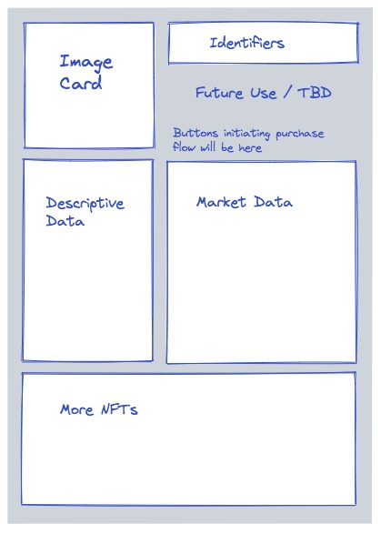

# APP-FS01 Detailed View

## 1. Purpose

The purpose of this Functional Specification (FS) is to describe the design requirements to view NFTs in detail, including display of chain-required object attributes, creator-provided descriptive data, available image data, and also to provide a view of market data such as bids and offers.  Additionally, this page will be a jumping-off point for the NFT purchase flow which will be portrayed in a separate document.

## 2. Scope

This document explains the basic design to display the detailed view of NFTs along with the market activity, and various NFT collections.

### 2.1 Components&#x20;

The components and features in this Functional Specification document describes layout to explain the following sections:

1. [Detailed view of NFT](app-fs01-detailed-view.md#6.1-detailed-view-of-nft) (Image card, Identifiers, Descriptive data)
2. [Market activity](app-fs01-detailed-view.md#6.2-market-activity) (Offers)
3. [Purchase flow](app-fs01-detailed-view.md#6.3-purchase-flow) (Buy now, Bid / Make an offer) - Future Scope
4. [Collections](app-fs01-detailed-view.md#6.4-collections) (More NFTs, View Collection)

## 3. Document Convention

For the purpose of traceability, the following code(s) will be used in this functional specification:

| Code       | Meaning                                   |
| ---------- | ----------------------------------------- |
| APP-FS01-# | App Component Requirement - Detailed View |

**The keyword `shall` indicates a requirement statement.**

The keywords `may`, `could`, and `should` are not requirements but rather indicate items related to requirements that are worthy of consideration.

## 4. Context

The detailed view page is the place where a user will land when following a link to any NFT from elsewhere in the TradeHands app. Users have different requirements based on their goal. So, the representation of any NFT should provide all the requisite details which helps the user to track information in a single section.&#x20;

## 5. Design Wire-frames

The wire-frame design mentioned below represents the browsing view of an NFT selection. These are provided to assist in understanding of what feature may look like or their potential use. The final output might vary from the design as there are possibilities to implement new concepts and features.

The below design helps in understanding the layout of a Single NFT selection. It has been categorized into five sections,

* Image card
* Identifiers
* Descriptive Data
* Market Data
* More NFTs (Collections)

At this point, buttons will be used to represent the purchase flow where the functionality of buttons will be explained in future release. As a future scope, there is a section to include few details and features.&#x20;

<figure><figcaption><p>Figure 1. The layout of a single NFT selection</p></figcaption></figure>

## 6. Requirements

### 6.1 Detailed View of NFT

This section describes the NFTs which shall contain the list of components below,

1. Image card
2. Identifiers (Series name, NFT Title,  Owner)
3. Descriptive Data Card

### 1. Image card <a href="#image-card" id="image-card"></a>

The image card shall display the **NFT image** using the Image link received from Image link Extractor.\
**Extracted From:** [NFT Object](app-fs01-detailed-view.md#a.-nft-object) (1.31.x)\
**Field:** [`token_uri` ](app-fs01-detailed-view.md#points-to-remember)``

```json
// Example from token_uri 
"image": "ipfs://bafybeidbpxnhns73t2le244n3l73q4ex6o4edu32bqgp72toarr6a6ukim/0.png"
```

### **2. Identifiers**

This section shall display the NFT in details which consists of series name, title and owner.

#### **A. Series Name**

This section shall display the **series name** using Series Name Extractor. **** \
**Extracted From:** [Metadata Object](app-fs01-detailed-view.md#b.-nft-metadata-object) (1.30.x)\
**Field:** `base_uri` and `name`


```json
// Name Extracted from base_uri
"base_uri": "{\"name\":\"Mint Bears Zeroth Run\"}"
```


#### **B. NFT Title** <a href="#nft-title" id="nft-title"></a>

This section shall display the NFT name using NFT Name Extractor. The "name extractor" checks to see if there is a interpretable data in the `token_uri` field defined as _display name_, otherwise it can fall back to the _series name_ as defined in the metadata object and optionally appending an _"index"_ into the series, incase if one can be determined (depends on a not-yet-existent core API call).\
**Extracted From:** [NFT Object](app-fs01-detailed-view.md#a.-nft-object) (1.31.x)\
**Field:** [`token_uri`](app-fs01-detailed-view.md#points-to-remember)``\
``**Else Extracted From:** [Metadata Object](app-fs01-detailed-view.md#b.-nft-metadata-object) (1.30.x)\
**Field:** `name`


```json
// name extracted from JSON data in token_uri field of NFT Object
"name": "Mint Bears #0"
```


```json
// name extracted from Metadata Object
 "name": "Mint Bears Zero"
```

In the latter case above (where we fell back on the metadata object `name` field, e.g. if the NFT object did not have interpretable `token_uri` data), if we can determine the NFT, \
**For example:** The fourth NFT issued under the metadata object, which would be index 3 (indexing from zero), then we could display this name as "**Mint Bears Zero #3**".&#x20;

#### **C. Owned By**

This section shall display the account name of the NFT owner using the name map. The NFT object identifies the account ID.  Note that a separate API call is needed to look up the account name from the chain. The name should be clickable and direct to the current profile owner of NFT.\
**Extracted From:** [NFT Object](app-fs01-detailed-view.md#a.-nft-object) (1.31.x)\
**Field:** `owner`&#x20;

```json
//Example for owner value 
"owner": "1.2.179"  // corresponds to account "jaribu-kuivunja" on Mint chain
```

### **3. Descriptive Data Card**&#x20;

This section shall display the key details about the NFT such as description, creator/author properties, details and object data using both NFT Object and Metadata Object.

#### **A. Description**

This section shall display the simple narration about the NFT using Description Extractor.\
**Extracted From:** [NFT Object](app-fs01-detailed-view.md#a.-nft-object) (1.31.x)\
**Field:** [`token_uri`](app-fs01-detailed-view.md#points-to-remember)``


```json
// Example of Description data extracted from token_uri JSON
"description": "Furry and fun MintBears! This is an early preliminary issuance of the Mint Bears. More to come?"
```


#### **B. By Field** (Creator/Author)

Within the description field there should be an option to display the NFT creator/author using the NFT Creator Extractor. After receiving the field value it follows the fallback sequence to determine the author. The creator filed should be clickable and direct to the NFT issuing User profile account which created the NFT.\
**Extracted From:** [NFT Object](app-fs01-detailed-view.md#a.-nft-object) (1.31.x)\
**Field:** [`token_uri`](app-fs01-detailed-view.md#points-to-remember)``

**Else Extracted From:** [Metadata Object](app-fs01-detailed-view.md#b.-nft-metadata-object) (1.30.x)\
**Field:** `base_uri` **** (first) followed by `owner` (second)

```json
// Example of creator from token_uri, or alternatively base_uri
"created_by": "Masha"
```

```json
// Example of owner from metadata object
"owner": "1.2.179"
```


**Example:** To display the name, the NFT declares via its `token_uri` field `created_by` which shows the entity name as "Masha". This name differs from the account name of the blockchain account that is issued underlying the NFT object, which in this case is _account 1.2.179_ with account name "jaribu-kuivunja" on the Mint blockchain.  The NFT Details page shall prefer to show display names when they can be determined.


#### **C. Traits**

This section shall display the attribute object and process them into a list of traits.\
**Extracted From:** [NFT Object](app-fs01-detailed-view.md#a.-nft-object) (1.31.x)\
**Field:** [`token_uri`](app-fs01-detailed-view.md#points-to-remember)``


```json
// Attribute like Fur color, eye color are extracted from token_uri

"attributes":{\"trait_type\":\"Fur Color\",\"value\":\"Brown\"},{\"trait_type\":\"Eye Color\",\"value\":\"Blue\"}
```


#### **D. About **_**`series_name`**_

This section shall display the series name and series description of the NFT object using description extractor.\
**Extracted From:** [Metadata Object](app-fs01-detailed-view.md#b.-nft-metadata-object) (1.30.x)  \
**Field:** base`_uri`

```json
// Name Extracted from base_uri
"base_uri": "{\"name\":\"Mint Bears Zeroth Run\"}"
```

This is similar to the description above except it is extracting a description of the _series_ rather than of the individual, specific NFT.

### 6.2 Market Activity

This section shall display the Offer object that will be retrieved from Chain.\
\<Information yet to be collected>

### 6.3 Purchase Flow

The functionality is scoped out in future release and this section will be explained later in a separate document. However, the following two button shall be included as a **`place holder`** and **`grayed out`**.

* Buy now
* Bid / Make an offer

### 6.4 Collections

This section list out the other NFTs in the same collection. The NFTs are retrieved using the metadata object same as the one used in the extraction of series name.

There are two categories included in this section,

#### A. NFT Card component

This section renders the summary view of the similar NFT collections which is extracted using the metadata\_object(1.30.x). The summary displays the below categories,

* [ ] Image - The NFT image can be displayed using the same method used in the section, [Image Card](app-fs01-detailed-view.md#1.-image-card)
* [ ] Series name - Display the series name which can be similar to the section, [Series Name](app-fs01-detailed-view.md#a.-series-name)
* [ ] NFT Name - The NFT name can be extracted using the method in the section , [NFT Title](app-fs01-detailed-view.md#b.-nft-title)
* [ ] NFT ID - The ID field can be extracted from _`token_uri` and `base_uri`_ based on the NFT object selection.

```
// The NFT ID of NFT Object is extracted from token_uri field
"id": "1.31.7"

//The NFT ID of NFT Metadata Object is extracted from base_uri field
"id": "1.30.8"
```

* [ ] View NFT - Clicking this **Button** should redirect to a separate page to display the NFT in detailed view.

#### B. View Collections

Clicking on this option shall direct to a separate page to display the collection page of all NFTs extracted using metadata\_object(1.30.x).

This option shall display the object page using extraction and can be limited to show 2 rows of NFTs in single page.

## 7. Appendix A

This document explains the association between User Interface elements and the chain data that inform those elements. The chain object falls in the below two category.

#### A. NFT Object

An NFT object defines a specific, singular, issued, hold able, transferrable, and tradable NFT. It occupies the `1.31.x` object space in the object database. An example NFT object is 1.31.7, which is the first of the "Mint Bears" series on the Mint test net.

The object has the following properties, which can be observed via  `get_objects` call to an API node:


```json
{
  "approved": "1.2.179",
  "approved_operators": [],
  "id": "1.31.7",
  "nft_metadata_id": "1.30.8",
  "owner": "1.2.179",
  "token_uri": "{\"name\":\"Mint Bears #0\",\"created_by\":\"Masha\",\"description\":\"Furry and fun MintBears! This is an early preliminary issuance of the Mint Bears. More to come?\",\"image\":\"ipfs://bafybeidbpxnhns73t2le244n3l73q4ex6o4edu32bqgp72toarr6a6ukim/0.png\",\"attributes\":[{\"trait_type\":\"Fur Color\",\"value\":\"Brown\"},{\"trait_type\":\"Eye Color\",\"value\":\"Blue\"}]}"
}
```


#### Points to Remember:

* The `token_uri` field is an open-ended string field, that can be populated with JSON-formatted text. The details page will _attempt_ to interpret the JSON in order to extract things like image links and descriptive data. If this process fails, (e.g. if the field is NOT populated with valid JSON-formatted text, _or_ if the schema is not understood by the interpreter), then fallbacks need to be assumed for the UI elements that draw from this data.
* Because the `token_uri` field is a text field, shown as a JSON object above, the quote characters are escaped. (i.e. `\"` is substituted for `"`.) However, the binary string data in the object contains `"` not `\"`.
* For reference, an un-escaped, pretty-printed dump of the `token_uri` JSON-formatted objects would look like this:


```json
{
  "name": "Mint Bears #0",
  "created_by": "Masha",
  "description": "Furry and fun MintBears! This is an early preliminary issuance of the Mint Bears. More to come?",
  "image": "ipfs://bafybeidbpxnhns73t2le244n3l73q4ex6o4edu32bqgp72toarr6a6ukim/0.png",
  "attributes": [
    {
      "trait_type": "Fur Color",
      "value": "Brown"
    },
    {
      "trait_type": "Eye Color",
      "value": "Blue"
    }
  ]
}

```


#### B. NFT Metadata Object

An NFT metadata object defines a _collection_ of NFTs that share a common issuing account, series symbol, name, and contract rules. It occupies the `1.30.x` object space in the database. The descriptive metadata issued is a JSON blob which can be optionally inserted into the `token_uri` field of NFT objects (1.31.x objects) to provide semantic or interpretive meaning to individual NFTs.  This "metadata" can be a narrative-style description, artist, creator information, etc.,

The object has the following properties, which can be observed via `get_objects` call to an API node:


```json
{
  "base_uri": "{\"name\":\"Mint Bears Zeroth Run\",\"created_by\":\"Masha\",\"description\":\"Furry and fun MintBears! This is an early preliminary issuance of the Mint Bears. More to come?\",\"base_uri\":\"ipfs://bafybeicym3epgdalnw6r3gns57njic57e34i4zn5jhg655zubdrwgxxise\"}",
  "id": "1.30.8",
  "is_sellable": true,
  "is_transferable": true,
  "max_supply": 1000,
  "name": "Mint Bears Zero",
  "owner": "1.2.179",
  "revenue_partner": "1.2.179",
  "revenue_split": 250,
  "symbol": "MINTBEARSZERO"
}
```


#### Points to remember:

* The `owner` of the metadata object can be thought of as the "issuer" of the NFTs in the collection. (In contrast to the `owner` of the 1.31.x object, which can be thought of as the "holder" of the specific issued NFT.)
* The metadata object determines permissions and contract terms (e.g. sellable, transferable, revenue split, etc.) of all NFTs issued under the same contract.
* The chain understands the symbol and token name which are defined for the _series_, and are not variable by individual NFT. However, NFTs may define, through their descriptive data, "display names" which can be displayed for the NFT name, series name, or artist.
* The NFT metadata object also has an arbitrary string field (`base_uri`) which can be packed with JSON-formatted text. This data can be thought to apply to the entire collection. Mostly the NFT Details Page won't concern itself with this data, except in areas where it describe the series to which the NFT belongs.
