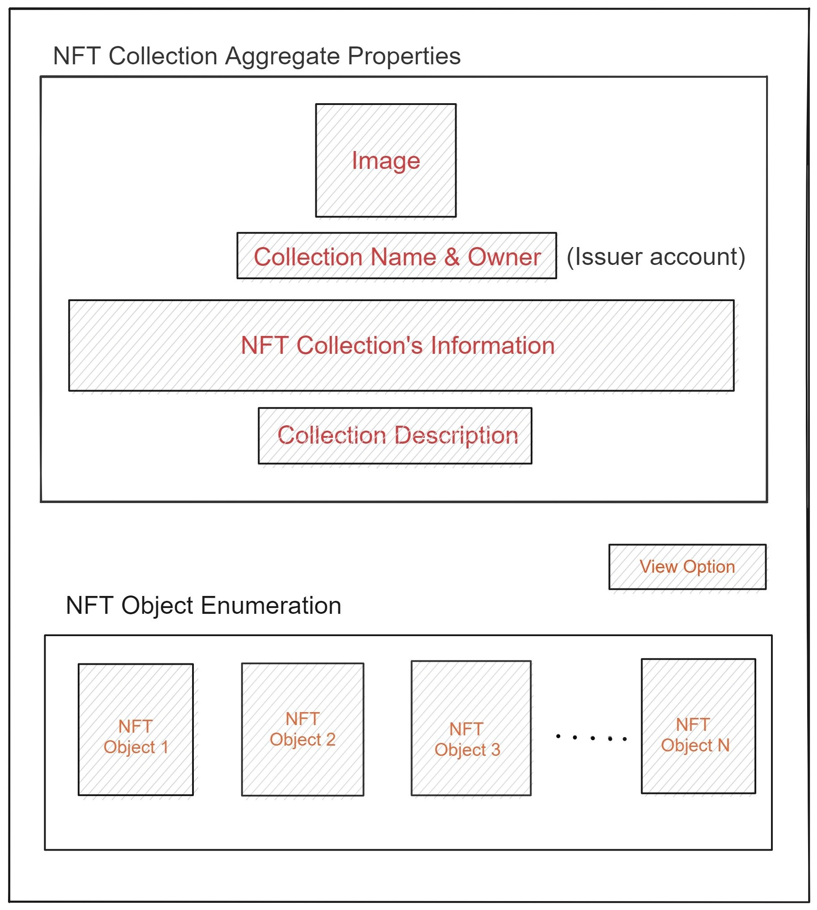

# APP-FS03 Collection Details Page

## 1. Purpose

The purpose of this Functional Specification (FS) is to explain the NFT Collection Details page in detail. This page shall display properties that apply to the collection as a whole, and shall list and display the individual NFTs belonging to the collection. This specification mainly will focus on the descriptive, objective, and visual representation of each collection. The page should have an option to show the collection in different views. The page shall display the details of collections such as number of objects, revenue percentage, partner, whether sellable/transferable, and additional descriptive data if included in the collection object. The initial collection page is scoped to showcase only basic and common descriptive attributes, while the remaining features are planned for future releases.

## 2. Scope

The FS shall describe the basic design and requirements to show the detailed collection of NFTs.

### 2.1 Components

In this FS, below component describes the requirement to build the collection view page in detail

&#x20;1\. NFT Collection Aggregate Properties\
&#x20;2\. NFT Object Enumeration

## 3. Document Convention

For the purpose of traceability, the following code(s) will be used in this functional specification:

| Code       | Meaning                                             |
| ---------- | --------------------------------------------------- |
| APP-FS03-# | App Component Requirement -Collection Detailed View |

**The keyword `shall` indicates a requirement statement.**

The keywords `may`, `could`, and `should` are not requirements but rather indicate items related to requirements that are worthy of consideration.

## 4. Context

The collection detail view page shall have two parts.  (1) an overview of properties belonging to the collection as a whole (which are then common to all NFTs included in the collection), and (2) an enumeration of the individual NFTs belonging to the collection. When the User select an NFT collection from the Front page or other origin, it shall re-direct to the Collection View page for the selected collection. User requirements might vary based on their need. So, this collection view page should explain the properties of NFT collection in detail which helps User to gather all necessary information in single page.  NFT collections may also be created following differing standards, and may embed varied data types based on use case, so the collection page should be designed with certain commonplace NFT standards in mind, help the user to understand the type and purpose of different NFT collections that they might view.

## 5. Design Wire-Frames

The wire-frames mentioned below will explain the layout of TradeHands Explorer's collection detail page. This helps in understanding the arrangement and potential use of the application. Final design may be vastly different from the provided layout.&#x20;

<figure><figcaption><p>Fig1: Layout of collection detailed view</p></figcaption></figure>

## 6. Requirements

The NFT Collection page features the list of objects in their collection. The objects in the collection are individual NFT objects.  The page shall provide the detailed description about the Collection as well as its objects. The list of components based on the requirements are explained below,

### 6.1 Content Segment

#### A. NFT Collection Aggregate Properties

The top portion of the page shall focus on the details of the collection as a whole, such as an image (if one declared in the 1.30.x object), name, revenue partner, number of NFT objects in collection, etc. The NFT collection is the group of NFTs under same category which implies that the method used to display all NFTs is similar. This extraction procedure is similar to the method used in generic NFT display. Click [here](https://devs.peerplays.com/supporting-and-reference-docs/tradehands-explorer/app-fs01-detailed-view#6.1-detailed-view-of-nft), To learn the procedure in details.

* [ ] Cover Photo - The NFT collection object (1.30.x object) MAY declare a _cover photo_.
* [ ] Image - The NFT collection object (1.30.x object) MAY declare a _primary photo_.
* [ ] NFT Collection name - The name of the NFT collection will be displayed.
* [ ] Owner name - The issuer name shall be mentioned and issuer is the one who has the credentials to create the NFTs in the collection.
* [ ] NFT Collection's Information - This section, shall display the number of NFTs in the collection, revenue percent & partner, type of NFT whether its sellable/transferable/lottery. &#x20;
* [ ] Collection description - The NFT collection object (1.30.x object) MAY declare a brief plaintext description, which is displayed here if present.&#x20;

#### B. NFT Object Enumeration

This area of the page shall present the NFTs that belong to the collection in a grid of card-like tiles that represent the individual NFTs, including, primarily, the image that the NFT represents (if the NFT object declares one).

#### 1. NFT object cards

The NFT object cards appearing in this section are similar to or may be the same as the NFT card component used in other pages of the site, (such as the "more NFTs in this collection" section of the NFT Detailed View page) and use the same data extraction procedure. The cards will display data such as: (Note: see final design document for specific list of displayed data)

* [ ] The NFT image&#x20;
* [ ] NFT series name
* [ ] NFT name&#x20;
* [ ] A View NFT link - This option should be a button and on-click shall directs to a separate page to display the NFT in detail.

Click [here](https://devs.peerplays.com/supporting-and-reference-docs/tradehands-explorer/app-fs01-detailed-view#a.-nft-card-component), to learn the extraction procedure used in NFT card component in detail.

### 6.2 Key Design Characteristics

The page should provide option for the user to view the NFTs in various formats based on the user perspective.

#### A. View Option

The collection view page should have the option to view the NFTs in various tile sizes based on the user's selection. This section shall provide option for the user to choose between small, medium, and large tile sizes.&#x20;

#### Large Tile

The user shall choose this option to view enlarged NFT collection. This option showcase the NFT with bigger image and description. However, this option limits the number of NFTs in a single page.&#x20;

#### Small tile

The user shall choose this option to view NFTs in smaller size. This option showcase the NFTs with smaller image and description. In case the collection has many NFTs and the user wish to look all NFTs in same page then small tile option will be the best option. Though, this option reduces the size of NFTs, it displays more NFTs in a single page compared to large tile option.

## 7. Appendix A

| Term | Meaning                  |
| ---- | ------------------------ |
| FS   | Functional Specification |
| NFT  | Non-Fungible Token       |

#### A. NFT Object

An NFT object defines a specific, singular, issued, hold able, transferrable, and tradable NFT. It occupies the `1.31.x` object space in the object database. An example NFT object is 1.31.7, which is the first of the "Mint Bears" series on the Mint test net.

The object has the following properties, which can be observed via  `get_objects` call to an API node:

```json
{
    "approved": "1.2.179",
    "approved_operators": [],
    "id": "1.31.34",
    "nft_metadata_id": "1.30.30",
    "owner": "1.2.179",
    "token_uri": "{\"name\":\"The PeerPeople Live and in Concert - Event Ticket #01001 - EventID 7e1ac9\",\"created_by\":\"Peerplays NFT Events Team\",\"description\":\"Ticket for entry and seating at event 7e1ac905 - The PeerPeople Live and in Concert - Peerplays Stadium, October 22, 2022 at 8:00pm\",\"image\":\"ipfs://bafybeig24q4a6lmvgyeuq2vbnhic7wp5jo4ekrn2okhgmdzqo3jgezu2o4/1.png\",\"privileges\":[{\"type\":\"EVENT/ENTRANCE\",\"venue\":\"Peerplays Stadium\",\"event\":\"Saturday, October 22, 2022, 8:00pm, Main Arena\",\"seat\":\"Section 16 Row R, Seat 24\",\"description\":\"This ticket entitles the bearer to entrance and a specified seat at: The Peer People Live and In Concert, subject to terms and conditions.\"}]}"
}

```

The `token_uri` field MAY optionally include arbitrary text, which MAY be JSON-formatted data providing a payload of descriptive data for the NFT.  Certain common object formats SHOULD be recognized.  An example of this data, decoded and pretty-printed, is as follows:


```json
{
"name":"The PeerPeople Live and in Concert - Event Ticket #01001 - EventID 7e1ac9",
"created_by":"Peerplays NFT Events Team",
"description":"Ticket for entry and seating at event 7e1ac905 - The PeerPeople Live and in Concert - Peerplays Stadium, October 22, 2022 at 8:00pm",
"image":"ipfs://bafybeig24q4a6lmvgyeuq2vbnhic7wp5jo4ekrn2okhgmdzqo3jgezu2o4/1.png",
"privileges":[
    {"type":"EVENT/ENTRANCE","venue":"Peerplays Stadium",
    "event":"Saturday, October 22, 2022, 8:00pm, Main Arena",
    "seat":"Section 16 Row R, Seat 24",
    "description":"This ticket entitles the bearer to entrance and a specified seat: The Peer People Live and In Concert, subject to terms and conditions."}
    ]
}
```


Note that this particular data payload appears to define an NFT that functions as an event ticket.

#### B. NFT Metadata Object

An NFT metadata object defines a _collection_ of NFTs that share a common issuing account, series symbol, name, and contract rules. It occupies the `1.30.x` object space in the database. The object MAY include a descriptive metadata payload encoded as a JSON blob in the `base_uri` field of the NFT metadata object (1.30.x object space) to provide semantic or interpretive meaning to the NFT collection.  This "metadata" can be a narrative-style description, artist, creator information, etc.

The object has the following properties, which can be observed via `get_objects` call to an API node:

```json
{
    "base_uri": "{\"name\":\"The PeerPeople Live and in Concert - EventID 7e1ac9\",\"created_by\":\"Peerplays NFT Events Team\",\"description\":\"Ticket for entry and seating at event 7e1ac905 - The PeerPeople Live and in Concert - Peerplays Stadium, October 22, 2022 at 8:00pm\",\"base_uri\":\"ipfs://bafybeihoynutke4olqxgzofr53beeploihdfothcmslshq3udx3z4hoxni\"}",
    "id": "1.30.30",
    "is_sellable": true,
    "is_transferable": true,
    "max_supply": 40000,
    "name": "PeerPeople Live",
    "owner": "1.2.179",
    "revenue_partner": "1.2.179",
    "revenue_split": 150,
    "symbol": "PEERPEOPLETIX"
}
```

The base`_uri` field MAY optionally include arbitrary text, which MAY be JSON-formatted data providing a payload of descriptive data for the NFT collection.  Certain common object formats SHOULD be recognized.  An example of this data, decoded and pretty-printed, is as follows:


```json
{
"name":"The PeerPeople Live and in Concert - EventID 7e1ac9",
"created_by":"Peerplays NFT Events Team",
"description":"Ticket for entry and seating at event 7e1ac905 - The PeerPeople Live and in Concert - Peerplays Stadium, October 22, 2022 at 8:00pm",
"base_uri":"ipfs://bafybeihoynutke4olqxgzofr53beeploihdfothcmslshq3udx3z4hoxni"
}
```


#### Points to remember:

* The `owner` of the metadata object can be thought of as the "issuer" of the NFTs in the collection. (In contrast to the `owner` of the 1.31.x object, which can be thought of as the "holder" of the specific issued NFT.)
* The metadata object determines permissions and contract terms (e.g. sellable, transferable, revenue split, etc.) of all NFTs issued under the same contract.
* The chain understands the symbol and token name which are defined for the _series_, and are not variable by individual NFT. However, NFTs may define, through their descriptive data, "display names" which can be displayed for the NFT name, series name, or artist.
* The NFT metadata object also has an arbitrary string field (`base_uri`) which can be packed with JSON-formatted text. This data can be thought to apply to the entire collection. Mostly the NFT Details Page won't concern itself with this data, except in areas where it describe the series to which the NFT belongs.
