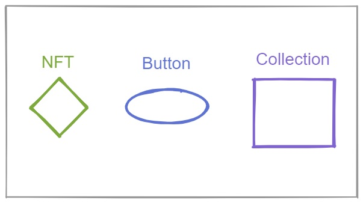
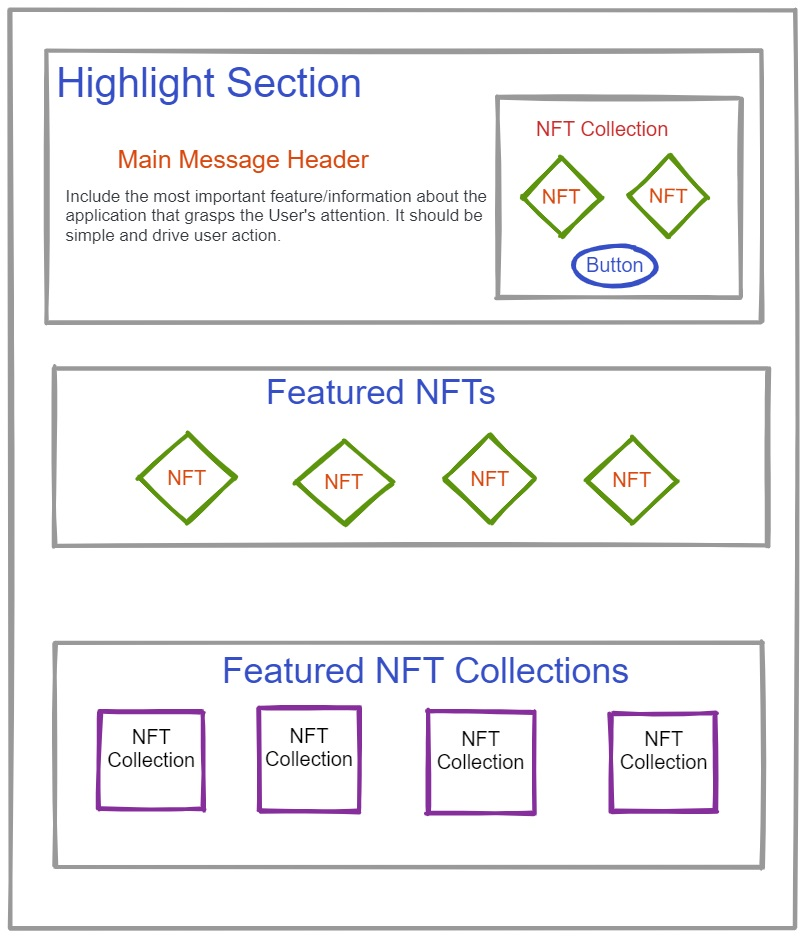

# Draft: APP-FS02 Front Page

## 1. Purpose

The functional specification (FS) document describes the home page layout for TradeHands Explorer application. Also, it outlines the requirement for design based on the perspective of potential user and site admin. This is the initial layout of application to showcase the NFT collections based on popularity, features and other specifications. The Home page shall be designed in simple and clear structure to attract the user attention and application engagement.\
While the other considerations like separate page for different events, custom gallery creation could be portrayed in future as a separate document.

## 2. Scope

The functional spec will describe the basic design and requirements to build the landing page.

### 2.1 Component

Specific component and features are covered in this FS:

#### A. Content Segments

The home page is categorized into three sections,

* Highlight section
* Featured NFTs
* Featured NFT Collections

#### B. Key design characteristics based on the user perspective

At this point, the application engagement will be performed by certain User and Site Admin. Based on their usage and expectation the home page shall be designed.

## 3. Document Convention

For the purpose of traceability, the following code(s) will be used in this functional specification:

| Code       | Meaning                                   |
| ---------- | ----------------------------------------- |
| APP-FS02-# | App component Requirement - App Home page |

**The keyword `shall` indicates a requirement statement.**

The keywords `may`, `could`, and `should` are not requirements but rather indicate items related to requirements that are worthy of consideration.

The following terms are used to describe specific users of the application:

* User - Has the privilege to check the NFT collection, login to buy/bid NFTs.
* Site Admin - Has the access to deploy the application, customize the content.

## 4. Context

Initially, the User will land on the Homepage when visiting the TradeHands Explorer app. It is essential to create the best impression to enhance the user involvement to engage with the application. The home page shall narrate the characteristics of the application by highlighting its distinct features. In this beta release, the design should be simple, precise, understandable user interface with basic features. The design shall include sections to highlight the NFTs based on certain metrics such as popularity, new NFT addition, etc.,&#x20;

From the design perspective, the home page is important for SEO, communication, easy usage, and aligning with target market activity. The home page should be flexible in terms of customization as it depends on the marketing strategy , branding and handling assorted messages.

## 5. Design Wire-Frames

The wire-frames mentioned below will explain the layout of TradeHands Explorer's Home page. This helps in understanding the arrangement and potential use of application. Final design may be vastly different from the provided layout.&#x20;

<figure><figcaption><p>Figure 1: Object identified by shape</p></figcaption></figure>

<figure><figcaption><p>Figure 2: TradeHands Explorer homepage layout</p></figcaption></figure>

## 6. Requirements

### 6.1 Content Segment

The initial design requirement for front page is breakdown into three section,

1\. Highlight section

2\. Featured NFTs

3\. Featured NFT Collections

### 1. Highlight section

This section shall mainly focus to display the important feature about the application in short. It should drive the user's attention and promotes application engagement.

The highlight section shall compose the following customization to enhance user action,

* Large block for featured content&#x20;
* Section for main message to include text header and brief description.
* Providing Buttons to initiate any User action such as new NFT creation, Checking NFT details, etc.,
* Including Banners as carousel sliders
* Links to other pages
* video displays

### 2. Featured NFTs

This section shall contain the popular NFTs similar to the NFTs featured in the More collection section of Detailed view.

The Featured NFTs section shall compose the following customization to enhance user attention,

* Include **NFT Image card** which should display the image bigger and more prominent.
* Provide link for navigation to the Details page on NFT selection.&#x20;
* The site admin could be given an option to define the categories, NFT lists at this stage of release.

### Image card Description

**A. Image Card**\
****The image card shall display the NFT image from NFT Object(1.31.x)\
**Field:** `token_uri` —> `image`

```json
Example:
"image": "ipfs://bafybeidbpxnhns73t2le244n3l73q4ex6o4edu32bqgp72toarr6a6ukim/0.png"
```

**B. Series Name**\
****The series name is extracted from Metadata Object (1.30.x). If the name length is too long then it has to be truncated.\
**Field:** `base_uri` —> `name`

```json
Example:
"base_uri": "{"name":"Mint Bears Zeroth Run"}
In case, if the name cannot be extracted then Fall back to
"name": "Mint Bears Zero"
```

**C. NFT Name** \
****The NFT name is extracted from NFT Object (1.31.x). \
**Field:** `token_uri` —> `name`

<pre class="language-json"><code class="lang-json">Example:
"name": "Mint Bears #0"
If cannot be extarcted then Fall back on
<strong>"symbol":"index"</strong></code></pre>

**D. View NFT**\
****Provide an option to view the NFT in detail.&#x20;

There are alternate ways in implementing this option and based on the design suggestion the NFT detailed page view will be displayed. Any one of the following options can be implemented,

* Providing **Button** named "View this NFT", which on click redirects to the NFT detail page
* On clicking anywhere on the **Image Card** should direct to detail page
* On clicking the Image area should direct to detail page

### 3. Featured NFT Collection

This section shall display NFT collections based on the popularity, new NFTs, SEO, etc.,&#x20;

**A. Image**

* The Collection section should contain the image associated with the NFT Collection.
* If the Collection is not associated with any image then image from the first NFT shall be used as an option.
* Some collection may contain more than one image such as cover image, profile, logo or avatar.\
  \<what to do in this situation>

#### B. Number of NFTs in collection

* The number of NFTs in the collection should be included as a part of collection display. Incase, if there are no NFTs in the collection then it should not be in the front-page and shall be placed at the end of collection based on the design configuration. However, it should be a part of collection.

#### C. Display Name

* Few collections shall have a well defined **display name.**\
  **Field:** `token_uri` —> `name`
* In case, if the name is not defined then it fall back to the Metadata object name.\
  **Field:** `base_uri` —> `name`

### 6.2 Key Design Characteristics

The TradeHands Explorer Home page shall consider the following key design characteristics,

* Color Gradient
* Layering
* Transparency
* Content Flow
* Interactivity
* Modularization

#### A. Color Gradient

Blending of two or three colors across a block of space, a background, header text, or borders adds to the organic feel of the app.

The front page shall make use of color gradients where ever appropriate.\


#### B. Layering

Layering shapes can help to show how objects relate to each other. Use of layering also signals to the user, the object hierarchy or order of events. Layering also makes the page feel more realistic.

The front page shall make use of shape layering to show object relationships, hierarchy, and/or order of events. Also incorporate drop shadows or similar techniques to help illustrate shape layering.

#### C. Transparency

The use of transparency when layering objects can produce a modern feel that doesn’t sacrifice the organic feel. Transparency is best used together with blur, parallax, colorization, or a combination of other techniques.

The front page shall make use of transparency, with or without related techniques, where ever appropriate.

#### D. Content Flow

The content flow is about providing quick and easy access to what users need, and it’s about delivering a story to the user. The main purpose of the content should be delivered early, the bulk of the content in the middle, and finishing up with detailed info, use-case specific functions, and solutions for edge cases. This can apply to all scales of content across the app (whole pages, user info, NFT info, a pop-up modal, etc.)

The front page shall begin with a highlight section. Followed by the introduction of new concepts to users from top to bottom, such as the following:

* The featured NFTs shall be displayed which showcase the brief description about it
* The NFT Collection are broad in scope that contain the NFTs.
* NFTs, on their own, are atomic which can exist independently of collections.

#### E. Interactivity

There should be a deep level of interaction between the user and the app. This creates a connection with the user.

The Front page shall provide an interactive approach to informational displays.

#### F. Modularization

The site admin shall have the privileges to categorize the sections as modules based on the requirement. The following privileges shall be given to site admin,

* An option to view both NFTs and event at the same section based on filters.&#x20;
* To decide which section to appear based on required orders.
* To control the headings and sub-group of any section.

The site admin shall be responsible for specifying the headings and NFTs included in the section should be determined through some mechanism which has to determined (future scoped). The mechanism can be a configuration file, database call or some API call. Finally, different sections should be present in the configuration file and Home page should be able to display based on this configuration.

#### Example

The grouping should be based on below two category,

1. Featured Artworks - The list of artworks in the NFT collection.
2. Featured Events -  The list of events available in the collection.

The collections shall be modularized based on the selection of the site admin. They can be defined as some of the examples stated below,

* [ ] Popular NFTs in past 7 days
* [ ] Top collections
* [ ] Most popular events
* [ ] Different groupings of NFTs
* [ ] NFTs with more value

## 7. Appendix A

| Term | Meaning                    |
| ---- | -------------------------- |
| FS   | Functional Specification   |
| NFT  | Non-Fungible Token         |
| SEO  | Search Engine Optimization |


#### A. NFT Object

An NFT object defines a specific, singular, issued, hold able, transferrable, and tradable NFT. It occupies the `1.31.x` object space in the object database. An example NFT object is 1.31.7, which is the first of the "Mint Bears" series on the Mint test net.

The object has the following properties, which can be observed via  `get_objects` call to an API node:


```json
{
  "approved": "1.2.179",
  "approved_operators": [],
  "id": "1.31.7",
  "nft_metadata_id": "1.30.8",
  "owner": "1.2.179",
  "token_uri": "{\"name\":\"Mint Bears #0\",\"created_by\":\"Masha\",\"description\":\"Furry and fun MintBears! This is an early preliminary issuance of the Mint Bears. More to come?\",\"image\":\"ipfs://bafybeidbpxnhns73t2le244n3l73q4ex6o4edu32bqgp72toarr6a6ukim/0.png\",\"attributes\":[{\"trait_type\":\"Fur Color\",\"value\":\"Brown\"},{\"trait_type\":\"Eye Color\",\"value\":\"Blue\"}]}"
}
```


#### Points to Remember:

* The `token_uri` field is an open-ended string field, that can be populated with JSON-formatted text. The details page will _attempt_ to interpret the JSON in order to extract things like image links and descriptive data. If this process fails, (e.g. if the field is NOT populated with valid JSON-formatted text, _or_ if the schema is not understood by the interpreter), then fallbacks need to be assumed for the UI elements that draw from this data.
* Because the `token_uri` field is a text field, shown as a JSON object above, the quote characters are escaped. (i.e. `\"` is substituted for `"`.) However, the binary string data in the object contains `"` not `\"`.
* For reference, an un-escaped, pretty-printed dump of the `token_uri` JSON-formatted objects would look like this:


```json
{
  "name": "Mint Bears #0",
  "created_by": "Masha",
  "description": "Furry and fun MintBears! This is an early preliminary issuance of the Mint Bears. More to come?",
  "image": "ipfs://bafybeidbpxnhns73t2le244n3l73q4ex6o4edu32bqgp72toarr6a6ukim/0.png",
  "attributes": [
    {
      "trait_type": "Fur Color",
      "value": "Brown"
    },
    {
      "trait_type": "Eye Color",
      "value": "Blue"
    }
  ]
}

```


#### B. NFT Metadata Object

An NFT metadata object defines a _collection_ of NFTs that share a common issuing account, series symbol, name, and contract rules. It occupies the `1.30.x` object space in the database. The descriptive metadata issued is a JSON blob which can be optionally inserted into the `token_uri` field of NFT objects (1.31.x objects) to provide semantic or interpretive meaning to individual NFTs.  This "metadata" can be a narrative-style description, artist, creator information, etc.,

The object has the following properties, which can be observed via `get_objects` call to an API node:


```json
{
  "base_uri": "{\"name\":\"Mint Bears Zeroth Run\",\"created_by\":\"Masha\",\"description\":\"Furry and fun MintBears! This is an early preliminary issuance of the Mint Bears. More to come?\",\"base_uri\":\"ipfs://bafybeicym3epgdalnw6r3gns57njic57e34i4zn5jhg655zubdrwgxxise\"}",
  "id": "1.30.8",
  "is_sellable": true,
  "is_transferable": true,
  "max_supply": 1000,
  "name": "Mint Bears Zero",
  "owner": "1.2.179",
  "revenue_partner": "1.2.179",
  "revenue_split": 250,
  "symbol": "MINTBEARSZERO"
}
```


#### Points to remember:

* The `owner` of the metadata object can be thought of as the "issuer" of the NFTs in the collection. (In contrast to the `owner` of the 1.31.x object, which can be thought of as the "holder" of the specific issued NFT.)
* The metadata object determines permissions and contract terms (e.g. sellable, transferable, revenue split, etc.) of all NFTs issued under the same contract.
* The chain understands the symbol and token name which are defined for the _series_, and are not variable by individual NFT. However, NFTs may define, through their descriptive data, "display names" which can be displayed for the NFT name, series name, or artist.
* The NFT metadata object also has an arbitrary string field (`base_uri`) which can be packed with JSON-formatted text. This data can be thought to apply to the entire collection. Mostly the NFT Details Page won't concern itself with this data, except in areas where it describe the series to which the NFT belongs.
