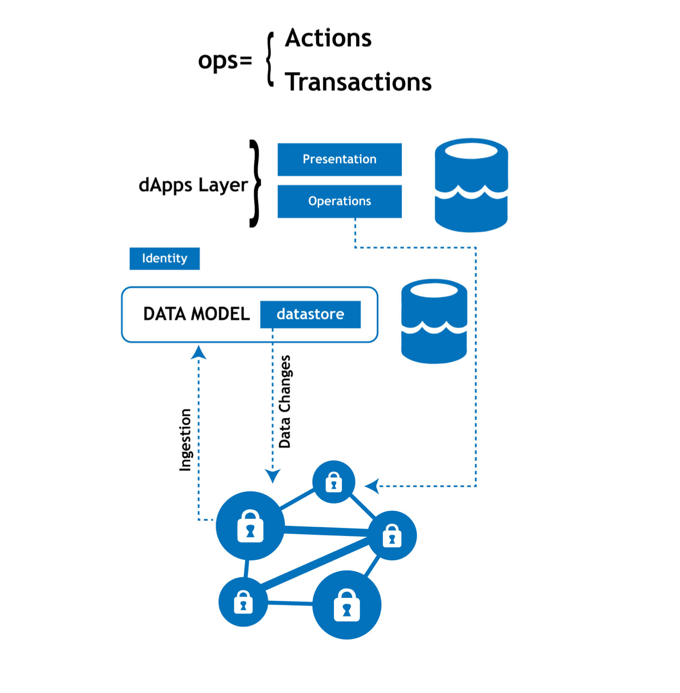

# Requirements Specification

## 1. Introduction

The goal of every Peerplays **dApp **developer is to develop applications using the rock solid transaction capabilities, tamper proof immutability, and impenetrable security offered by the Peerplays blockchain platform.

While these are compelling reasons for developers to use blockchain technology, the need for end-to-end application development knowledge along with traditional enterprise backed software development methods create entry barriers for developers.

A Blockchain Middleware System (BMS) platform with various components will be built by the **PBSA **to address these unique challenges. Our goal is to expose general purpose APIs which can be accessed in a language and platform agnostic way and thus make it possible for developers of varying skill sets to create applications on the blockchain.

## 2. Identity Management

User and identity management is a major part in any application development. Blockchains bring challenges with their unique security constraints. The public key cryptography based account access provided by the Peerplays blockchain is secure compared to a username and password based authentication. But this method makes it challenging or even next to impossible for laymen to create and use dApps. A common alternative proposed is using cryptocurrency wallets. This doesn't really solve the on-boarding challenge as a tiny set of the internet browsing population use cryptocurrency wallets.

To ensure faster and smoother on-boarding of users, Peerplays is thus creating an identity and access management (**IdAM**) and **SSO **platform which helps anyone with an email address, Facebook, or Google account to easily create an account on the Peerplays blockchain. For tech-savvy users the traditional blockchain mechanism will be used to create the accounts.

In addition to the account creation, Peerplays will also provide simpler mechanisms for dApp developers to create and provision dApps and configure various dApp level permissions.

## 3. Requirements

### **3.1. High level Requirements**

This section will define each of the high level components of the identity management product - **PeerID**.

The components:

* account creation
* retrieving Peerplays keys
* dApp provisioning
* dApp Permissions
* unlinking third party services
* Multi-Factor Authentication (**MFA**)
* Anti-Phishing features

#### **3.1.1. Account creation**

User account creation within a dApp will always involve creation of an account on the Peerplays blockchain. PeerID will provide two modes of account creation. The first mode will be for advanced users which will use the core Peerplays Faucet to generate a blockchain account and keys. The second will be a simpler mechanism wherein the account can be created by signing up with an email, Facebook, or Google account. The list of third party services will be increased in the future which might include Twitter, Discord, Steam, Snapchat, etc.

#### **3.1.2. Retrieving Peerplays keys**

Scenarios might arise which may lead a user to request their Peerplays private keys or master password. In such a scenario, requested keys or a master password will be sent to the user via an email and shown on the screen/UI. This will be an irreversible action and all the third party links established during this process will be securely deleted from the PeerID databases.

#### **3.1.3. dApp provisioning**

Developers must be given a simple interface wherein they can create the dApp, assign permissions, and configure any third party call back URLs. Provisioning of the dApp related permissions, minting tokens, etc., should be done using the cli\_wallet. The provisioning features within PeerID should be used primarily for the staging and development process. Additionally, multiple accounts can be used to create each type of provisioning. For minting tokens a high security account can be used. Then permissions can be created with another account, and so on. This must be detailed in the functional specifications.

#### 3.1.4. dApp permissions

The blockchain level permissions capabilities should be used to create permissions. The permissions must map users to dApps, assets, and operations based on various conditions. The conditions can be generic and configurable via the PeerID user interface.

The blockchain will expose a generic interface to validate / verify with any external validator. The dApp can perform the calls with external services like a **KYC **verification application to receive a call back and then set relevant attributes to a given user.

PeerID should allow limiting users based on conditions set in the blockchain which are based on external validators (services like KYC, geo-location, etc.) The external conditions can be properties like is\_member\_of\_facebook, is\_MFA\_enabled, etc.

#### **3.1.5. Miscellaneous features**

These features will be low priority, phase II features that will ensure additional controls and enhanced security.

* unlinking third party services
* Multi-Factor Authentication
* Anti-Phishing features

### **3.2. Functional Requirements**

#### **3.2.1. Account creation**

* A user shall be able to create an account with any one of the following:
  * email address
  * Facebook id
  * Google id
* A user shall be able to change their password
* A user shall be able to import or export their Peerplays keys
* A password recovery (forgot password) option shall be provided

#### 3.2.2. dApp provisioning 

1. The first step of dApp creation is to create a corresponding blockchain account for the dApp. A simple UI shall be provided for creating the dApp account.

Aspects provisioned for the dApp account:

* account name
* access credentials - usernames, passwords, permissions
* security tokens
* federated logins with Google, Twitch, Youtube, Facebook, Steam, EPIC games, etc.
* support for multi-factor authentication

## 4. Glossary

**dApp **- Decentralized Application. Just like a typical computer application, but with no centralized database, host, or distribution.

**PBSA **- Peerplays Blockchain Standards Association - For more information, see [pbsa.info](https://pbsa.info).

**IdAM **- Identity and Access Management - A framework of policies and technologies for ensuring that the right users have the appropriate access to technology resources.

**SSO **- Single Sign-On - An authentication scheme that allows a user to log in with a single set of credentials to any of several related, yet independent, applications. True single sign-on allows the user to log in once and access services without re-entering authentication factors.

**PeerID **- The IdAM and SSO blockchain middleware for the Peerplays blockchain.

**MFA **- Multi-Factor Authentication (encompassing **two-factor authentication**, or **2FA**, along with similar terms) -  An authentication method in which a user is granted access to an application only after successfully presenting two or more pieces of evidence (or factors) to an authentication mechanism.

**KYC **- Know Your Customer (or Client) -  Guidelines in financial services that require organizations to make an effort to verify the identity, suitability, and risks involved with maintaining a business relationship.

